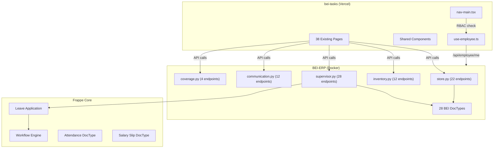
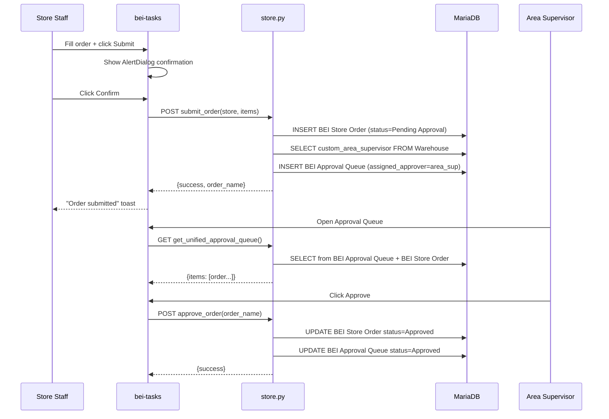
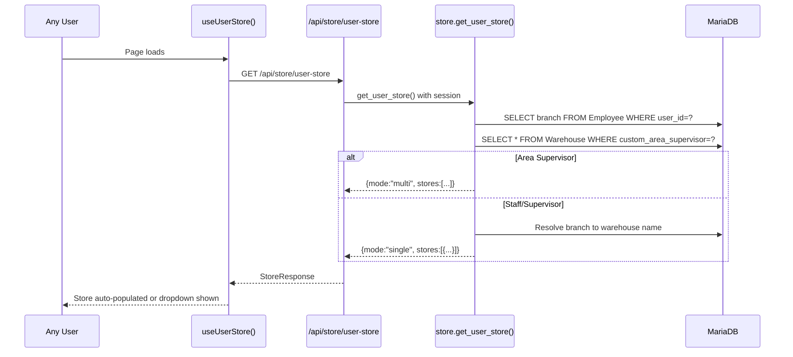

# Design: Store Ops Sprint 2 -- Fix 44 UAT Issues

## Overview

Resolve 44 remaining OPEN issues from Feb 6 Ops UAT by extending existing backend APIs and frontend pages across two repos (BEI-ERP + bei-tasks). The approach is **extend-first**: 0 new DocTypes, 0 new pages, 6 new API changes, and reuse of existing patterns (Combobox, RoleGuard, store resolution). Backend deploys first (backward-compatible), then frontend.

---

## Architecture



---

## Core Design Patterns

### Pattern 1: Store Resolution (Fixes H-1, H-2, SUP-5, SUP-8)

**Problem:** `supervisor.get_my_stores()` only returns stores for Area Supervisors (queries `Warehouse.custom_area_supervisor`). Store Staff get empty response.

**Solution:** New backend endpoint `store.get_user_store()` that resolves store for ANY user role.

```python
# hrms/api/store.py -- NEW endpoint
@frappe.whitelist()
def get_user_store():
    """
    Get store for current user. Works for all roles:
    - Store Staff/Supervisor: resolves from Employee.branch
    - Area Supervisor: returns list from Warehouse.custom_area_supervisor
    """
    user = frappe.session.user
    employee = frappe.db.get_value(
        "Employee",
        {"user_id": user, "status": "Active"},
        ["name", "branch", "designation"],
        as_dict=True
    )
    if not employee:
        frappe.throw(_("No active employee record found"))

    # Area Supervisors get multiple stores
    area_stores = frappe.get_all(
        "Warehouse",
        filters={"custom_area_supervisor": user, "is_group": 0},
        fields=["name", "warehouse_name"],
    )
    if area_stores:
        return {
            "mode": "multi",
            "stores": [{"name": s.name, "warehouse_name": s.warehouse_name} for s in area_stores],
            "default_store": area_stores[0].name
        }

    # All others: resolve from Employee.branch
    if employee.branch:
        warehouse = resolve_warehouse(employee.branch)
        return {
            "mode": "single",
            "stores": [{"name": warehouse, "warehouse_name": employee.branch}],
            "default_store": warehouse
        }

    frappe.throw(_("No store assigned to your employee record"))
```

**Frontend hook:** `useUserStore()` in `hooks/use-user-store.ts`

```typescript
// hooks/use-user-store.ts
export function useUserStore() {
  const { data, isLoading } = useSWR<StoreResponse>("/api/store/user-store", fetcher);
  return {
    stores: data?.stores || [],
    defaultStore: data?.default_store,
    isMultiStore: data?.mode === "multi",
    isLoading,
  };
}
```

**Impact:** Replaces all calls to `/api/supervisor/my-stores` in store-ops pages (handover, opening, closing, deposit, pos).

---

### Pattern 2: Entity Combobox (Fixes FQ-1, HR-7, HR-8, COM-2, SUP-4)

**Problem:** 6 text inputs need dropdown conversion. All follow same pattern.

**Solution:** One shared `EntityCombobox` component with configurable doctype/fields.

```typescript
// components/shared/entity-combobox.tsx
interface EntityComboboxProps {
  doctype: string;                    // e.g. "Employee", "Warehouse", "Item"
  filters?: Record<string, unknown>;  // e.g. { is_stock_item: 1 }
  displayField?: string;              // field for display (e.g. "employee_name")
  valueField?: string;                // field for value (default: "name")
  searchField?: string;               // field to search on
  value?: string;
  onChange: (value: string | undefined) => void;
  placeholder?: string;
  allowOther?: boolean;               // Show "Other" option + free text
  icon?: LucideIcon;
}
```

Built on existing Shadcn `Command` pattern (same as `BranchSelector`, `UserSelector`).

**Instances:**

| Page | Doctype | Display Field | Filters | allowOther |
|------|---------|--------------|---------|------------|
| FQI Report | `Item` | `item_name` | `{is_stock_item: 1}` | Yes |
| Coverage (store) | `Warehouse` | `warehouse_name` | `{is_group: 0}` | No |
| Coverage (employee) | `Employee` | `employee_name` | `{status: "Active"}` | No |
| Kudos (recipient) | `Employee` | `employee_name` | `{status: "Active"}` | No |
| Labor Plan (store) | `Warehouse` | `warehouse_name` | (supervisor's stores) | No |
| Schedule (shift) | `BEI Shift Template` | `template_name` | - | No |

---

### Pattern 3: DocType Permission Fix (Fixes P-1, COM-1, SUP-8)

Standard JSON patch to add roles to DocType permission arrays.

| DocType JSON File | Role to Add | Perms |
|-------------------|-------------|-------|
| `bei_pos_upload.json` | `Employee` | create=1, read=1, write=1 |
| `bei_kudos.json` | `Employee` (existing) | **add write=1** (currently missing) |
| `bei_store_visit_report.json` | `Area Supervisor` | create=1, read=1, write=1 |
| `bei_store_visit_report.json` | `Employee` | read=1 |

---

### Pattern 4: Denomination Grid (Fixes C-2)

**Decision:** Use 30 individual Currency fields (not JSON, not child table). Matches existing `denom_1000`...`denom_coins` pattern, queryable in Frappe report builder.

**DocType Fields Added to `BEI Store Closing Report`:**

```
Section Break: PCF Denomination
  pcf_denom_1000, pcf_denom_500, pcf_denom_200, pcf_denom_100,
  pcf_denom_50, pcf_denom_20, pcf_denom_10, pcf_denom_5,
  pcf_denom_1, pcf_denom_coins, pcf_denom_total (read-only)

Section Break: Delivery Fund Denomination
  del_denom_1000, del_denom_500, del_denom_200, del_denom_100,
  del_denom_50, del_denom_20, del_denom_10, del_denom_5,
  del_denom_1, del_denom_coins, del_denom_total (read-only)

Section Break: Change Fund Denomination
  chg_denom_1000, chg_denom_500, chg_denom_200, chg_denom_100,
  chg_denom_50, chg_denom_20, chg_denom_10, chg_denom_5,
  chg_denom_1, chg_denom_coins, chg_denom_total (read-only)
```

**Frontend Component:** `DenominationGrid`

```typescript
// components/store-ops/denomination-grid.tsx
interface DenominationGridProps {
  prefix: string;         // "pcf" | "del" | "chg"
  label: string;          // "PCF" | "Delivery Fund" | "Change Fund"
  values: Record<string, number>;
  onChange: (field: string, count: number) => void;
}

const DENOMINATIONS = [
  { label: "1,000", value: 1000, field: "denom_1000" },
  { label: "500",   value: 500,  field: "denom_500" },
  { label: "200",   value: 200,  field: "denom_200" },
  { label: "100",   value: 100,  field: "denom_100" },
  { label: "50",    value: 50,   field: "denom_50" },
  { label: "20",    value: 20,   field: "denom_20" },
  { label: "10",    value: 10,   field: "denom_10" },
  { label: "5",     value: 5,    field: "denom_5" },
  { label: "1",     value: 1,    field: "denom_1" },
  { label: "0.25",  value: 0.25, field: "denom_coins" },
];
// Renders table: Denomination | Count (int input) | Subtotal (auto-calc)
// Fund total auto-sums at bottom
```

---

### Pattern 5: Approval Queue Creation (Fixes SUP-1, SO-5, SO-6)

**Problem:** `submit_order()` creates order with `status = "Pending Approval"` but does NOT create a `BEI Approval Queue` entry.

**Solution:** Add queue entry creation at end of `submit_order()`:

```python
# In store.py submit_order(), after order.insert():

# Create approval queue entry
from frappe.utils import now_datetime
queue = frappe.new_doc("BEI Approval Queue")
queue.reference_doctype = "BEI Store Order"
queue.reference_name = order.name
queue.store = warehouse
queue.submitted_by = frappe.session.user
queue.submitted_at = now_datetime()
queue.assigned_approver = _get_area_supervisor_for_store(warehouse)
queue.priority = "Normal"
queue.status = "Pending"
queue.insert(ignore_permissions=True)
```

Helper function to find area supervisor:

```python
def _get_area_supervisor_for_store(warehouse):
    """Get the area supervisor user for a given store warehouse."""
    supervisor = frappe.db.get_value(
        "Warehouse", warehouse, "custom_area_supervisor"
    )
    return supervisor
```

---

## Components

### Backend Changes (BEI-ERP repo)

#### Modified Files

| File | Changes | Items Addressed |
|------|---------|-----------------|
| `hrms/api/store.py` | Add `get_user_store()`, modify `submit_order()` to create queue entry, modify `submit_closing_stage1_cash()` for per-fund denomination + voucher fields, add `deposit_type` handling to `submit_bank_deposit()` | H-1, H-2, D-1, C-2, C-3, SO-5, SUP-1 |
| `hrms/api/inventory.py` | Add optional `count_date` param to `submit_cycle_count()`, add negative qty validation, add frequency sort to `get_orderable_items()` | CC-2, CC-3, SO-3 |
| `hrms/api/communication.py` | No Python changes needed -- bugs are in DocType JSON + frontend | - |
| `hrms/api/coverage.py` | Add `doc.status = "Open"` before insert in `request_coverage()` | HR-9 |

#### DocType JSON Changes

| DocType JSON | Change | Items |
|-------------|--------|-------|
| `bei_pos_upload.json` | Add Employee permission `{create:1, read:1, write:1}` | P-1 |
| `bei_kudos.json` | Add `write: 1` to existing Employee permission | COM-1 |
| `bei_store_visit_report.json` | Add Area Supervisor + Employee permissions | SUP-8 |
| `bei_store_closing_report.json` | Add 33 new fields (30 denomination + `pcf_voucher_amount` + `delivery_voucher_amount` + section breaks) | C-2, C-3 |
| `bei_bank_deposit.json` | Add `deposit_type` Select field (options: "Bank Deposit\nPickup") | D-1 |
| `bei_fqi_report.json` | Verify `naming_series` default is set correctly | FQ-3 |

### Frontend Changes (bei-tasks repo)

#### New Shared Components

| Component | Path | Purpose |
|-----------|------|---------|
| `EntityCombobox` | `components/shared/entity-combobox.tsx` | Reusable entity selector (6 instances) |
| `DenominationGrid` | `components/store-ops/denomination-grid.tsx` | Per-fund denomination entry (3 instances) |

#### New Hooks

| Hook | Path | Purpose |
|------|------|---------|
| `useUserStore` | `hooks/use-user-store.ts` | Resolves store for any role (replaces supervisor-only fetch) |

#### New API Routes

| Route | Path | Purpose |
|-------|------|---------|
| `GET /api/store/user-store` | `app/api/store/user-store/route.ts` | Proxy to `store.get_user_store()` |

#### Modified Pages (26 pages total)

| Page | Changes | Items |
|------|---------|-------|
| `store-ops/handover/page.tsx` | Replace `get_my_stores` with `useUserStore` | H-1, H-2 |
| `store-ops/deposit/page.tsx` | Add deposit_type select, single date picker, photo cap (4 max) | D-1, D-2, D-3 |
| `store-ops/pos/page.tsx` | Show date mismatch warning from API response | P-2 |
| `store-ops/closing/page.tsx` | Add 3x DenominationGrid + voucher amount fields to Stage 1 | C-2, C-3 |
| `inventory/ordering/page.tsx` | Add UOM display, AlertDialog confirmation, RoleGuard for Staff | SO-2, SO-4, SO-5 |
| `inventory/counts/page.tsx` | Add date picker, min=0 on qty inputs, resubmit button | CC-2, CC-3, CC-4 |
| `receiving/fqi/page.tsx` | Replace text with EntityCombobox + "Other" conditional | FQ-1, FQ-2 |
| `hr/coverage/page.tsx` | Replace store + employee text inputs with EntityCombobox | HR-7, HR-8 |
| `hr/schedule/page.tsx` | Replace free-form shift with EntityCombobox (BEI Shift Template) | HR-5 |
| `communication/kudos/page.tsx` | Fix category values, replace recipient text with EntityCombobox | COM-1, COM-2 |
| `communication/support/page.tsx` | Align category values to DocType | COM-4 |
| `supervisor/labor-plan/page.tsx` | Replace store text with EntityCombobox | SUP-4 |
| `supervisor/completeness/page.tsx` | Filter data by supervisor's assigned stores | SUP-5 |
| `supervisor/store-visits/page.tsx` | Use `useUserStore` for store list | SUP-8 |
| `profile/page.tsx` | Fix submission error (investigate duplicate pending check) | PR-1 |

#### Navigation Changes

No missing nav links found -- Variance Report, Shelf Life, Enrichment, and Store Dashboard are **already in nav-main.tsx** (confirmed in lines 304-314, 338-341). Items IV-1, IV-2, SUP-6, SUP-7 are about the pages loading data correctly, not missing navigation.

---

## Data Flow

### Order Submission + Approval Queue Flow



### Store Resolution Flow (New)



---

## Technical Decisions

| Decision | Options | Choice | Rationale |
|----------|---------|--------|-----------|
| Denomination storage | (a) 30 individual fields (b) 3 JSON fields (c) New child table | (a) 30 individual fields | Matches existing `denom_*` pattern. Queryable in Frappe Report Builder. No new DocType needed (per audit: DELETE child table proposal). |
| Store resolution | (a) Fix `get_my_stores` for all roles (b) New `get_user_store` endpoint | (b) New endpoint | `get_my_stores` is correctly scoped for area supervisors only. New endpoint handles ALL roles cleanly without breaking existing callers. |
| Combobox approach | (a) 6 separate selectors (b) 1 shared `EntityCombobox` | (b) Shared component | All 6 conversions use identical pattern (Popover + Command + API fetch). DRY. Consistent UX. |
| Item filtering (SO-1) | (a) Custom field on Item (b) Item Group filtering (c) New mapping DocType | (b) Item Group | Frappe's `item_group` already exists. Filter `get_orderable_items` by warehouse's linked Item Group. No new DocType needed (per audit: DELETE mapping proposal). |
| Category alignment (COM-1, COM-4) | (a) Update frontend to match DocType (b) Update DocType to match frontend | (a) Frontend matches DocType | DocType is the source of truth (Frappe Desk uses it). Changing DocType requires migration. Frontend is a thin client. |
| Approval queue (SUP-1) | (a) Create queue entries from frontend (b) Create in `submit_order()` backend | (b) Backend creation | Single responsibility. Queue must always be created on order submit, regardless of frontend client. |
| Deposit type UI | (a) Radio buttons (b) Select dropdown | (a) Radio group | Only 2 options. Radio is more discoverable and requires fewer clicks. |

---

## Cost Savings Analysis (Per Duplication Audit)

| Metric | Without Audit | With Audit | Savings |
|--------|---------------|------------|---------|
| New DocTypes | 3 | **0** | 3 DocTypes avoided |
| New API endpoints | 15 | **6 modifications** | 9 endpoints reused |
| New frontend pages | 5 | **0** | 5 pages reused |
| Items simplified | 44 (all as new) | **23 extends** | 21 items simplified |
| Data seeding scripts | 0 | **1 script** | Prevents "no data" bugs |
| **Estimated effort** | **3-4 weeks** | **3-5 days** | **2-3 weeks saved** |
| **Duplication risk** | 60% | **0%** | **Eliminated** |

**Key savings:**
- Denomination: extend existing fields, not new child DocType (saves 2-3 days)
- Store SKU filter: use Item Group hierarchy, not new mapping DocType (saves 1-2 days)
- Navigation: pages already exist and ARE linked -- just need data/config (saves 1 day)
- Combobox: shared component used 6 times (saves 1 day vs 6 individual implementations)
- Leave workflow: Frappe core config, not custom code (saves 2-3 days of misdirected effort)

---

## Error Handling

| Error Scenario | Handling Strategy | User Impact |
|----------------|-------------------|-------------|
| Store not found for user | `get_user_store()` throws descriptive error with Employee branch | Toast: "No store assigned to your employee record" |
| Negative cycle count qty | Backend: `frappe.throw()` with item name. Frontend: `min="0"` prevents input | Server-side validation + client-side prevention |
| FQI naming_series missing | Set default in DocType JSON, explicit set in API | Transparent -- FQI creates normally |
| Duplicate pending edit request (PR-1) | Check for existing pending BEI Edit Request before insert | "You already have a pending edit request for [field]" |
| Coverage request missing status | Set `doc.status = "Open"` explicitly before insert | Transparent -- request creates normally |
| Category mismatch (kudos/support) | Frontend values updated to match DocType Select options | Transparent -- dropdown shows correct values |
| Date mismatch on POS upload | Backend returns `date_mismatch` flag; frontend shows dismissable banner | Yellow warning banner: "File date X does not match Y" |
| Photo limit exceeded | Frontend: disable "Add Photo" at 4. No backend change needed | "Add Photo" button hidden after 4 photos |

---

## Edge Cases

- **Staff with no branch:** `get_user_store()` throws clear error. Staff must have `branch` set on Employee record.
- **Area Supervisor with 0 stores:** Returns empty array. Dashboard shows "No stores assigned" message.
- **Existing closing reports with old denom fields:** Backward compatible. Old `denom_*` fields remain. New `pcf_denom_*` fields default to 0.
- **Order submitted but no Area Supervisor on warehouse:** Queue entry created with `assigned_approver = None`. Caught by `get_unified_approval_queue` which checks for approver.
- **Resubmit button on non-rejected count:** Backend enforces `status == "Rejected"` check. Button only rendered conditionally.
- **"Other" item in FQI:** When user selects "Other", free-text input appears. API accepts any `item_code` string already.
- **Concurrent denomination edits:** Last-write-wins (standard Frappe behavior). Low risk -- only 1 user closes per store per day.

---

## Test Strategy

### Unit Tests (Backend)

| Test | File | What |
|------|------|------|
| Store resolution | `test_store.py` | `get_user_store()` for Staff, Supervisor, Area roles |
| Negative qty rejection | `test_inventory.py` | `submit_cycle_count()` with negative `counted_qty` |
| Approval queue creation | `test_store.py` | `submit_order()` creates BEI Approval Queue entry |
| Coverage status default | `test_coverage.py` | `request_coverage()` sets status="Open" |

### Integration Tests (DocType Permissions)

| Test | What |
|------|------|
| Employee can create BEI POS Upload | Login as Staff, POST to upload API |
| Employee can write BEI Kudos | Login as Staff, POST to send_kudos API |
| Area Supervisor can create Store Visit | Login as Area Sup, POST to create_store_visit |

### E2E Tests (bei-tasks via `/test-full-cycle`)

| Flow | Roles | Key Assertions |
|------|-------|----------------|
| Handover submission | Store Staff | Page loads, store auto-populated, form submits |
| Order -> Approval | Staff + Area Supervisor | Staff submits order, Area Sup sees in queue, approves |
| Cycle count date + resubmit | Staff + Supervisor | Staff submits with date, supervisor rejects, staff resubmits |
| Closing report denomination | Staff | All 3 grids render, counts calculate, form submits |
| Leave apply -> approve | Staff + Supervisor | Staff applies leave, supervisor approves, balance updates |
| Kudos send | Staff | Category dropdown shows correct values, submit succeeds |
| Coverage request | Staff | Store/employee comboboxes work, submit succeeds |

---

## Performance Considerations

- **`get_orderable_items()` with frequency sort:** Uses SQL JOIN on `BEI Store Order Item` aggregated by item. Single query, no N+1. Expected <500ms for ~200 items.
- **Entity Combobox debounce:** 300ms debounce on search input. Fetch limit 50 per request. Frontend-side filtering of cached results for typed characters.
- **Denomination grid rendering:** 10 rows x 3 grids = 30 inputs. Lightweight -- no API calls. All calculation is client-side. Target: <200ms on mobile.
- **Store resolution cache:** `useUserStore` uses SWR with 60s dedup interval (same as `useEmployee`). Single API call per session, not per page.

---

## Security Considerations

- **DocType permissions are the primary access control.** All permission changes go through Frappe's built-in DocType permission system.
- **`get_user_store()` only returns stores the user is authorized for** -- Employee.branch for staff, `custom_area_supervisor` for area supervisors. No cross-store data leak.
- **Approval queue entries use `ignore_permissions=True` on insert** because the submitting user may not have write access to BEI Approval Queue. The queue is read-only for non-approvers via DocType permissions.
- **Category values are server-validated** through Frappe's Select field validation. Frontend alignment is for UX, not security.

---

## Existing Patterns to Follow

Based on codebase analysis:

1. **Combobox pattern:** Shadcn `Command` + `Popover` with `CommandInput`/`CommandItem` (see `branch-selector.tsx`, `user-selector.tsx`)
2. **SWR data fetching:** All hooks use `useSWR` with `revalidateOnFocus: false` and `dedupingInterval: 60000` (see `use-employee.ts`)
3. **API route proxy:** Next.js `/api/` routes proxy to Frappe backend using session cookie forwarding (see `app/api/supervisor/my-stores/route.ts`)
4. **DocType permission format:** JSON permissions array with `{role, create, read, write, report, print, share}` (see any DocType JSON)
5. **Navigation config:** `nav-main.tsx` uses `RBACNavGroup[]` with `module` field for RBAC filtering
6. **`resolve_warehouse()`:** Exists in both `store.py` and `coverage.py` -- handle branch code to full warehouse name conversion
7. **Toast notifications:** `sonner` toast library for success/error messages
8. **AlertDialog:** Shadcn `alert-dialog.tsx` component exists in `components/ui/` for confirmation dialogs

---

## Development Workflow (MANDATORY - /build Rules)

**This plan MUST be executed following `/build` workflow rules:**

### During Implementation (Every Task)

**For Python/API changes:**
1. Use `/local-frappe` to test changes BEFORE committing
2. Never commit untested Python code
3. Verify migrations work locally first

**For Frontend changes (bei-tasks repo):**
1. Test locally with `npm run dev`
2. Verify API integration works against hq.bebang.ph
3. Check responsive design (375px viewport minimum)

**For Commits:**
1. NEVER use `git commit` directly
2. ALWAYS use `/pr-deploy` (creates PR and triggers deployment)
3. Follow commit message conventions: `feat:`, `fix:`, `refactor:`

**For Deployments:**
- ALWAYS poll using `scripts/wait_for_deployment.py`
- NEVER stop at "deployment gate"
- Create [VERIFY] task on timeout, but CONTINUE working

**When Issues Found:**
1. Create subtasks immediately with TaskCreate
2. Don't stop to ask -- operate autonomously
3. Fix issues inline, mark subtasks complete

### Deployment Sequence

1. **Backend first (BEI-ERP):**
   - DocType JSON permission changes
   - DocType field additions (denomination, deposit_type, voucher)
   - API bug fixes (coverage status, cycle count validation, FQI naming)
   - New `get_user_store()` endpoint
   - `submit_order()` queue creation
   - Docker build + migrate (5-10 min)

2. **Frontend second (bei-tasks):**
   - Shared components (EntityCombobox, DenominationGrid)
   - New hooks (useUserStore)
   - New API route (/api/store/user-store)
   - Page modifications (26 pages)
   - Vercel auto-deploy on push to main

**Why backend first:** Frontend references new DocType fields and new API endpoint. Backend changes are backward-compatible (new fields have defaults, new endpoint doesn't break existing callers).

---

## File Structure

### Backend (BEI-ERP)

| File | Action | Purpose |
|------|--------|---------|
| `hrms/api/store.py` | Modify | Add `get_user_store()`, modify `submit_order()` + `submit_closing_stage1_cash()` + `submit_bank_deposit()` |
| `hrms/api/inventory.py` | Modify | Add `count_date` param, negative validation, frequency sort |
| `hrms/api/coverage.py` | Modify | Add `doc.status = "Open"` |
| `hrms/hr/doctype/bei_pos_upload/bei_pos_upload.json` | Modify | Add Employee permission |
| `hrms/hr/doctype/bei_kudos/bei_kudos.json` | Modify | Add write=1 to Employee permission |
| `hrms/hr/doctype/bei_store_visit_report/bei_store_visit_report.json` | Modify | Add Area Supervisor + Employee permissions |
| `hrms/hr/doctype/bei_store_closing_report/bei_store_closing_report.json` | Modify | Add 33 denomination + voucher fields |
| `hrms/hr/doctype/bei_bank_deposit/bei_bank_deposit.json` | Modify | Add `deposit_type` Select field |
| `hrms/hr/doctype/bei_fqi_report/bei_fqi_report.json` | Modify | Verify naming_series default |
| `scripts/seed_sprint2_test_data.py` | Create | Seed attendance, payslips, announcements, stock, shift templates |

### Frontend (bei-tasks)

| File | Action | Purpose |
|------|--------|---------|
| `components/shared/entity-combobox.tsx` | Create | Shared entity selector (6 instances) |
| `components/store-ops/denomination-grid.tsx` | Create | Per-fund denomination entry |
| `hooks/use-user-store.ts` | Create | Store resolution for any role |
| `app/api/store/user-store/route.ts` | Create | Proxy to `store.get_user_store()` |
| `app/dashboard/store-ops/handover/page.tsx` | Modify | Replace supervisor store fetch |
| `app/dashboard/store-ops/deposit/page.tsx` | Modify | Deposit type, date, photo cap |
| `app/dashboard/store-ops/pos/page.tsx` | Modify | Date mismatch warning |
| `app/dashboard/store-ops/closing/page.tsx` | Modify | DenominationGrid + voucher fields |
| `app/dashboard/inventory/ordering/page.tsx` | Modify | UOM, AlertDialog, RoleGuard |
| `app/dashboard/inventory/counts/page.tsx` | Modify | Date picker, min=0, resubmit |
| `app/dashboard/receiving/fqi/page.tsx` | Modify | EntityCombobox + "Other" |
| `app/dashboard/hr/coverage/page.tsx` | Modify | 2x EntityCombobox |
| `app/dashboard/hr/schedule/page.tsx` | Modify | Shift template combobox |
| `app/dashboard/communication/kudos/page.tsx` | Modify | Fix categories, EntityCombobox |
| `app/dashboard/communication/support/page.tsx` | Modify | Fix categories |
| `app/dashboard/supervisor/labor-plan/page.tsx` | Modify | EntityCombobox for store |
| `app/dashboard/supervisor/completeness/page.tsx` | Modify | Filter by supervisor stores |
| `app/dashboard/supervisor/store-visits/page.tsx` | Modify | Use useUserStore |
| `app/dashboard/profile/page.tsx` | Modify | Fix submission error |

---

## Implementation Phases

### Phase 1: Permissions & Quick Fixes (Day 1) -- 16 items

**Backend (parallel):**
1. Fix `bei_pos_upload.json` -- add Employee permission (P-1)
2. Fix `bei_kudos.json` -- add write=1 to Employee (COM-1 part 1)
3. Fix `bei_store_visit_report.json` -- add Area Supervisor + Employee (SUP-8)
4. Fix `coverage.py` -- add `doc.status = "Open"` (HR-9)
5. Verify `bei_fqi_report.json` naming_series default (FQ-3)
6. Add `deposit_type` field to `bei_bank_deposit.json` (D-1)
7. Add negative qty validation to `inventory.py submit_cycle_count()` (CC-3)
8. Add optional `count_date` param to `submit_cycle_count()` (CC-2)
9. Add `get_user_store()` endpoint to `store.py` (H-1 backend)

**Frontend (parallel):**
10. Create `useUserStore` hook (H-1 prerequisite)
11. Create `/api/store/user-store` route (H-1 prerequisite)
12. Fix handover page -- replace `get_my_stores` with `useUserStore` (H-1, H-2)
13. Fix deposit page -- single date picker + photo cap + deposit type radio (D-1, D-2, D-3)
14. Fix POS page -- show date mismatch warning banner (P-2)
15. Fix ordering page -- display UOM + AlertDialog confirmation (SO-2, SO-4)
16. Fix counts page -- date picker + min=0 + resubmit button (CC-2, CC-3, CC-4)

**Deploy backend after items 1-9. Deploy frontend after items 10-16.**

### Phase 2: Dropdown Conversions (Day 2) -- 8 items

17. Create shared `EntityCombobox` component
18. FQI item dropdown + "Other" conditional input (FQ-1, FQ-2)
19. Coverage store dropdown (HR-7)
20. Coverage employee dropdown (HR-8)
21. Kudos recipient dropdown + fix category values (COM-2, COM-1 part 2)
22. Labor Plan store dropdown (SUP-4)
23. Schedule shift template dropdown (HR-5)
24. Fix support ticket category alignment (COM-4)

**Deploy: frontend only (no backend changes in Phase 2).**

### Phase 3: Navigation & Config (Day 2-3) -- 8 items

25. Run `seed_sprint2_test_data.py` for: attendance (HR-4), payslips (HR-6), announcements (COM-5), stock bins (IV-3), distribution trips (IV-4), shift templates (HR-5), `custom_area_supervisor` on test warehouses (AS-1, AS-2)
26. Fix completeness tracker store filtering (SUP-5)
27. Verify Variance Report page loads data (IV-1)
28. Verify Shelf Life page loads data (IV-2)
29. Verify Enrichment Tracker page loads data (SUP-6)
30. Verify Store Dashboard page loads data (SUP-7)
31. Seed reports feed data (SUP-3 -- depends on reports being submittable)

**Deploy: seed script runs via bench console. Minor frontend fixes if pages don't load correctly.**

### Phase 4: Complex Features (Day 3-4) -- 6 items

32. Add 33 denomination fields to `bei_store_closing_report.json` (C-2 backend)
33. Add `pcf_voucher_amount` + `delivery_voucher_amount` fields (C-3 backend)
34. Modify `submit_closing_stage1_cash()` for per-fund denomination params (C-2 backend)
35. Create `DenominationGrid` component + wire to closing page (C-2 frontend)
36. Modify `get_orderable_items()` for store-specific filtering + frequency sort (SO-1, SO-3)
37. Modify `submit_order()` to create approval queue entry + RoleGuard fix (SO-5, SO-6, SUP-1)
38. Investigate + fix profile submission error (PR-1)

**Deploy: backend first (DocType field additions), then frontend.**

### Phase 5: Leave Workflow (Day 4-5) -- 5 items

39. Configure Frappe Leave Application Workflow (Draft -> Applied -> Approved/Rejected)
40. Verify test employee `reports_to` chain (Staff -> Supervisor -> Area)
41. Test leave apply -> approve -> balance update flow (HR-1, HR-2, HR-3)
42. Verify supervisor approval queue shows leave applications (SUP-2)
43. Fix store visit page to use `useUserStore` for store list (SUP-8)

**Deploy: Frappe workflow config via bench console. No code deployment needed.**

---

## Unresolved Questions

1. **BEI Shift Template definitions:** Exact 7 shift names and time ranges not confirmed by Ops. Placeholder values will be used (Opening 5:00-14:00, Mid 10:00-19:00, Closing 14:00-23:00, Split 5:00-9:00+14:00-18:00, etc.). Can be updated via Frappe Desk after confirmation.

2. **Item Group store mapping (SO-1):** Which Frappe Item Group maps to which store type? Current approach: query items where `item_group` matches the warehouse's `custom_item_group` field (if it exists) or fallback to all stock items. If Ops confirms specific mappings, they can be set as `custom_allowed_item_group` on Warehouse DocType.

3. **PR-1 root cause:** Needs reproduction. Design assumes duplicate-pending-request or field-validation-mismatch. Implementation will log the exact error and fix accordingly.

---

## Implementation Steps

1. Create feature branch `fix/store-ops-sprint2` from `production`
2. Apply DocType JSON permission fixes (3 files)
3. Add DocType fields (deposit_type, denomination, voucher)
4. Fix backend API bugs (coverage status, cycle count, FQI)
5. Add `get_user_store()` endpoint
6. Add approval queue creation to `submit_order()`
7. Deploy backend via `/pr-deploy`
8. Create `EntityCombobox` shared component
9. Create `DenominationGrid` component
10. Create `useUserStore` hook + API route
11. Apply all 26 page modifications
12. Deploy frontend via push to bei-tasks main
13. Run seed script for test data
14. Configure Leave Application Workflow in Frappe
15. Run `/test-full-cycle` for E2E verification
