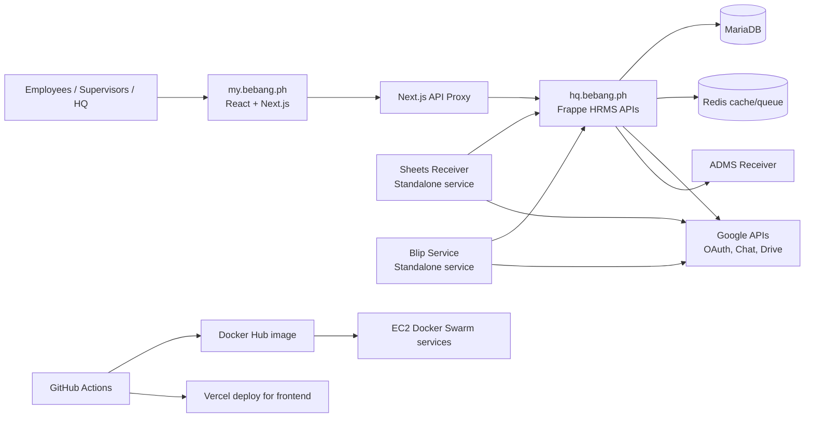

# Solution Architecture Document (SAD) - BEI ERP

**Version:** v1.4  
**Status:** Fact-audited and blocker-remediated (exec-ready baseline)  
**Last Updated:** 2026-02-26  
**Evidence Audit Window:** 2026-02-26  
**Owner:** Sam Karazi  
**Next Review:** 2026-03-05  
**Primary Owner:** Sam Karazi  
**Business Approver:** Sam Karazi (CEO)

## Purpose

This document is the single architecture reference for technical personnel onboarding to BEI ERP.
It defines system scope, architecture boundaries, reliability and security posture, deployment model, and governance.

## Fact Policy

Only repository evidence and validated local artifacts are used in this SAD.
If evidence is missing or conflicting, it is marked as an **Evidence Gap** and not replaced by assumptions.
Documentation update workflow is governed by `docs/architecture/DOCUMENTATION_TRUTH_PROTOCOL.md`.

## Section-to-Source Traceability Matrix

| SAD Section | Primary Source(s) | Additional Verification | Status |
|---|---|---|---|
| 1. Executive Summary | `docs/architecture/INDEX.md`, `docs/plans/system-flow-gaps-v3.md` | `output/l1/runs/*.json`, `output/l2/runs/*.json`, `output/l3/runs/*.json` | Complete |
| 2. Business Context and Scope | `docs/00_START_HERE.md` | `docs/MY_BEBANG_PH_COMPLETE_REFERENCE.md`, `docs/architecture/REPOSITORY_INVENTORY.md` | Complete |
| 3. Solution Overview | `docs/MY_BEBANG_PH_COMPLETE_REFERENCE.md` | `.github/workflows/build-and-deploy.yml` | Complete |
| 4. Architecture Building Blocks | `docs/architecture/INDEX.md`, `docs/MY_BEBANG_PH_COMPLETE_REFERENCE.md` | Local code audit (`hrms/api`, `hrms/hr/doctype`, `bei-tasks/app`) | Complete |
| 5. Data Architecture and ERD Summary | `docs/architecture/erd.md` | `frappe_docker_build/stack-swarm.yml`, `hrms/services/sheets_receiver/README.md` | Complete |
| 6. API and Integration Architecture | `docs/MY_BEBANG_PH_COMPLETE_REFERENCE.md`, `docs/testing/ROUTE_REGISTRY.md` | `bei-tasks/app/api/**`, `hrms/api/*.py` | Complete |
| 7. Security Architecture | `docs/architecture/SECURITY_ARCHITECTURE.md`, `docs/GOOGLE_OAUTH_RUNBOOK.md` | `hrms/api/google_login.py`, `hrms/utils/google_oauth.py`, `hrms/hr/doctype/user_oauth_token/user_oauth_token.json` | Complete |
| 8. Reliability and NFR/SLO | `docs/architecture/NFR_SLO_BASELINE.md` | `.github/workflows/uptime-check.yml`, `synthetic-monitoring.yml`, run artifacts | Complete |
| 9. Deployment Topology and Release Flow | `.github/workflows/build-and-deploy.yml` | `.claude/rules/deployment.md`, `frappe_docker_build/stack-swarm.yml`, `docs/architecture/HOSTING_AND_DOMAINS.md` | Complete |
| 10. DR Strategy | `docs/architecture/DEPLOYMENT_TOPOLOGY_AND_DR.md`, `docs/deployment/ROLLBACK_RUNBOOK.md` | `.github/workflows/build-and-deploy.yml`, `frappe_docker_build/stack-swarm.yml` | Complete |
| 11. Testing Strategy and Quality Gates | `docs/testing/L3_V2_METHOD.md`, `docs/testing/E2E_RULES.md`, `docs/testing/scenarios/index.yaml` | `docs/testing/ROUTE_REGISTRY.md`, `docs/architecture/FLOW_CATALOG.md`, run artifacts | Complete |
| 12. Observability and Operations | `.github/workflows/uptime-check.yml`, `synthetic-monitoring.yml` | `hrms/hooks.py`, `docs/GOOGLE_OAUTH_RUNBOOK.md` | Complete |
| 13. Ownership and Governance | `docs/architecture/OWNERSHIP_MATRIX.md`, `.claude/rules/core-governance.md` | `docs/architecture/adr/ADR-0005-ownership-bootstrap-sam.md` | Complete |
| 14. ADR Index and Decisions | `docs/architecture/adr/ADR-INDEX.md` | `docs/architecture/FRONTEND_ARCHITECTURE_DECISION_2026-01-22.md`, `docs/00_START_HERE.md` | Complete |
| 15. Open Risks and Roadmap | `docs/architecture/gaps/gap-register.md`, `docs/architecture/gaps/gap-register.csv` | `docs/plans/system-flow-gaps-v3.md` | Complete |
| 16. Glossary and Onboarding Quick-Start | `docs/00_START_HERE.md`, `docs/testing/L3_V2_METHOD.md` | Local dev/deploy/testing files | Complete |

## 1) Executive Summary

BEI ERP is implemented as a two-platform solution:

1. `my.bebang.ph` employee-facing app (React/Next.js).
2. `hq.bebang.ph` backend (Frappe HRMS fork).

Validated architecture snapshot:

1. Architecture scan date: 2026-02-23 (`docs/architecture/INDEX.md`).
2. Gaps tracked: 96 total (register and CSV both show 96 entries).
3. Full route map: 169 mapped rows, 169 registry-bound, 0 not yet bound (`system-flow-gaps-v3-full-route-map.md`).
4. Cross-flow test state (2026-02-25):
   - L1: total 54, passed 18, warned 36, failed 0 (`output/l1/runs/l1_run_20260225_114617_024421.json`).
   - L2: total 57, passed 57, failed 0 (`output/l2/runs/l2_run_20260225_114718_554264.json`).
   - L3-v2: PASS 10, FAIL 0, NOT_IMPLEMENTED 0 (`output/l3/runs/l3_v2_run_20260225_121602_104741.json`).

Independent code audit (2026-02-26) in this workspace:

1. `hrms/api`: 58 Python files, 677 `@frappe.whitelist` decorators.
2. `hrms/hr/doctype`: 111 BEI custom DocType folders.
3. `C:\Users\Sam\Projects\Claude\bei-tasks\app`: 39 `app/api/**/route.*` files, 57 `app/**/page.*` files.

## 2) Business Context and System Scope

### 2.1 Business Context

From `docs/00_START_HERE.md`, the workspace operates as three connected branches:

1. BEI-ERP (this repo): core system and project brain.
2. bei-tasks repo: employee app deployed to `my.bebang.ph`.
3. Bebang Analytics: dashboard/ETL branch at `C:\Users\Sam\.cursor\Projects\bebang-analytics`.

Repository-level details (paths/remotes/branches/commits) are tracked in
`docs/architecture/REPOSITORY_INVENTORY.md`.

### 2.2 In Scope (SAD v1)

1. System architecture for `my.bebang.ph` and `hq.bebang.ph`.
2. Backend API architecture, data model, integrations, deployment, testing, and operations.
3. Governance and decision recording status.

### 2.3 Out of Scope (SAD v1)

1. Department process SOP detail per module.
2. Third-party vendor internals outside repo evidence.
3. Multi-region and advanced scaling targets beyond current v1 baseline artifacts.

## 3) Solution Overview

### 3.1 Context Diagram

### 3.2 High-Level Request Path

1. User actions originate in `my.bebang.ph` routes.
2. Requests flow through Next.js API routes/proxy to Frappe endpoints.
3. Frappe persists records in MariaDB DocTypes and runs scheduler/background tasks.
4. Google/ADMS/service integrations are called as needed.
5. L1/L2/L3 and deployment checks validate release behavior.

## 4) Architecture Building Blocks

### 4.1 Frontend Block (my.bebang.ph)

Evidence:

1. Stack in `bei-tasks/package.json`: Next.js 16.0.8, React 19.2.1, Tailwind v4, Shadcn ecosystem.
2. Local code audit (2026-02-26): 39 API route handlers under `app/api`, 57 page routes under `app`.
3. RBAC implementation in `bei-tasks/lib/roles.ts`: 11 role constants, 26 module constants, module access matrix.

### 4.2 Backend Block (Frappe HRMS)

Evidence:

1. `hrms/api` contains 58 Python modules.
2. 677 whitelisted API decorators in `hrms/api`.
3. Scheduler/doc-event wiring in `hrms/hooks.py` covers approval queue notifications, store-order notifications, SLA checks, overtime detection, billing schedules, and other jobs.

### 4.3 Data/DocType Block

Evidence:

1. 111 BEI custom DocType folder artifacts in `hrms/hr/doctype/bei_*`.
2. ERD documentation covers 6 domains (`docs/architecture/erd.md`).
3. Gap register and flow docs identify unresolved write-path and lifecycle gaps in critical modules.

### 4.4 Integration Block

Active integration surfaces documented in repo:

1. Google OAuth/Chat/Drive (`hrms/api/google_*.py`, `hrms/utils/google_oauth.py`, runbook).
2. ADMS monitored endpoint (`https://adms.bebang.ph/health` in uptime workflow).
3. Sheets Receiver standalone service (`hrms/services/sheets_receiver/*`).
4. Blip standalone service (`hrms/services/blip/*`).

## 5) Data Architecture and ERD Summary

### 5.1 Domain Model Coverage

`docs/architecture/erd.md` defines 6 ERD domains:

1. HR and Payroll
2. Procurement and Finance
3. Store Operations
4. Warehouse and Logistics
5. Commissary
6. Projects and Maintenance

### 5.2 Core Data Stores

Current architecture evidence indicates:

1. MariaDB runs as a Docker Swarm service (`db`) in `frappe_docker_build/stack-swarm.yml`.
2. Redis services (`redis-cache`, `redis-queue`) are part of the same swarm topology.
3. Sheets Receiver keeps operational SQLite state (`sheets_receiver.db`) for sync/audit logs.

### 5.3 Critical Data Integrity Risks (Documented)

From ERD notes and gap register:

1. BEI Shift Record to Attendance bridge missing (payroll visibility risk).
2. ERP sync functions with log-only behavior in specific finance/inventory domains.
3. Multiple frontend coverage gaps for existing backend data paths.

## 6) API and Integration Architecture

### 6.1 API Surfaces

1. Next.js API routes in `bei-tasks/app/api/**`.
2. Frappe whitelisted methods in `hrms/api/*.py`.
3. Scenario and route binding references in `docs/testing/ROUTE_REGISTRY.md` and `docs/plans/system-flow-gaps-v3-full-route-map.md`.

### 6.2 Authentication Pattern (Observed)

From `bei-tasks/app/api/frappe/[...path]/route.ts`:

1. Session cookie (`sid`) and `csrf_token` are forwarded to Frappe.
2. `X-Frappe-CSRF-Token` is added on mutating methods.

From multiple API route handlers in `bei-tasks/app/api/**`:

1. Some handlers use token fallback (`Authorization: token ...`) if API key/secret env vars exist.
2. This mixed pattern exists in current code and is not hypothetical.

### 6.3 External Integration Endpoints (Documented)

1. Google OAuth token exchange/refresh: `oauth2.googleapis.com/token`.
2. Google Chat spaces API: `chat.googleapis.com/v1/spaces`.
3. Google Drive files API: `www.googleapis.com/drive/v3/files`.
4. Sheets Receiver webhook: `/sheets-webhook` via standalone service deployment docs.

## 7) Security Architecture (AuthN/AuthZ/Secrets/Audit)

### 7.1 Authentication

Evidence in `hrms/api/google_login.py`:

1. Guest-allowed OAuth login endpoint is implemented.
2. Email domain is explicitly enforced against allowlist/default (`bebang.ph`).
3. Session is established using Frappe login manager after successful OAuth flow.

### 7.2 Token Security

Evidence in `hrms/hr/doctype/user_oauth_token/user_oauth_token.json` and `hrms/utils/google_oauth.py`:

1. OAuth token fields are `Long Text` (not Password fields).
2. Tokens are encrypted/decrypted via Frappe `encrypt()`/`decrypt()` helpers.
3. Legacy Password-field token migration logic exists.

### 7.3 Authorization

1. Frontend RBAC matrix is in `bei-tasks/lib/roles.ts`.
2. Token document permissions are restricted to `System Manager` in DocType JSON.
3. Route registry ties routes to test roles for validation coverage.

### 7.4 Secrets Handling

1. `docs/00_START_HERE.md` mandates Doppler for secrets and forbids credential files.
2. Deployment workflows consume GitHub secrets for AWS, Docker, and Sentry.

### 7.5 Audit and Security Gates

1. OAuth and integration failures are logged via `frappe.log_error` in Google integration modules.
2. `.github/workflows/dm-checklist-gate.yml` posts Deadly Mistakes checklist reminders for GL/payment pattern changes.

### 7.6 Security Evidence Gaps

1. `docs/MY_BEBANG_PH_COMPLETE_REFERENCE.md` contains literal API key/secret examples in env section; treat as credential-exposure risk requiring rotation and redaction.
2. Key/token rotation cadence is not yet documented in architecture artifacts.

## 8) Reliability Architecture and NFR/SLO Baseline

### 8.1 Measured Reliability Snapshot (Evidence)

1. L1 run on 2026-02-25: 54 total, 18 passed, 36 warned, 0 failed.
2. L2 run on 2026-02-25: 57 total, 57 passed, 0 failed.
3. L3-v2 run on 2026-02-25: 10 pass, 0 fail, 0 not implemented.
4. Prior L3 baseline on 2026-02-24: 8 pass, 1 fail, 1 not implemented.

### 8.2 Monitoring Mechanisms Present

1. `uptime-check.yml` checks `hq.bebang.ph`, `my.bebang.ph`, and ADMS health endpoint.
2. `synthetic-monitoring.yml` runs click-path Playwright tests and can alert via Google Chat webhook.

### 8.3 NFR/SLO Baseline Status

Numeric SLO targets are now documented in `docs/architecture/NFR_SLO_BASELINE.md`, including:

1. Availability targets for `hq.bebang.ph` and `my.bebang.ph`.
2. Latency targets for health probes.
3. Synthetic monitoring pass-rate target.
4. Release gate requirement: `L1/L2/L3` fail counts must be zero before rollout.

Remaining gap:

1. Monthly SLO rollup automation is not yet documented as a single dashboard spec.

## 9) Deployment Topology and Release Flow

### 9.1 Backend Deployment Pipeline (Evidence)

From `.github/workflows/build-and-deploy.yml`:

1. Trigger: push to `production` (paths scoped) and manual dispatch.
2. Build: Docker image built/pushed (`samkarazi/bebang-erpnext-hrms:v15`).
3. Deploy: AWS SSM runs Docker Swarm `docker service update` on EC2 `i-026b7477d27bd46d6`.
4. Services updated: backend, frontend, websocket, queue-short, queue-long, scheduler.
5. Optional migrate and asset sync steps run if enabled.
6. Post-deploy checks: Frappe ping and CSS/JS asset load validation.

### 9.2 Frontend Deployment Rule

From `.claude/rules/deployment.md`:

1. Vercel production deploy is required after push for bei-tasks.
2. Cache-bust marker update and live verification are required by policy.

### 9.3 Topology Notes

1. Swarm topology file includes `db` and Redis services in same deployment stack.
2. Standalone services (`sheets-receiver`, `blip-assistant`) deploy independently and call `hq.bebang.ph` APIs.

Canonical infra component inventory (AWS account, VPC/subnets, DNS/certificates, secrets, backup surfaces) is tracked in
`docs/architecture/INFRASTRUCTURE_INVENTORY.md`.

## 10) DR Strategy (RTO/RPO + Recovery Procedures)

### 10.1 Current Documented Recovery Actions

From `docs/deployment/ROLLBACK_RUNBOOK.md`:

1. Backend rollback: `docker service rollback` for core services.
2. Frontend rollback: Vercel dashboard promote/redeploy (or CLI rollback).
3. Database restore: `bench --site hq.bebang.ph restore <backup>` with optional file restores.
4. Post-rollback sanity checks are required.

### 10.2 DR Baseline Status

`docs/architecture/DEPLOYMENT_TOPOLOGY_AND_DR.md` now defines explicit DR targets:

1. Tier 1 (`hq.bebang.ph`, `my.bebang.ph`): `RTO=120 minutes`, `RPO=24 hours`.
2. Tier 2 integrations (ADMS/Sheets/Blip): `RTO=240 minutes`, `RPO=24 hours`.

Remaining gap:

1. Backup frequency/retention source-of-truth still needs explicit documentation in architecture artifacts.

## 11) Testing Strategy and Quality Gates

### 11.1 Test Stack

From `docs/testing/L3_V2_METHOD.md`:

1. Manifest check: `python scripts/testing/l3_manifest_check.py`.
2. Runner: `python scripts/testing/l3_v2_runner.py --module <module|all>`.
3. Report generation: `python scripts/testing/l3_generate_run_report.py --run-file ...`.

### 11.2 Mandatory Test Rules

From `docs/testing/E2E_RULES.md`:

1. Submit plus backend verification is mandatory.
2. Backend errors are FAIL.
3. Browser-driven L3 path is mandatory; API-first submission in L3 is forbidden.
4. Regression bank is append-only.

### 11.3 Coverage State

From `docs/testing/scenarios/index.yaml` and V3 plan artifacts:

1. Flow status: `procure-to-pay` ready; `dispatch-warehouse-commissary` ready; `hire-to-onboard` ready.
2. Full map coverage: 169 mapped routes/features; 169 currently route-registry bound.

### 11.4 Release Gate Reality

Runtime is green on latest referenced run IDs, but documented flow coverage remains incomplete for target cross-module flows.

## 12) Observability and Operations Model

### 12.1 Current Signals

1. GitHub workflow health checks for API/app/ADMS.
2. Synthetic click-path monitoring workflow with artifact upload on failure.
3. Sentry DSN propagation in backend deploy workflow.
4. OAuth/Chat/Drive error logging into Frappe Error Log.
5. Scheduled operations in `hrms/hooks.py` (including SLA checks and recurring jobs).

### 12.2 Operations Runbooks in Repo

1. `docs/GOOGLE_OAUTH_RUNBOOK.md`
2. `docs/deployment/ROLLBACK_RUNBOOK.md`
3. `hrms/services/sheets_receiver/README.md`

### 12.3 Operations Evidence Gaps

1. No consolidated observability dashboard specification is present in architecture docs.
2. First weekly compliance rollup after schedule re-enable is pending.

## 13) Ownership and Governance Model

### 13.1 Current Governance Facts

1. Accountable architecture owner is `Sam Karazi` across all architecture domains (`OWNERSHIP_MATRIX.md`).
2. Business approver is `Sam Karazi (CEO)`.
3. Core governance rule is evidence-only and requires project-brain reads before work (`.claude/rules/core-governance.md`).

### 13.2 Ownership Coverage Status

Canonical ownership matrix exists at `docs/architecture/OWNERSHIP_MATRIX.md`.

Current architecture-critical ownership:

1. HR and Payroll domain owner: Sam Karazi.
2. Procurement and Finance domain owner: Sam Karazi.
3. Store Ops/Inventory/Warehouse domain owner: Sam Karazi.
4. Security owner: Sam Karazi.
5. SRE/Operations owner: Sam Karazi.

### 13.3 Governance Process (Observed)

1. Rules and policy maintained in `.claude/rules/*`.
2. Delivery pipeline enforced via GitHub workflows.
3. Testing evidence and route/scenario catalogs maintained under `docs/testing/*`.
4. Architecture decisions are now tracked under `docs/architecture/adr/*`.

## 14) ADR Index and Key Decisions

### 14.1 ADR Repository Status

`docs/architecture/adr/` directory and `ADR-INDEX.md` are now present with initial accepted ADR set.

### 14.2 Current ADR Set (Accepted)

1. `ADR-0001`: Frontend platform (Next.js + React + Shadcn on Vercel).
2. `ADR-0002`: Backend deployment topology (Swarm on EC2 via Actions + SSM).
3. `ADR-0003`: OAuth token storage model (encrypted token payloads).
4. `ADR-0004`: L1/L2/L3 test gate model.
5. `ADR-0005`: Ownership bootstrap (Sam as accountable owner).

### 14.3 Existing Decision Records (Non-ADR Format)

1. `docs/architecture/FRONTEND_ARCHITECTURE_DECISION_2026-01-22.md` (Status: APPROVED).
2. ERP migration decisions captured in `docs/00_START_HERE.md` (valuation model, commissary legal model, PO approval levels, go-live date).

## 15) Open Risks, Evidence Gaps, and Roadmap

### 15.1 Highest Risks (Evidence-Based)

1. Architecture gap backlog remains high (96 total; urgent set present).
2. Cross-module flow catalog status is now `ready`, but execution evidence depth still varies by domain.
3. SLO and DR targets are defined, but compliance history is still short (new baseline).
4. Backup frequency/retention source-of-truth is still not explicit in architecture docs.

### 15.2 Source Consistency Risks (Validated)

1. Route/API metric divergence between static docs and current `bei-tasks` code counts.
2. Infrastructure narrative divergence: some older docs reference RDS architecture while current stack/workflow evidence uses swarm-local MariaDB service.
3. Gap register markdown priority totals do not match CSV priority totals (both have 96 rows, but severity distribution differs).

### 15.3 Architecture Roadmap (From SAD Plan)

1. Keep route-registry binding synchronized at 169/169 as routes evolve.
2. Redact/rotate credential-like examples from reference docs.
3. Document backup retention/frequency source-of-truth and DR drill cadence.
4. Add monthly SLO compliance rollup artifact.
5. Continue ADR backfill for additional high-impact decisions.
6. Enforce evidence-only updates via `docs/architecture/DOCUMENTATION_TRUTH_PROTOCOL.md`.

## 16) Glossary and Onboarding Quick-Start

### 16.1 Glossary

1. **Frappe HRMS**: Backend framework/application running on `hq.bebang.ph`.
2. **DocType**: Frappe metadata model for records/tables.
3. **L1/L2/L3**: API smoke, page-render, and workflow-level test layers.
4. **Route Registry**: Canonical route-role-endpoint mapping for test execution.
5. **Flow Coverage**: Scenario catalog status for end-to-end domain flows.
6. **DM Checklist**: Frappe Deadly Mistakes review checklist for GL/payment-risk changes.

### 16.2 Onboarding Quick-Start (Fact-Based)

1. Read in order:
   - `docs/00_START_HERE.md`
   - `docs/architecture/INDEX.md`
   - `docs/plans/system-flow-gaps-v3.md`
   - `docs/architecture/NFR_SLO_BASELINE.md`
   - `docs/architecture/SECURITY_ARCHITECTURE.md`
   - `docs/architecture/DEPLOYMENT_TOPOLOGY_AND_DR.md`
   - `docs/architecture/OWNERSHIP_MATRIX.md`
   - `docs/architecture/REPOSITORY_INVENTORY.md`
   - `docs/architecture/INFRASTRUCTURE_INVENTORY.md`
   - `docs/architecture/HOSTING_AND_DOMAINS.md`
   - `docs/architecture/FLOW_CATALOG.md`
   - `docs/architecture/snapshots/2026-02.md`
   - `docs/architecture/BRANCH_INTENT_handoff-rajat-sad-2026-02-26.md`
   - this SAD
2. Verify environments:
   - `https://hq.bebang.ph/api/method/frappe.ping`
   - `https://my.bebang.ph`
3. Verify test catalog status:
   - `docs/testing/scenarios/index.yaml`
   - `docs/testing/ROUTE_REGISTRY.md`
4. Run L3 baseline checks locally from repo scripts (see Section 11 commands).
5. Review deploy and rollback paths:
   - `.github/workflows/build-and-deploy.yml`
   - `docs/deployment/ROLLBACK_RUNBOOK.md`
6. Before production-impacting edits, ensure role/account and seed-data prerequisites are explicit (V3 no-shortcut policy).

---

## Appendix A - Fact Audit Snapshot (2026-02-26)

| Item | Verified Value | Evidence |
|---|---|---|
| Backend API files | 58 (`hrms/api/*.py`) | Local filesystem audit (2026-02-26) |
| Whitelisted endpoints marker count | 677 `@frappe.whitelist` lines | `rg '^\s*@frappe.whitelist' hrms/api` (2026-02-26) |
| BEI custom DocType count | 111 (`bei_*` folders) | `hrms/hr/doctype/bei_*` directory audit (2026-02-26) |
| Frontend API route files | 39 (`../bei-tasks/app/api/**/route.*`) | Local filesystem audit (2026-02-26) |
| Frontend page files | 57 (`../bei-tasks/app/**/page.*`) | Local filesystem audit (2026-02-26) |
| Full route map rows | 169 | `docs/plans/system-flow-gaps-v3-full-route-map.md` table parse |
| Registry-bound routes in full map | 169 | Same file table parse |
| L3-v2 latest all-module run | PASS 10 / FAIL 0 / NI 0 | `output/l3/runs/l3_v2_run_20260225_121602_104741.json` |

## Change Log

| Date | Version | Change |
|---|---|---|
| 2026-02-26 | v0.1 | Initial SAD skeleton with traceability matrix |
| 2026-02-26 | v1.0 | Completed all 16 sections with evidence-backed content and explicit evidence gaps |
| 2026-02-26 | v1.1 | Added ownership matrix, NFR/SLO baseline, security architecture, deployment+DR baseline, ADR index/set, and updated section status semantics |
| 2026-02-26 | v1.2 | Refreshed live code footprint metrics and added documentation truth protocol reference |
| 2026-02-26 | v1.3 | Synced flow/route coverage closure state (169/169 route binding; flow statuses ready) |
| 2026-02-26 | v1.4 | Added hosting/domains inventory link, flow catalog link, monthly snapshot link, and review metadata for governance cadence |
