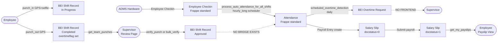
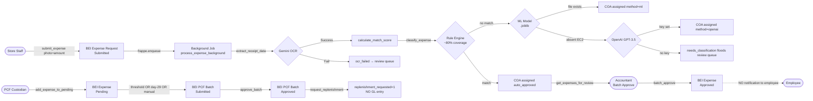

# Critical Path Diagrams
**Scanned:** 2026-02-23 | **Previous Scan:** 2026-02-17 | **Commit:** 7b998877f

Five critical end-to-end business flows with gap annotations.

---

## Critical Path 1: Store Order → Commissary → Pick → Trip → Delivery

```mermaid
graph LR
    A([Store Staff]) -->|submit_order| B[BEI Store Order\nPending Approval]
    B -->|BEI Approval Queue\nhooks.py GChat| C([Area Supervisor])
    C -->|approve_order| D[BEI Store Order\nApproved]
    D -->|_create_mr_for_store_order| E[Material Request\ndocstatus=1]

    E -->|get_pending_store_orders| F([Commissary Supervisor])
    F -->|fulfill_store_order| G[Stock Entry\nMaterial Transfer]
    G -->|async enqueue| H[G-046\nSales Invoice + Purchase Invoice]
    G -->|_update_status| D2[BEI Store Order\nReady for Dispatch]

    D2 -->|generate_pick_list| I[BEI Pick List\nPending]
    I -->|update_pick_item| I2[BEI Pick List\nIn Progress]
    I2 -->|complete_picking| I3[BEI Pick List\nPacked]
    I3 -->|confirm_loaded| J[Stock Entry per stop\nsubmitted]

    J -->|confirm_departure| K[BEI Distribution Trip\nIn Transit]
    K -->|confirm_delivery per stop| L[BEI Trip Stop\nDelivered]
    L -->|_send_delivery_notification| M([Next Store\nGChat 1-stop-away])
    L -->|async _create_delivery_billing| N[BEI Billing Schedule]

    M -->|get_expected_deliveries| O([Store Staff])
    O -->|complete_receiving| P[BEI Store Receiving\nCompleted]
    O -->|create_fqi_report if issues| Q[BEI FQI Report\nOpen]
```

| Step | Status | Issues |
|------|--------|--------|
| submit_order | LIVE | Cutoff gate 11:59 AM; emergency bypass exists |
| BEI Approval Queue creation | LIVE | Silent failure if no area supervisor set (GAP-020) |
| fulfill_store_order | LIVE | G-046 failure has no GChat alert (GAP-046) |
| generate_pick_list | LIVE | Idempotency guard present |
| preview_trip_stops (Trip Wizard) | **BROKEN** | Function does not exist (GAP-003) |
| get_vehicles (Trip Wizard) | **BROKEN** | Response format mismatch (GAP-029) |
| FQI severity field | **DATA LOSS** | Severity sent by FE; silently dropped (GAP-063) |

---

## Critical Path 2: PR → PO → GR → 3-Way Match → Payment

```mermaid
graph LR
    A([Requester]) -->|create_purchase_requisition| B[BEI PR\nDraft]
    B -->|submit_pr_for_approval| C[BEI PR\nPending Approval]
    C -->|approve_pr| D[BEI PR\nApproved]
    D -->|convert_pr_to_po| E[BEI PO\nDraft]
    E -->|submit_po_for_approval| F[BEI PO\nPending Mae]

    F -->|approve_po_mae ≤500K| G[BEI PO\nApproved]
    F -->|approve_po_mae >500K| F2[BEI PO\nPending Butch]
    F2 -->|approve_po_butch| G

    G -->|send_po_to_supplier| H([Supplier\nEmail])
    H -->|physical delivery| I([Warehouse Staff])
    I -->|create_goods_receipt| J[BEI GR\nDraft]
    J -->|submit_goods_receipt| J2[BEI GR\nSubmitted]
    J2 -->|complete_gr_inspection| J3[BEI GR\nAccepted]

    J3 -->|create_invoice| K[BEI Invoice\nDraft]
    K -->|submit_invoice_for_verification| K2[BEI Invoice\nPending Verification]
    K2 -->|verify_invoice_match| K3{Match?}
    K3 -->|Matched| K4[BEI Invoice\nVerified]
    K3 -->|Variance| K5[BEI Match Exception]
    K5 -->|approve_match_exception| K4

    K4 -->|create_payment_request| L[BEI Payment Request\nPending Review]
    L -->|approve_payment_review| L2[Pending Budget]
    L2 -->|approve_payment_budget| L3[Pending CFO]
    L3 -->|approve_payment_cfo| L4[Pending CEO or Approved]
    L4 -->|approve_payment_ceo| L5[BEI Payment\nApproved]
    L5 -->|mark_payment_complete| L6[BEI Payment\nPaid + EWT JV]
    L6 -->|upload_official_receipt| L7[BEI Payment\nClosed]
```

| Step | Status | Issues |
|------|--------|--------|
| PR → PO | LIVE | No GChat at any handoff; approvers must poll |
| GR → Frappe Purchase Receipt | **BROKEN** | frappe_purchase_receipt link exists but NOT created |
| mark_payment_complete EWT JV | **BUG** | Wrong AP account 2101001 vs 2101101; DM-1 violation (GAP-041) |
| BEI PO is_submittable | **BROKEN** | PO not submittable; approved POs editable post-approval (GAP-016) |
| send_or_follow_up | **BROKEN** | No email/GChat sent to supplier; counter + comment only (GAP-048) |

---

## Critical Path 3: GPS Punch → Attendance → Payroll → Payslip

| Step | Status | Issues |
|------|--------|--------|
| punch_in | LIVE | Row-level lock, anti-spoofing 300m, selfie required |
| **BEI Shift Record → Attendance** | **CRITICAL BUG** | No bridge; GPS punches NEVER reach payroll (GAP-001) |
| BEI Overtime Request | **HIGH BUG** | Daily cron creates OT docs; ZERO frontend for supervisors (GAP-005) |
| reject_correction | **BUG** | db_set("status") not doc.cancel(); docstatus stays draft (GAP-019) |

---

## Critical Path 4: Expense Submit → AI Classify → PCF Batch → Accounting → Reimbursement

| Step | Status | Issues |
|------|--------|--------|
| ML model | **BROKEN** | .joblib absent on EC2; silent fallback (GAP-034) |
| batch_approve notification | **BROKEN** | No employee DM when batch-approved |
| PCF admin create_pcf_fund | **BROKEN** | No frontend page (GAP-035) |
| replenishment lifecycle | **BROKEN** | Only flag set; no GL entry, no cheque tracking (GAP-036) |

---

## Critical Path 5: Maintenance Request → Projects → Completion → Finance Charge → Monthly Billing

```mermaid
graph LR
    A([Store Staff]) -->|submit_maintenance_request\nmulti-photo| B[BEI Maintenance Request\nOpen]
    B -.->|NO notification to Projects| PJ([Projects Team])

    SLA([SLA Scheduler\nhourly]) -->|check_sla_violations| GC([GChat SPACE_NOTIFICATIONS])

    PJ -->|assign_maintenance_request| B2[BEI Maintenance Request\nAssigned]
    B2 -->|update_maintenance_status In Progress| B3[In Progress]
    B3 -->|record_maintenance_completion\nafter_photo REQUIRED| COMP[BEI Maintenance Completion]
    COMP --> B4[BEI Maintenance Request\nCompleted]

    B4 -->|assess_maintenance_request| B4a[concern_type set]
    B4a -->|set_maintenance_charge if charge_to_store| B5[Pending Acknowledgement]
    B5 -.->|NO notification to Store| STORE([Store Supervisor])

    STORE -->|acknowledge_maintenance_charge| B6[Verified\ncharge_to_store=1]

    CRON([1st of Month 6AM\ngenerate_monthly_billing]) -->|query charge_to_store=1\nbilling_status=Not Billed| B6
    B6 --> BILLING[BEI Billing Schedule\nMaintenance fee]
    BILLING -->|approve_billing| BILLING2[Approved]
    BILLING2 -->|send_billing_to_store| EMAIL([Email to Store])
```

| Step | Status | Issues |
|------|--------|--------|
| submit_maintenance_request → Projects | **BROKEN** | Comment says "notifies Projects" but no GChat sent (GAP-032) |
| set_maintenance_charge → Store | **BROKEN** | No GChat to store supervisor (GAP-033) |
| record_maintenance_completion | LIVE | Only first photo saved (GAP-086) |
| Bypass path | **BUG** | Assigned→Pending Acknowledgement skips Completed state (GAP-087) |
| generate_monthly_billing | LIVE | Internal store charges excluded (GAP-088) |
| SOA generation | **BROKEN** | soa.py fully built; ZERO frontend (GAP-013) |
| Preventive Maintenance | **BROKEN** | No DocType, no API, no frontend (GAP-030) |
