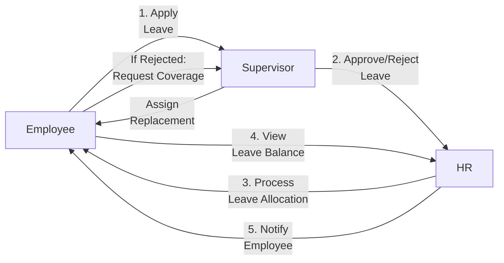

# Critical Path: Leave Approval
**Scanned:** 2026-02-17 | **Commit:** 7e445d778

```mermaid
graph LR
    EMPLOYEE["Employee"]
    SUPERVISOR["Supervisor"]
    HR["HR"]

    EMPLOYEE -->|1. Apply<br/>Leave| SUPERVISOR
    SUPERVISOR -->|2. Approve/Reject<br/>Leave| HR
    HR -->|3. Process<br/>Leave Allocation| EMPLOYEE
    EMPLOYEE -->|4. View<br/>Leave Balance| HR
    HR -->|5. Notify<br/>Employee| EMPLOYEE

    EMPLOYEE -->|If Rejected:<br/>Request Coverage| SUPERVISOR
    SUPERVISOR -->|Assign<br/>Replacement| EMPLOYEE
```
