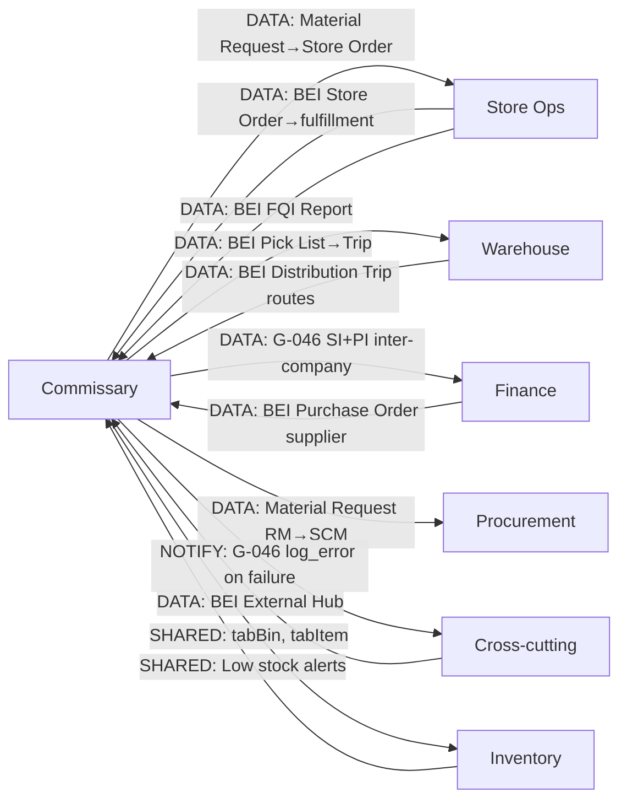

# Commissary — Department Connections
**Scanned:** 2026-02-23 | **Previous Scan:** 2026-02-17 | **Commit:** 7b998877f

## Key Connections Detail

| Connection | Type | DocType / Mechanism | Status |
|-----------|------|---------------------|--------|
| CO → Store Ops | DATA | fulfill_store_order → BEI Store Order → Ready for Dispatch | LIVE |
| CO → Warehouse | DATA | BEI Pick List (commissary generates; warehouse confirms) | LIVE |
| CO → Finance | DATA | G-046: Sales Invoice (BKI) + Purchase Invoice (BEI) async | LIVE |
| Store → CO | DATA | BEI FQI Report (store submits; commissary views in /quality) | LIVE |
| CO → Procurement | DATA | create_rm_requisition → Material Request (Draft for SCM approval) | LIVE |
| QC Form tab | BROKEN | submit_qc_form LIVE but /quality page QC tab not wired (GAP-044) | BROKEN |
| Requisition approval UI | BROKEN | approve_requisition LIVE; no frontend for SCM manager (GAP-045) | BROKEN |
| G-046 failure | BROKEN | Only frappe.log_error; no GChat alert on PI creation failure (GAP-046) | BROKEN |
| preview_trip_stops | BROKEN | Called from Trip Wizard; function does not exist (GAP-003) | BROKEN |
