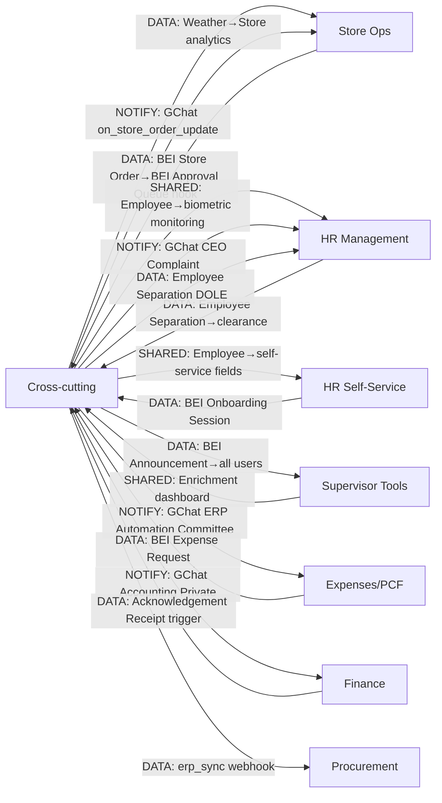

# Cross-cutting — Department Connections
**Scanned:** 2026-02-23 | **Commit:** 7b998877f

### Key Connections Detail

| Connection | Type | DocType / Mechanism | Status |
|-----------|------|---------------------|--------|
| CC → All | NOTIFY | `google_chat.send_message_to_space` (service account) | LIVE |
| CC → HR Self | NOTIFY | Employee clearance + exit interview | LIVE |
| CC → Finance | NOTIFY | GChat Accounting Private on AR receipt generation | LIVE |
| ERP Sync | BROKEN | 5/8 sync endpoints are STUB (log only, no DB writes) | BROKEN |
| Announcement count | BROKEN | Communication hub shows hardcoded "2 unread" | BROKEN |
| Announce admin UI | BROKEN | `create_announcement` LIVE; no admin FE page | BROKEN |
| Support ticket admin | BROKEN | No admin endpoints for ticket assignment/resolution | BROKEN |
| ADMS URL | CONFIG | `localhost:8080` hardcoded; should be in BEI Settings | RISK |
| Kudos leaderboard | BUG | period param ignored in SQL; always shows all-time | BUG |
| boarding_status | BROKEN | `on_separation_updated` fires but boarding_status never set "Completed" → duplicate GChat alerts | BROKEN |
