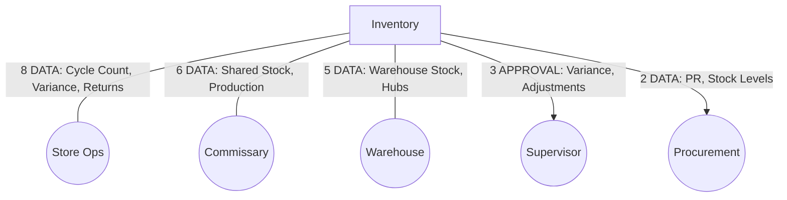

# Connection Map: Inventory
**Last Scanned:** 2026-02-23 | **Previous Scan:** 2026-02-17 | **Commit:** 7b998877f

```mermaid
graph TD
    Inventory[Inventory]
    
    StoreOps((Store Ops))
    Commissary((Commissary))
    Warehouse((Warehouse))
    Supervisor((Supervisor))
    Procurement((Procurement))

    Inventory ---|8 DATA: Cycle Count, Variance, Returns| StoreOps
    Inventory ---|6 DATA: Shared Stock, Production| Commissary
    Inventory ---|5 DATA: Warehouse Stock, Hubs| Warehouse
    Inventory -->|3 APPROVAL: Variance, Adjustments| Supervisor
    Inventory -->|2 DATA: PR, Stock Levels| Procurement
```
