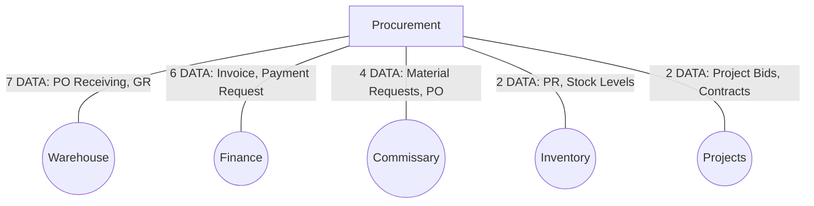

# Connection Map: Procurement
**Last Scanned:** 2026-02-23 | **Previous Scan:** 2026-02-17 | **Commit:** 7b998877f

```mermaid
graph TD
    Procurement[Procurement]
    
    Warehouse((Warehouse))
    Finance((Finance))
    Commissary((Commissary))
    Inventory((Inventory))
    Projects((Projects))

    Procurement ---|7 DATA: PO Receiving, GR| Warehouse
    Procurement ---|6 DATA: Invoice, Payment Request| Finance
    Procurement ---|4 DATA: Material Requests, PO| Commissary
    Procurement ---|2 DATA: PR, Stock Levels| Inventory
    Procurement ---|2 DATA: Project Bids, Contracts| Projects
```
