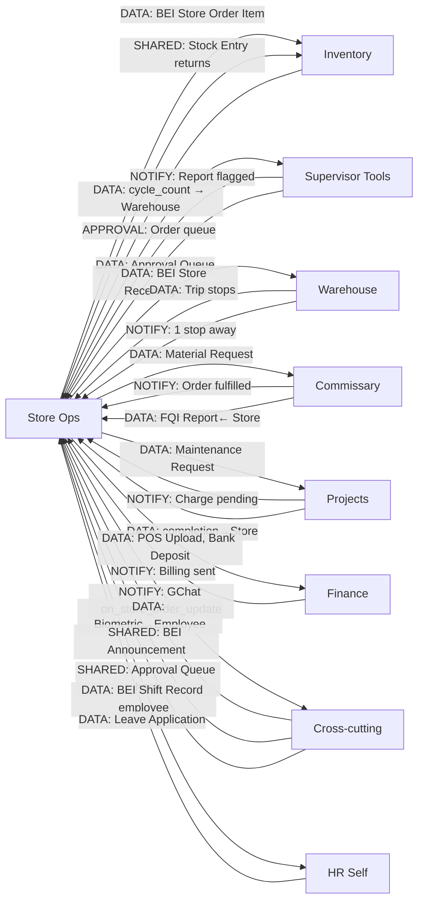

# Store Ops — Department Connections
**Scanned:** 2026-02-23 | **Previous Scan:** 2026-02-17 | **Commit:** 7b998877f

## Key Connections Detail

| Connection | Type | DocType / Mechanism | Status |
|-----------|------|---------------------|--------|
| SO → Supervisor | APPROVAL | BEI Approval Queue (order-approvals) | LIVE |
| SO → Warehouse | DATA | BEI Store Receiving linked to BEI Distribution Trip | LIVE |
| SO → Commissary | DATA | Material Request (Material Transfer) created on order approval | LIVE |
| SO → Projects | DATA | BEI Maintenance Request (store → Warehouse link) | LIVE |
| SO → Finance | DATA | BEI POS Upload, BEI Bank Deposit | LIVE |
| Warehouse → SO | NOTIFY | GChat "1 stop away" via _send_delivery_notification | LIVE |
| Commissary → SO | NOTIFY | BEI Store Order status → Ready for Dispatch | LIVE |
| Projects → SO | NOTIFY | **Missing** — no GChat when charge is set (GAP-033) | BROKEN |
| CC → SO | NOTIFY | hooks.py on_store_order_update → GChat | LIVE |
