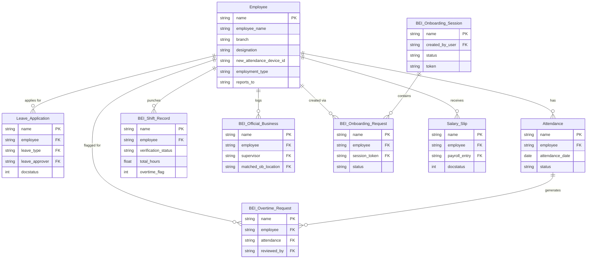
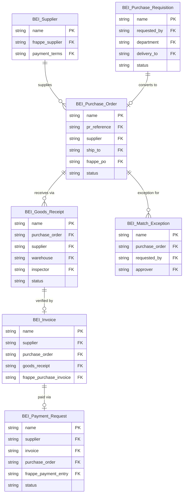
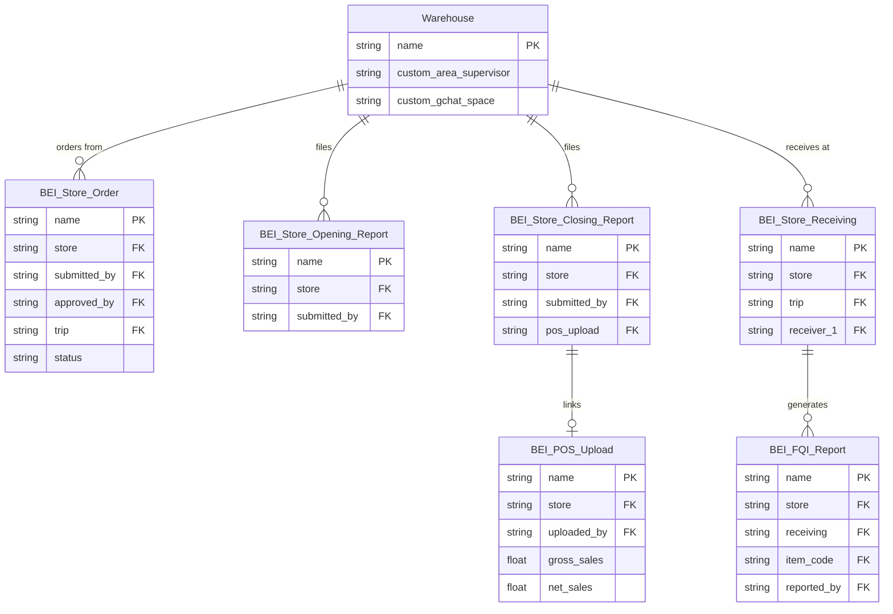
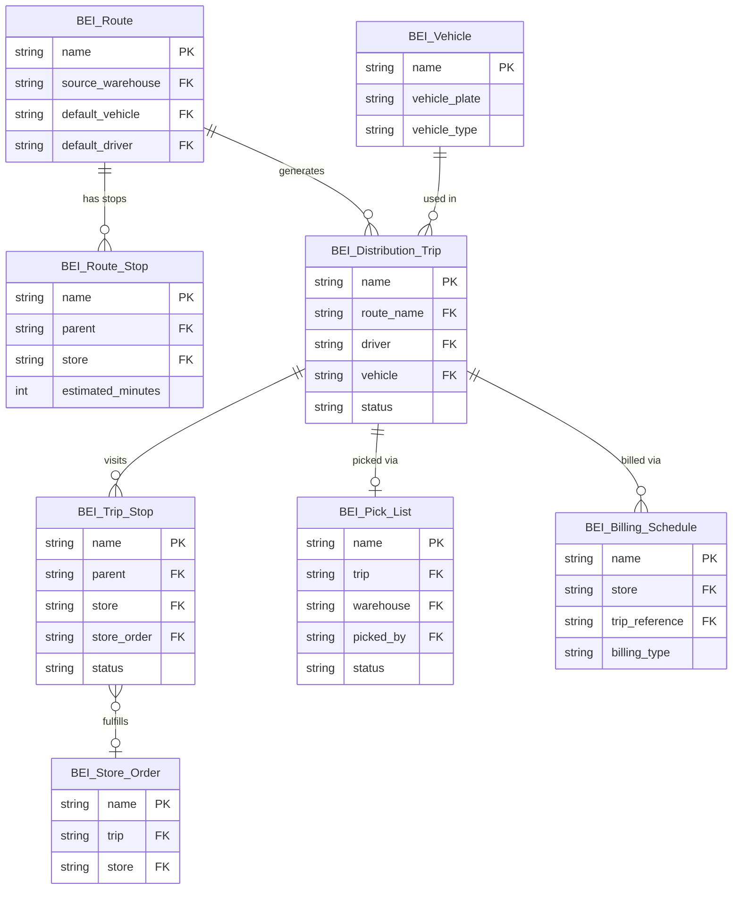
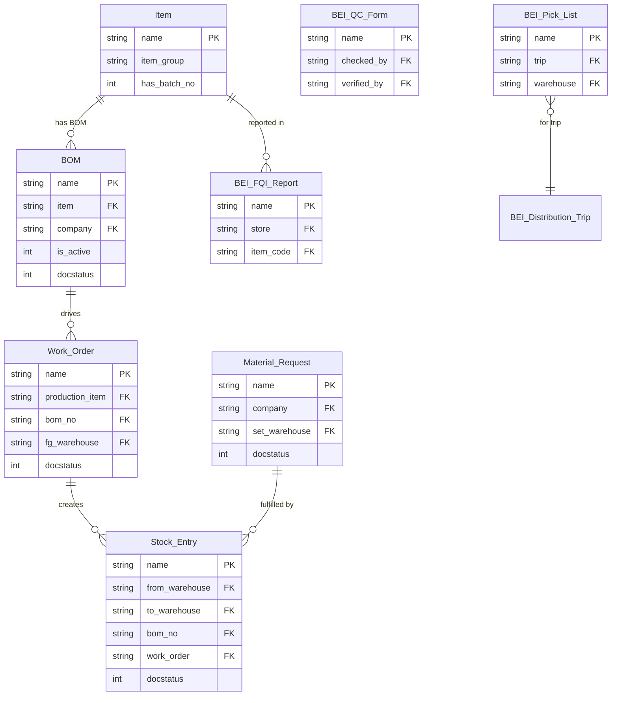
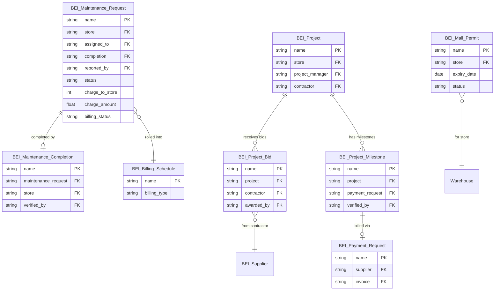

# Entity Relationship Diagrams
**Scanned:** 2026-02-23 | **Previous Scan:** 2026-02-17 | **Commit:** 7b998877f

Six domain ERDs covering all major BEI custom DocTypes and their Frappe standard relationships.

---

## Domain 1: HR & Payroll

**Critical Note:** BEI Shift Record and Frappe Attendance are NOT bridged (GAP-001 — Critical). GPS punches never reach payroll.

---

## Domain 2: Procurement & Finance

**Critical Notes:** BEI Purchase Order is NOT submittable (GAP-016). BEI GR does NOT create Frappe Purchase Receipt.

---

## Domain 3: Store Operations

**Critical Notes:** BEI POS Upload `gross_sales`/`net_sales` never populated (GAP-022).

---

## Domain 4: Warehouse & Logistics

**Critical Notes:** `preview_trip_stops` missing (GAP-003). `get_vehicles` response mismatch (GAP-029). `estimated_minutes` not propagated from route to trip stop (GAP-080).

---

## Domain 5: Commissary

**Critical Notes:** QC Form tab not wired in /quality frontend (GAP-044). G-046 async fires on `fulfill_store_order` Stock Entry submit.

---

## Domain 6: Projects & Maintenance

**Critical Notes:** Permits: 5 endpoints LIVE; 4 have no frontend (GAP-031). Preventive Maintenance: no implementation (GAP-030). Coaching Log → Appraisal link missing (GAP-075).

---

## DocType Count by Domain

| Domain | Custom DocTypes | Frappe Standard | Total |
|--------|----------------|-----------------|-------|
| HR & Payroll | 6 | 4 | 10 |
| Procurement & Finance | 7 | 0 | 7 |
| Store Operations | 9 | 1 | 10 |
| Warehouse & Logistics | 8 | 0 | 8 |
| Commissary | 4 | 5 | 9 |
| Projects & Maintenance | 6 | 0 | 6 |
| **Total** | **40** | **10** | **50** |

**New since Feb 17:** BEI Pick List, BEI Announcement Read Receipt, BEI Mall Permit (formalized in ERD)
