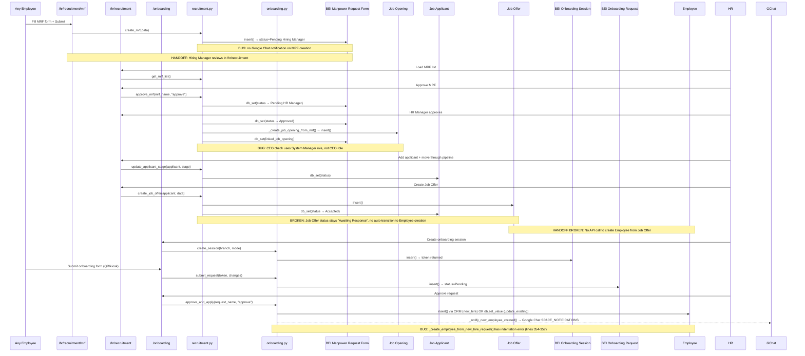

# Flow 01: Hire-to-Onboard
**Departments:** HR → Store Ops | **Scanned:** 2026-02-23 | **Agent:** flow-tracer-1

---

## Flow Diagram (Mermaid)

---

## Step-by-Step Trace

| Step | Actor | Action | Frontend Page | API Endpoint | DocType Created/Updated | Status |
|------|-------|--------|---------------|-------------|------------------------|--------|
| 1 | Any Employee | Fill and submit Manpower Request Form | `/hr/recruitment/mrf/page.tsx` | `recruitment.create_mrf()` | BEI Manpower Request Form (Draft → Pending Hiring Manager) | LIVE |
| 2 | System | Auto-set status via `db_set` | — | — | BEI Manpower Request Form (status = Pending Hiring Manager) | LIVE |
| 3 | Hiring Manager | View MRF list in pipeline | `/hr/recruitment/page.tsx` | `recruitment.get_mrf_list()` | — (read only) | LIVE |
| 4 | Hiring Manager | Approve at Stage 1 | `/hr/recruitment/page.tsx` | `recruitment.approve_mrf(action="approve")` | BEI Manpower Request Form (→ Pending HR Manager) | LIVE |
| 5 | HR Manager | Approve at Stage 2 | `/hr/recruitment/page.tsx` | `recruitment.approve_mrf(action="approve")` | BEI Manpower Request Form (→ Approved or Pending CEO) | LIVE (with bug) |
| 6 | System | Auto-create Job Opening | — | `_create_job_opening_from_mrf()` (internal) | Job Opening (status=Open), MRF.linked_job_opening set | LIVE |
| 7 | HR | View applicant pipeline | `/hr/recruitment/page.tsx` | `recruitment.get_recruitment_pipeline()` | — (read only) | LIVE |
| 8 | HR | Move applicant through stages | `/hr/recruitment/page.tsx` | `recruitment.update_applicant_stage()` | Job Applicant (status=Open/Replied/Hold/Accepted/Rejected) | LIVE |
| 9 | HR | Create Job Offer for accepted applicant | `/hr/recruitment/page.tsx` | `recruitment.create_job_offer()` | Job Offer (status=Awaiting Response), Job Applicant (→ Accepted) | LIVE |
| 10 | HR/Supervisor | Create onboarding session | `/onboarding/page.tsx` | `onboarding.create_session()` | BEI Onboarding Session (status=Active, token issued) | LIVE |
| 11 | New Hire / Supervisor | Submit onboarding data (QR/kiosk/manual) | `/onboarding/page.tsx` | `onboarding.lookup_employee()` → `onboarding.submit_request()` | BEI Onboarding Request (status=Pending) | LIVE (with bug) |
| 12 | HR | Approve onboarding request | `/onboarding/page.tsx` | `onboarding.approve_and_apply()` | Employee (created or updated), BEI Onboarding Request (→ Applied) | LIVE (with bug) |
| 13 | System | Send Google Chat notification | — | `_notify_new_employee_created()` | — | LIVE |

---

## Handoff Points

| From Dept | To Dept | Trigger | Mechanism | Status |
|-----------|---------|---------|-----------|--------|
| Any Employee (MRF submitter) | Hiring Manager | MRF created with status=Pending Hiring Manager | Status field on BEI Manpower Request Form; no notification sent | BROKEN — no notification to Hiring Manager |
| Hiring Manager | HR Manager | MRF status → Pending HR Manager | Status field; no notification sent | BROKEN — no notification to HR Manager |
| HR Manager | Store Ops / New Hire | MRF Approved → Job Opening created | `linked_job_opening` field set on MRF; Job Opening published if `internal_hiring_eligible=1` | PARTIAL — Job Opening created but no notification to dept/store |
| Recruitment (HR) | Onboarding (HR/Supervisor) | Job Offer created (status=Awaiting Response) | Manual — HR must separately initiate onboarding session; no auto-link from Job Offer to Onboarding | BROKEN — no bridge between Job Offer acceptance and onboarding trigger |
| Onboarding (HR) | Store Ops (Employee active) | `approve_and_apply()` creates Employee record | Google Chat to SPACE_NOTIFICATIONS; Employee record inserted | LIVE (notification works) |

---

## Broken Links / Gaps

| ID | Location | Problem | Impact | Severity |
|----|----------|---------|--------|----------|
| BL-01 | `recruitment.create_mrf()` | No notification sent to Hiring Manager when MRF is created. The MRF lands in "Pending Hiring Manager" with no alert to the approver. | Hiring Managers must poll the recruitment page to discover pending MRFs | HIGH |
| BL-02 | `recruitment.approve_mrf()` at Pending HR Manager stage | No notification sent to HR Manager when Hiring Manager approves. Status changes silently. | HR Managers unaware of MRFs waiting for their review | HIGH |
| BL-03 | `recruitment.approve_mrf()` CEO check | `"System Manager" not in roles` check at Pending CEO stage means any System Manager can approve CEO-level MRFs; actual CEO role is not verified | Governance bypass — non-CEO admin accounts can approve senior hires | MEDIUM |
| BL-04 | `recruitment.create_job_offer()` → Employee creation | No API path from Job Offer acceptance to Employee record creation. The flow requires HR to manually open `/onboarding/` and create a separate session. There is no `linked_onboarding_session` or auto-trigger. | Critical gap in automation; HR must remember to do onboarding manually after offer | HIGH |
| BL-05 | `onboarding._create_employee_from_new_hire_request()` lines 354-357 | Indentation bug: `now = now_datetime()` and `company = ...` at lines 354-356 are not inside the `try` block, misaligned with the surrounding `employee_doc = frappe.get_doc(...)`. Python may interpret as un-indented code at module level causing `SyntaxError`. | If triggered, `approve_and_apply` for new hires crashes at runtime | HIGH |
| BL-06 | `recruitment.get_recruitment_metrics()` | `avg_time_to_fill` uses `DATEDIFF(modified, creation)` on Job Opening. `modified` changes on any update, not just when status goes to Closed. | Time-to-fill metric is inaccurate; will undercount or over-inflate based on edit frequency | LOW |
| BL-07 | Frontend pipeline stages vs backend stages | Frontend `PIPELINE_STAGES` shows: Applied, Screening, Interview, Offer, Hired, Rejected. Backend `update_applicant_stage` accepts: Open, Replied, Hold, Accepted, Rejected. Stage names do not match. | Pipeline kanban columns in the UI will always show 0 applicants because the backend statuses never equal the frontend stage names | HIGH |
| BL-08 | `recruitment.approve_mrf()` + `onboarding.py` | No `after_insert` hook on BEI Manpower Request Form in `hooks.py` for Google Chat notification. No `doc_events` for Job Offer either. | No real-time team alerts at any MRF approval stage | MEDIUM |
| BL-09 | `_create_employee_from_new_hire_request()` uses ORM `employee_doc.insert()` | MEMORY.md Lesson #6 documents that Frappe Employee ORM insert has "5 cascading validation traps". This function uses `frappe.get_doc(...).insert()` instead of direct SQL, which is the known-failing pattern. | New hire creation via onboarding approval may fail with cryptic Frappe validation errors | HIGH |

---

## Error Paths

| Trigger | What Happens | User Experience | Status |
|---------|-------------|----------------|--------|
| MRF submitted with missing required field | `frappe.throw()` in `create_mrf()` raises ValidationError | Frontend receives error JSON; form stays open with error message | LIVE |
| Hiring Manager tries to approve MRF they don't own | `dept_head != current_emp` check throws | Error returned to UI | LIVE |
| MRF rejected at any stage | `db_set("status", "Rejected")` — no comment unless `notes` provided | MRF stuck at Rejected with no audit trail if notes omitted | PARTIAL |
| `create_job_offer` for non-HR user | `_check_hr_permission()` throws | 403-equivalent Frappe error | LIVE |
| Onboarding session expired (>30 min) | `get_session()` returns `{"success": false, "code": "EXPIRED"}` and marks session Expired | Frontend should handle `EXPIRED` code; user shown error | LIVE |
| Onboarding `submit_request` with wrong branch employee | `BRANCH_MISMATCH` code returned from `lookup_employee()` | Frontend receives structured error; no Employee is created | LIVE |
| `approve_and_apply` with `decision="reject"` | `req.status = "Rejected"`, saved, returned | Clean rejection path | LIVE |
| `approve_and_apply` for new hire hits indentation bug | `SyntaxError` at import time or `NameError` for `now`/`company` variables | Entire `onboarding.py` module may fail to import; all onboarding endpoints return 500 | BROKEN (BL-05) |
| `approve_and_apply` update_existing fails to apply | `try/except` catches, logs error, returns `{"success": false, "code": "APPLY_FAILED"}` | Request stays "Approved" (not "Applied"); changes not applied to Employee | PARTIAL |

---

## Improvement Suggestions

| Feature | Current State | Suggested Improvement | Priority |
|---------|--------------|----------------------|----------|
| No notifications on MRF status transitions | Status changes silently via `db_set` | Add Google Chat notification to BEI Approval Queue (or direct Chat) at each approval stage, same pattern as `on_approval_queue_insert` hook | HIGH |
| Job Offer to Onboarding gap | Manual HR step required | Add `after_insert` hook on Job Offer that auto-creates a BEI Onboarding Session and notifies the designated supervisor | HIGH |
| Frontend pipeline stage names | "Applied/Screening/Interview/Offer/Hired" don't match backend "Open/Replied/Hold/Accepted/Rejected" | Either update backend `update_applicant_stage` valid_stages to match frontend labels, or add a mapping layer in the API | HIGH |
| CEO approval uses System Manager role | `System Manager` check is too broad | Add a dedicated "CEO" Frappe role; check that role in `approve_mrf` Pending CEO stage | MEDIUM |
| Onboarding new hire Employee creation | ORM insert prone to cascading validation errors | Switch `_create_employee_from_new_hire_request` to direct SQL INSERT per the pattern documented in MEMORY.md Lesson #6 | HIGH |
| Time-to-fill metric | Uses `modified` column (changes on any edit) | Add `closed_date` custom field to Job Opening; set it in the closing hook | MEDIUM |
| `get_mrf_list` non-HR scope | Non-HR sees own dept's MRFs — but dept is looked up live each call | Cache employee department on session/profile to avoid extra DB round-trip per page load | LOW |
