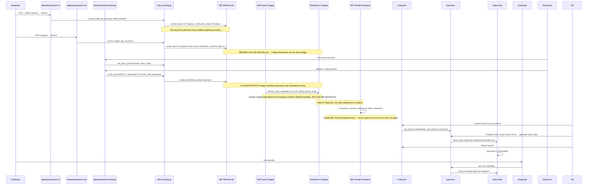

# Flow 02: Clock-In to Payslip
**Departments:** All Employees → HR → Finance | **Scanned:** 2026-02-23 | **Agent:** flow-tracer-1

---

## Flow Diagram (Mermaid)

---

## Step-by-Step Trace

| Step | Actor | Action | Frontend Page | API Endpoint | DocType Created/Updated | Status |
|------|-------|--------|---------------|-------------|------------------------|--------|
| 1 | Employee | Punch in (GPS + selfie) | `/attendance/punch-in/page.tsx` | `shift_tracking.punch_in()` | BEI Shift Record (status=In Progress, verification_status=Pending) | LIVE |
| 2 | System | Anti-spoofing validation (300m GPS check), selfie saved as Frappe File | — | Internal in `punch_in()` | File (private), linked to BEI Shift Record | LIVE |
| 3 | Employee | Punch out (GPS only) | `/attendance/punch-out/page.tsx` | `shift_tracking.punch_out()` | BEI Shift Record (status=Completed, total_hours/overtime_flag calculated) | LIVE |
| 4 | Supervisor | View team punch queue | `/attendance/punch/review/page.tsx` | `shift_tracking.get_team_punches()` | — (read only) | LIVE |
| 5 | Supervisor | Approve or flag individual punch | `/attendance/punch/review/page.tsx` | `shift_tracking.verify_punch()` | BEI Shift Record (verification_status=Approved or Flagged) | LIVE |
| 6 | Supervisor | Bulk approve punches (up to 100) | `/attendance/punch/review/page.tsx` | `shift_tracking.bulk_verify_punches()` | BEI Shift Record (bulk verification_status update) | LIVE |
| 7 | Scheduler (hourly) | Auto punch-out stale shifts | — | `hrms.tasks.auto_punch_out_stale_shifts` | BEI Shift Record (auto_punched_out=1, status=Completed) | LIVE |
| 8 | Scheduler (hourly_long) | Process auto-attendance from ADMS biometric checkins | — | `shift_type.process_auto_attendance_for_all_shifts()` | Attendance (Frappe standard — created from Employee Checkin, NOT from BEI Shift Record) | LIVE (separate path) |
| 9 | Scheduler (hourly_long) | Auto-create shift assignments from schedules | — | `shift_schedule_assignment.process_auto_shift_creation()` | Shift Assignment (Frappe) | LIVE |
| 10 | Employee | Submit attendance correction request | `/hr/attendance-correction/page.tsx` | `attendance_correction.submit_correction()` | Attendance Request (Frappe — docstatus=0) | LIVE |
| 11 | HR Manager | Review and approve correction | `/hr/attendance-correction/review/page.tsx` | `attendance_correction.approve_correction()` | Attendance Request (approved), Attendance (updated) | LIVE |
| 12 | HR Manager | Reject correction | `/hr/attendance-correction/review/page.tsx` | `attendance_correction.reject_correction()` | Attendance Request (db_set status=Rejected — docstatus NOT cancelled) | BUGGY |
| 13 | Scheduler (daily) | Detect overtime for all attendance | — | `overtime.scheduled_overtime_detection()` | BEI Overtime Request (created for each OT-flagged attendance) | LIVE |
| 14 | HR Manager | Create Payroll Entry (Frappe desk or payroll page) | `/hr/payroll/page.tsx` | `payroll.get_payroll_dashboard()`, `get_payroll_summary()` | Payroll Entry, Salary Slip (docstatus=0) | LIVE (dashboard); payroll entry creation via Frappe desk |
| 15 | HR Manager | Submit payroll run | `/hr/payroll/page.tsx` | `payroll.get_payroll_processing_status()` (polling) | Salary Slip (docstatus=1) | LIVE (polling) |
| 16 | HR Manager | Generate bank file | `/hr/payroll/page.tsx` | `payroll.generate_bank_file()` | (download, BPI tab-delimited format) | LIVE |
| 17 | Employee | View payslip | `/hr/payslip/page.tsx` | `payroll.get_my_payslips()` | Salary Slip (read) | LIVE |

---

## Handoff Points

| From Dept | To Dept | Trigger | Mechanism | Status |
|-----------|---------|---------|-----------|--------|
| Employee (punch-in/out) | Supervisor (punch review) | BEI Shift Record created with verification_status=Pending | Supervisor opens review page and sees pending punches; no push notification | PARTIAL — no notification to supervisor |
| Supervisor (punch approval) | HR (attendance) | verification_status=Approved on BEI Shift Record | No automatic write to Frappe Attendance from verified BEI Shift Record | BROKEN — two independent attendance tracks |
| ADMS Biometric | HR (attendance) | Employee Checkin recorded by ADMS hardware | Frappe `process_auto_attendance_for_all_shifts()` runs hourly; creates Attendance from Checkin, not from BEI Shift Record | LIVE (but separate from GPS punch track) |
| HR (attendance) | Finance (payroll) | Salary Slip generated from Payroll Entry using Attendance records | Payroll Entry reads Attendance DocType; BEI Shift Record data is NOT read by payroll | PARTIAL — payroll reads ADMS-based Attendance, GPS punches not used |
| HR (payroll) | Employee (payslip) | Salary Slip submitted (docstatus=1) | Employee queries via `get_my_payslips()`; no push notification | LIVE |
| HR (attendance correction) | HR (payroll) | Approved Attendance Request corrects Attendance record | Standard Frappe Attendance Request flow | LIVE |

---

## Broken Links / Gaps

| ID | Location | Problem | Impact | Severity |
|----|----------|---------|--------|----------|
| BL-01 | BEI Shift Record → Frappe Attendance | BEI Shift Record (GPS punch-in/out) and Frappe Attendance (ADMS biometric) are completely independent tracks. No code bridges verified BEI Shift Records into Frappe Attendance. Payroll reads Attendance, not BEI Shift Record. | GPS punches from the mobile app are NEVER reflected in payroll. If an employee only uses the app (no ADMS), they will have zero Attendance records and may appear absent during payroll processing. | CRITICAL |
| BL-02 | `attendance_correction.reject_correction()` | Uses `doc.db_set("status", "Rejected")` but `Attendance Request` is a submittable DocType (docstatus). Rejection should call `doc.cancel()` (docstatus=2). Currently rejected requests stay as draft docs with a custom status field set to Rejected, while Frappe considers them still open (docstatus=0). | HR correction review page shows "rejected" items that Frappe may still process or count as pending in workflow views | MEDIUM |
| BL-03 | `overtime.scheduled_overtime_detection()` → BEI Overtime Request | Daily cron creates BEI Overtime Request docs, but `hr_mgmt.md` Gap G1 confirms there is NO frontend page for supervisors to approve/reject overtime requests. `overtime.approve_overtime`, `reject_overtime`, `get_pending_overtime` are all LIVE backend functions but have zero frontend coverage. | Overtime requests pile up with no human action possible from the app. Payroll may silently include or exclude unapproved OT. | HIGH |
| BL-04 | `payroll.get_payroll_comparison()` | Function has an explicit `# TODO` comment — returns Frappe-only data labeled as APEX comparison. Frontend tab shows this data as if it were a meaningful comparison. | HR Manager sees a misleading payroll comparison tab that compares Frappe to itself, not to APEX | MEDIUM |
| BL-05 | No supervisor push notification when punch queue has pending items | `verify_punch` and `bulk_verify_punches` have no notification trigger. After employees punch in, supervisors receive no alert to check their review queue. | Supervisors must manually poll the review page | LOW |
| BL-06 | BEI Shift Record `velocity_flag` and `cross_day_flag` | Calculated in `validate()` of BEI Shift Record controller (on `punch_out` save). However, no action is taken when these flags are set — no alert, no auto-flag for HR review. Flags are visible in `get_my_punch_history` but no workflow triggers off them. | Suspicious punches (velocity spoofing, cross-day) are detected but silently ignored in the workflow | MEDIUM |
| BL-07 | `auto_punch_out_stale_shifts` has no FE visibility | Stale shifts are auto-closed hourly. The employee's punch history shows `auto_punched_out=1` but there is no notification to the employee or supervisor that this happened. | Employees may not realize their shift was auto-closed with incorrect hours; supervisors have no alert queue for auto-punched records | LOW |

---

## Error Paths

| Trigger | What Happens | User Experience | Status |
|---------|-------------|----------------|--------|
| Punch in when already punched in | Row-level lock query finds active shift; `frappe.throw("Already punched in")` | Error message shown in app | LIVE |
| GPS accuracy > 100m | `frappe.throw()` with accuracy value | App shows "GPS accuracy too low" with meters reading | LIVE |
| Adjusted pin > 300m from GPS | Haversine check throws with distance value | App shows distance error; user cannot punch in | LIVE |
| Selfie missing on punch-in | `frappe.throw("Selfie is required")` | App shows validation error | LIVE |
| Punch out with no active punch | `frappe.throw("No active punch found")` | App shows error | LIVE |
| Reverse geocode fails (AWS Location down) | `frappe.log_error()` but punch proceeds; address = raw coordinates | Punch recorded with GPS coordinates as address string; non-blocking | LIVE |
| `verify_punch` on non-subordinate employee | `frappe.throw("You can only verify punches for your team members")` | Supervisor sees permission error | LIVE |
| `bulk_verify_punches` > 100 items | `frappe.throw("Maximum 100 punches")` | Frontend receives validation error | LIVE |
| Payroll Entry not found | `get_payroll_processing_status()` returns `{payroll_entry: None, status: "No payroll entry found"}` | Dashboard shows empty state | LIVE |
| Salary Slip not submitted (docstatus=0) | `get_my_payslips()` query filters `docstatus=1`; draft slips not visible | Employee sees no payslips until HR submits payroll | LIVE (by design) |

---

## Improvement Suggestions

| Feature | Current State | Suggested Improvement | Priority |
|---------|--------------|----------------------|----------|
| GPS punch → Frappe Attendance bridge | BEI Shift Record and Attendance are completely separate tracks | Add `on_update` hook or scheduled task that creates/updates Frappe Attendance record when BEI Shift Record is verified (verification_status=Approved). Map: punch_in_time → time_in, punch_out_time → time_out, employee → employee. | CRITICAL |
| Overtime approval frontend | `overtime.py` is fully built with approve/reject/list endpoints | Add `/hr/overtime/page.tsx` for supervisors: pending OT list, approve/reject with reason, OT hours summary for payroll period | HIGH |
| Supervisor notification for pending punches | No notification mechanism | Add `after_insert` hook on BEI Shift Record to send push notification (or Google Chat) to the employee's direct supervisor | MEDIUM |
| `velocity_flag` / `cross_day_flag` workflow | Flags set but ignored | Add HR alert queue entry when these flags are set; auto-set `verification_status=Flagged` instead of Pending | MEDIUM |
| `reject_correction` bug | `db_set(status)` without docstatus cancel | Change to call `doc.cancel()` so the Attendance Request is properly closed in Frappe's workflow engine | MEDIUM |
| `get_payroll_comparison` APEX stub | Returns Frappe-only data with TODO | Either implement actual APEX data pull, or remove the tab and show a "coming soon" placeholder to avoid misleading HR | MEDIUM |
| Auto-punch-out notification | Silent auto-close | Send notification to employee and supervisor when `auto_punch_out_stale_shifts` fires for their shift | LOW |
