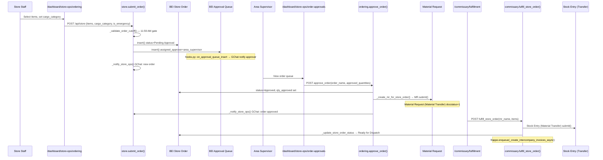
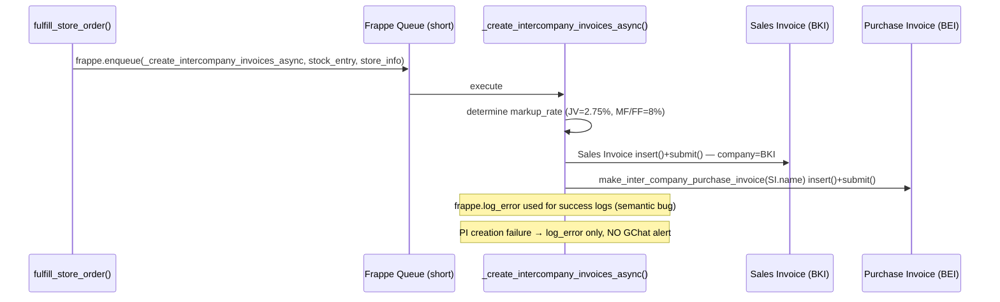

# Flow 04: Store Order to Delivery
**Departments:** Store Ops → Area Supervisor → Warehouse (Picking) → Commissary (Fulfillment) → Logistics (Trip) → Store Receiving
**Scanned:** 2026-02-23 | **Git Commit:** 7b998877f | **Agent:** flow-tracer-2

---

## Flow Diagram (Mermaid) — Part A: Order Creation to Commissary Fulfillment



## Flow Diagram (Mermaid) — Part B: G-046 Inter-Company Invoice (Async)



## Flow Diagram (Mermaid) — Part C: Picking, Trip, and Delivery

```mermaid
sequenceDiagram
    participant WH as Warehouse User
    participant PickPage as /warehouse/picking
    participant PickAPI as picking.generate_pick_list()
    participant PL as BEI Pick List
    participant DispPage as /warehouse/dispatch
    participant DispAPI as dispatch.confirm_departure()
    participant Trip as BEI Distribution Trip
    participant Driver as Driver/Dispatch
    participant TripAPI as dispatch.confirm_delivery()
    participant Store2 as Store Staff
    participant RecvPage as /dashboard/receiving
    participant StoreAPI2 as store.complete_receiving()
    participant Recv as BEI Store Receiving
    participant FQI as BEI FQI Report

    WH->>PickPage: Generate pick list for trip
    PickPage->>PickAPI: POST generate_pick_list(trip_name)
    PickAPI->>PL: insert() status=Pending — aggregated from BEI Store Orders
    WH->>PickPage: Update each item qty_picked
    PickPage->>PickAPI: POST update_pick_item() → status=In Progress
    WH->>PickPage: Complete picking
    PickPage->>PickAPI: POST complete_picking() → status=Packed
    WH->>PickPage: Confirm loaded
    PickPage->>PickAPI: POST confirm_loaded() → Stock Entry per stop, submit()
    PickAPI->>PL: status=Loaded
    WH->>DispPage: Confirm departure (driver, vehicle, temp, seal)
    DispPage->>DispAPI: POST confirm_departure() → Trip status=In Transit
    Driver->>TripAPI: POST confirm_delivery(trip, stop_idx, signature)
    TripAPI->>Trip: stop.status=Delivered; _update_trip_status()
    TripAPI->>TripAPI: enqueue(_create_delivery_billing) async [feature-flagged]
    TripAPI->>TripAPI: _send_delivery_notification() GChat "1 stop away" to next store
    Store2->>RecvPage: View expected deliveries
    RecvPage->>StoreAPI2: GET get_expected_deliveries(store)
    Store2->>RecvPage: Complete receiving checklist
    RecvPage->>StoreAPI2: POST complete_receiving(store, trip, items, signatures)
    StoreAPI2->>Recv: insert() status=Completed or With Issues
    Store2->>RecvPage: Submit FQI if issue found
    RecvPage->>StoreAPI2: POST create_fqi_report(store, issue_type, photo)
    StoreAPI2->>FQI: insert() status=Open
```

---

## Step-by-Step Trace

| Step | Actor | Action | Frontend Page | API Endpoint | DocType Created/Updated | Status |
|------|-------|--------|---------------|-------------|------------------------|--------|
| 1 | Store Staff | Browse orderable items | `/dashboard/store-ops/ordering` | `ordering.get_orderable_items` → `store.get_orderable_items` | tabItem, BEI Store Order Item (history) | LIVE |
| 2 | Store Staff | Check order schedule gate | `/dashboard/store-ops/ordering` | `ordering.validate_order_schedule` → `store.validate_order_schedule` | BEI Settings (read) | LIVE |
| 3 | Store Staff | Submit order (items + cargo_category) | `/dashboard/store-ops/ordering` | `ordering.submit_order` → `store.submit_order` | BEI Store Order (Pending Approval) + BEI Store Order Item | LIVE |
| 3a | System | GChat notification — new order | (background) | `_notify_store_ops()` → `google_chat.send_message_to_space` | — | LIVE |
| 3b | System | Route to approver queue | (background) | `_get_area_supervisor_for_store()` + `BEI Approval Queue.insert()` | BEI Approval Queue | LIVE — non-fatal if fails |
| 3c | System | GChat notify approver | (hooks.py after_insert) | `google_chat.on_approval_queue_insert` | — | LIVE |
| 4 | Area Supervisor | Review order queue | `/dashboard/store-ops/order-approvals` | `ordering.get_order_review_queue` | BEI Store Order, BEI Approval Queue | LIVE |
| 5 | Area Supervisor | Approve order (with optional qty adjustments) | `/dashboard/store-ops/order-approvals` | `ordering.approve_order` → `store.approve_order` | BEI Store Order (Approved), BEI Store Order Item (qty_approved) | LIVE |
| 5a | System | Create Material Request | (inline in approve_order) | `store._create_mr_for_store_order()` → `MR.submit()` | Material Request (docstatus=1, Material Transfer type) | LIVE — non-fatal if fails |
| 5b | System | GChat notify store — approved | (inline) | `_notify_store_ops()` | — | LIVE |
| 6 | Commissary Sup | View pending store orders | `/commissary/fulfillment` | `commissary.get_pending_store_orders` | Material Request (read) | LIVE |
| 7 | Commissary Sup | View order detail | `/commissary/fulfillment` | `commissary.get_order_detail(mr_name)` | Material Request, Bin | LIVE |
| 8 | Commissary Sup | Fulfill store order | `/commissary/fulfillment` | `commissary.fulfill_store_order(mr_name, items)` | Stock Entry (Material Transfer, submitted), BEI Store Order → Ready for Dispatch | LIVE |
| 8a | System | G-046: Enqueue inter-company invoices | (async, queue=short) | `commissary._create_intercompany_invoices_async` | Sales Invoice (BKI, submitted) + Purchase Invoice (BEI, submitted) | LIVE — async, no GChat on failure |
| 8b | System | Update store order status | (inline) | `_update_store_order_status_after_fulfillment()` | BEI Store Order → Ready for Dispatch or Partially Fulfilled | LIVE |
| 9 | Warehouse | Create trip (manual or from route) | `/warehouse/trips` or `/warehouse/trips/create` | `dispatch.create_trip` or `dispatch.create_trip_from_route` | BEI Distribution Trip (Preparing) + BEI Trip Stop | LIVE |
| 10 | Warehouse | Generate pick list for trip | `/warehouse/picking` | `picking.generate_pick_list(trip_name)` | BEI Pick List (Pending) — aggregated from BEI Store Orders | LIVE |
| 11 | Warehouse User | Update pick items (qty_picked per item) | `/warehouse/picking` | `picking.update_pick_item` | BEI Pick List (In Progress) | LIVE |
| 12 | Warehouse User | Complete picking | `/warehouse/picking` | `picking.complete_picking` | BEI Pick List (Packed) | LIVE |
| 13 | Warehouse User | Confirm loaded (items on truck) | `/warehouse/picking` | `picking.confirm_loaded` | BEI Pick List (Loaded) + Stock Entry per stop (submitted) | LIVE |
| 14 | Warehouse | Confirm departure (driver, vehicle, temp, seal) | `/warehouse/dispatch` | `dispatch.confirm_departure` | BEI Distribution Trip (In Transit) | LIVE |
| 15 | Driver/Dispatch | Confirm delivery at each stop | `/dashboard/receiving/dispatch` | `dispatch.confirm_delivery(trip, stop_idx, signature)` | BEI Trip Stop (Delivered), BEI Distribution Trip status update | LIVE |
| 15a | System | "1 stop away" GChat notification | (async, fire-and-forget) | `dispatch._send_delivery_notification` | Warehouse.custom_gchat_space | LIVE |
| 15b | System | Auto-generate delivery billing | (async, feature-flagged) | `dispatch._create_delivery_billing` | BEI Billing Schedule | LIVE — only if BEI Settings flag on |
| 16 | Store Staff | View expected deliveries | `/dashboard/receiving` | `store.get_expected_deliveries(store)` | BEI Distribution Trip, BEI Trip Stop | LIVE |
| 17 | Store Staff | Track delivery status | `/dashboard/receiving/dispatch` | `dispatch.get_trips`, `dispatch.get_route_progress` | BEI Distribution Trip, BEI Trip Stop | LIVE |
| 18 | Store Staff | Complete receiving checklist | `/dashboard/receiving` | `store.complete_receiving(store, trip, items, signatures)` | BEI Store Receiving + BEI Store Receiving Item | LIVE |
| 19 | Store Staff | Submit FQI report (if issue) | `/dashboard/receiving/fqi` | `store.create_fqi_report` | BEI FQI Report (Open) | LIVE — partial (severity field lost) |

---

## Handoff Points

| From Dept | To Dept | Trigger | Mechanism | Status |
|-----------|---------|---------|-----------|--------|
| Store Ops | Area Supervisor | BEI Store Order inserted (status=Pending Approval) | BEI Approval Queue insert → hooks.py GChat notify | LIVE |
| Area Supervisor | Commissary | Order approved → Material Request submitted | Material Request (docstatus=1, Material Transfer) created by `_create_mr_for_store_order()` | LIVE — non-fatal; if MR creation fails commissary never sees the order |
| Commissary | Warehouse | Stock Entry submitted (Material Transfer) | BEI Store Order status → Ready for Dispatch; warehouse sees via `/warehouse/dispatch` | LIVE — status update non-fatal |
| Warehouse | Logistics | `confirm_loaded()` submits Stock Entry per stop | BEI Pick List → Loaded; trip status managed separately via `confirm_departure()` | LIVE — two separate steps, no automated link from pick list Loaded → trip departure |
| Logistics | Store | `confirm_delivery()` called per stop | GChat "1 stop away" notification to next store's custom_gchat_space | LIVE — falls back to global space if custom field absent |
| Store | Commissary (quality) | FQI report created on receiving | BEI FQI Report (Open) → visible in `/commissary/quality` via `get_fqi_summary()` | LIVE |

---

## Broken Links / Gaps

| ID | Location | Problem | Impact | Severity |
|----|----------|---------|--------|----------|
| BL-04-01 | `store.approve_order()` → `_create_mr_for_store_order()` | MR creation is non-fatal: if it fails, commissary never receives the approved order — no fallback, no re-queue, no alert | Store order stays "Approved" with no MR; commissary never sees it; silent failure | HIGH |
| BL-04-02 | `dispatch.create_trip()` / `dispatch.create_trip_from_route()` | No frontend page exists to link a pick list (Loaded) to trip departure; `confirm_loaded()` and `confirm_departure()` are separate operations with no automated handoff | Warehouse must manually navigate between picking and dispatch pages; no guard preventing departure before pick list is Loaded | HIGH |
| BL-04-03 | `dispatch.py` line ~385: `preview_trip_stops` | Called by `/warehouse/trips/create` Step 3 but function does NOT exist in dispatch.py | Trip Wizard Step 3 always shows "No order" for all stores; auto-selection of stores with pending orders is broken | HIGH |
| BL-04-04 | `store.create_fqi_report()` | FE sends `severity` field (critical/major/minor) but backend ignores it — not stored on BEI FQI Report DocType | Severity data is silently dropped; all FQIs show as equal priority | MEDIUM |
| BL-04-05 | `commissary._create_intercompany_invoices_async()` | On PI creation failure: only `frappe.log_error` — no GChat alert, no retry logic, no status field on Stock Entry | Commissary supervisor has no visibility into G-046 failures; invoices can go uncreated silently | MEDIUM |
| BL-04-06 | `_create_intercompany_invoices_async()` line 744 | Uses `frappe.log_error` for SUCCESS log entries (semantic bug): "G-046: Creating inter-company invoices for SE…" logged as error | Pollutes error log with non-errors; makes real errors harder to find | LOW |
| BL-04-07 | `dispatch.confirm_departure()` | Trip Wizard Step 2 vehicle dropdown: `get_vehicles` returns `{"vehicles": [...]}` but wizard expects flat array → always falls back to text input | Dispatcher types vehicle name manually; no validation against BEI Vehicle master | MEDIUM |
| BL-04-08 | `picking.confirm_loaded()` | Does not trigger G-046 inter-company invoice — only `fulfill_store_order()` does | If warehouse bypasses commissary fulfillment and uses pick list directly, no inter-company invoice is created | MEDIUM |
| BL-04-09 | `store.get_returns_pending()` + `store.create_store_return()` | No frontend page on `/dashboard/receiving` to initiate a return from a receiving item where `has_issue=1` | Store staff cannot return items from the receiving flow; must use inventory module returns instead | MEDIUM |
| BL-04-10 | `ordering.py` (deprecated proxies) | Three functions in `ordering.py` proxy to `store.py` and log deprecation warnings; frontend still calls `/api/ordering` | Deprecation warnings fill logs; should be updated to call `/api/store` directly | LOW |

---

## Error Paths

| Trigger | What Happens | User Experience | Status |
|---------|-------------|----------------|--------|
| Store submits order after 11:59 AM cutoff, is_emergency=false | `_validate_order_cutoff()` throws PermissionError | Frontend receives error; user sees "Order submission closed. Daily cutoff is 11:59" | LIVE |
| Store submits order after cutoff with is_emergency=true | Order created, `frappe.log_error` records emergency log | Order proceeds normally; area supervisor sees emergency flag; error log entry created | LIVE |
| Duplicate order same store+date+cargo_category | `frappe.throw()` with existing order name | User sees "An order already exists for {store} on {date} for category {category}: {order_name}" | LIVE |
| Approval queue routing fails (no area supervisor set) | `except Exception` swallowed; `warning` field returned in response | Order created but user sees warning: "approval routing failed. Please notify your Area Supervisor manually." | LIVE — silent failure |
| MR creation fails during approve_order | `except Exception` swallowed; MR name returned as None | Order marked Approved but commissary never sees it; no user-facing error | LIVE — silent gap |
| G-046 async job fails (BKI company missing) | `frappe.log_error` only | No notification; accounting discovers missing invoices only via manual reconciliation | LIVE — silent failure |
| All items on pick list not picked → complete_picking called | Validation raises: "The following items have not been picked yet: {item_codes}" | Warehouse sees list of unpicked items; cannot complete until all are picked | LIVE |
| Trip not in "Preparing" status → confirm_departure | `frappe.throw("Trip is not in Preparing status")` | Dispatcher sees error message; cannot re-confirm departure | LIVE |
| FQI submitted with invalid store name | `resolve_warehouse()` throws with similar store suggestions | User sees "Store '{name}' not found. Did you mean: {suggestions}?" | LIVE |
| `complete_receiving` called with no trip | BEI Store Receiving inserted without trip link | Receiving record has no trip reference; trip stop status not updated | LIVE — orphan receiving record |

---

## Improvement Suggestions

1. **BL-04-01 (CRITICAL):** Add retry mechanism or at minimum a Google Chat alert when `_create_mr_for_store_order` fails. Store orders in Approved status with no linked MR should be surfaced in a dashboard or daily scheduler check.

2. **BL-04-02 (HIGH):** Add a backend guard in `confirm_departure()` that checks whether the linked BEI Pick List is in "Loaded" status before allowing departure. This prevents trucks departing before items are verified.

3. **BL-04-03 (HIGH):** Implement `preview_trip_stops(route_name, trip_date)` in `dispatch.py` — query BEI Store Order by store + delivery_date + status Approved; return `[{store, pending_order_count, items_count}]` per route stop.

4. **BL-04-04 (MEDIUM):** Add `severity` field to BEI FQI Report DocType and update `store.create_fqi_report()` to accept and store it. Severity is already validated on the FE; backend just needs to persist it.

5. **BL-04-05 (MEDIUM):** Add Google Chat notification to `_create_intercompany_invoices_async()` on failure (same pattern as `dispatch._create_delivery_billing` which sends alerts). Move success logs to `frappe.log_info`.

6. **BL-04-07 (MEDIUM):** Fix `get_vehicles` response to return flat array `[{name, plate}]` OR fix the Trip Wizard to unpack `data.message.vehicles`. Standardize the contract.

7. **Checklist hardcoding:** Opening and closing checklists are hardcoded in frontend arrays. Move to a DocType or BEI Settings child table so ops team can update without a code deployment.
