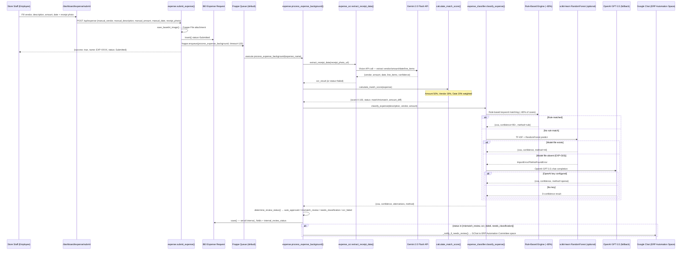

# Flow 06: Expense to Reimbursement
**Departments:** Employee (Store) → Finance (Accounting) → PCF Custodian
**Scanned:** 2026-02-23 | **Git Commit:** 7b998877f | **Agent:** flow-tracer-2

---

## Flow Diagram (Mermaid) — Part A: Standard Expense Submission and AI Processing



## Flow Diagram (Mermaid) — Part B: PCF Flow (Alternative Petty Cash Path)

```mermaid
sequenceDiagram
    participant Emp as Store Staff (Employee/Custodian)
    participant PCFPage as /dashboard/expense/pcf/add
    participant PCFAPI as pcf.add_expense_to_pending()
    participant ER as BEI Expense Request (status=Pending)
    participant PCF as BEI Petty Cash Fund
    participant Custodian as PCF Custodian
    participant PendPage as /dashboard/expense/pcf/pending
    participant BatchAPI as pcf.submit_batch_now()
    participant BatchFn as bei_pcf_batch.create_batch_from_pending()
    participant Batch as BEI PCF Batch
    participant Scheduler as Hourly Scheduler
    participant MonthSched as Daily Scheduler (day 29)

    Emp->>PCFPage: Add expense to PCF pending queue
    PCFPage->>PCFAPI: POST add_expense_to_pending(vendor, desc, amount, date, photo)
    PCFAPI->>ER: insert() status=Pending
    PCFAPI->>PCF: update_pcf_totals() — recalculate pending_total
    alt Threshold reached (pending_total >= fund_amount * threshold_pct)
        PCFAPI->>PCFAPI: send_threshold_notification() → GChat to ERP Automation Committee only
    end
    PCFAPI-->>Emp: {expense_id, pcf_status: {balance, pending_total, at_threshold}}

    alt Manual batch submit (custodian only)
        Custodian->>PendPage: Click "Submit Batch Now"
        PendPage->>BatchAPI: POST submit_batch_now()
        BatchAPI->>BatchFn: create_batch_from_pending(store, Threshold)
        BatchFn->>Batch: insert() status=Submitted; items from Pending expenses
        BatchFn->>ER: Update linked expenses to Submitted
    else Auto-submit via hourly scheduler
        Scheduler->>BatchFn: check_threshold_and_auto_submit()
        Note over Scheduler: Redis lock guard prevents concurrent runs
        BatchFn->>Batch: create_batch_from_pending(store, Threshold Auto)
    else Month-end auto-submit (day 29, daily scheduler)
        MonthSched->>BatchFn: check_month_end_auto_submit()
        BatchFn->>Batch: create_batch_from_pending(store, Month-End Auto)
    end
```

## Flow Diagram (Mermaid) — Part C: Accounting Review and Reimbursement

```mermaid
sequenceDiagram
    participant Accountant as Accountant (Accounts User/Manager)
    participant AcctPage as /dashboard/accounting/expenses
    participant ReviewAPI as expense_review.get_pending_review()
    participant IndvPage as /dashboard/accounting/expenses/[id]
    participant DetailAPI as expense_review.get_expense_detail()
    participant ApprAPI as expense_review.approve_expense()
    participant RejectAPI as expense_review.reject_expense()
    participant BatchApprPage as /dashboard/accounting/expenses/batch
    participant BatchApprAPI as expense_review.batch_approve()
    participant ER as BEI Expense Request
    participant TrainingDB as BEI Expense Training Data
    participant Classifier as expense_classifier.record_correction()
    participant JV as Journal Entry (PCF JV)
    participant GChat as Google Chat (employee notification)
    participant AcctBatchPage as /dashboard/accounting/expenses/batch
    participant PCFBatchPage as /dashboard/billing/[batch]
    participant ApprBatch as pcf.approve_batch()
    participant PCFBatch as BEI PCF Batch
    participant Replenish as pcf.request_replenishment()

    Accountant->>AcctPage: View expense review dashboard
    AcctPage->>ReviewAPI: GET get_review_dashboard() — counts by status
    Accountant->>AcctPage: Filter by mismatch / ocr_failed / needs_classification / auto_approved
    AcctPage->>ReviewAPI: GET get_pending_review(review_type)

    alt Individual expense review
        Accountant->>IndvPage: Open expense detail (3-way comparison: manual vs OCR vs match)
        IndvPage->>DetailAPI: GET get_expense_detail(expense_name)
        Accountant->>IndvPage: Select final_coa + approved_amount → Approve
        IndvPage->>ApprAPI: POST approve_expense(expense_name, final_coa, approved_amount)
        ApprAPI->>ER: status=Approved; internal_final_coa, internal_approved_amount set
        ApprAPI->>Classifier: record_correction() if final_coa != suggested_coa → BEI Expense Training Data
        ApprAPI->>JV: _create_pcf_jv(expense) — auto-generate Journal Entry
        ApprAPI->>GChat: _notify_employee() → direct message to employee user_id
    else Batch approve (auto-matched items)
        Accountant->>BatchApprPage: Get auto-matched expenses
        BatchApprPage->>BatchApprAPI: GET get_auto_approved_batch(store)
        Accountant->>BatchApprPage: Select all → Batch Approve
        BatchApprPage->>BatchApprAPI: POST batch_approve(expense_names)
        BatchApprAPI->>ER: Loop: status=Approved, internal_final_coa=suggested_coa
        Note over BatchApprAPI: batch_approve does NOT notify employees (EXP gap)
    end

    Accountant->>PCFBatchPage: Review PCF batch
    PCFBatchPage->>ApprBatch: GET get_batch_details(batch_name)
    Accountant->>PCFBatchPage: Approve batch
    PCFBatchPage->>ApprBatch: POST approve_batch(batch_name, notes)
    ApprBatch->>PCFBatch: status=Approved
    ApprBatch->>PCFBatch: send_batch_notification(batch, approved)
    Accountant->>PCFBatchPage: Request replenishment
    PCFBatchPage->>Replenish: POST request_replenishment(batch_name, amount)
    Replenish->>PCFBatch: replenishment_requested=1; PCF.last_replenishment_date updated
    Note over Replenish: No actual JE or cheque tracking; ends at flag (gap)
```

---

## Step-by-Step Trace

| Step | Actor | Action | Frontend Page | API Endpoint | DocType Created/Updated | Status |
|------|-------|--------|---------------|-------------|------------------------|--------|
| 1 | Store Staff | View own expense list | `/dashboard/expense` | `expense.get_my_expenses()` | BEI Expense Request (read, display_status mapped) | LIVE |
| 2 | Store Staff | Submit expense with receipt photo | `/dashboard/expense/submit` | `expense.submit_expense(vendor, desc, amount, date, receipt_photo)` | BEI Expense Request (Submitted) + File (receipt photo) | LIVE |
| 2a | System | Background processing triggered | (async, queue=default, timeout=120s) | `expense.process_expense_background(expense_name)` | — (enqueued) | LIVE |
| 3 | System (BG) | OCR receipt via Gemini 2.0 Flash | (background) | `expense_ocr.extract_receipt_data(photo_url)` | BEI Expense Request (internal_ocr_* fields set) | LIVE — requires `gemini_api_key` in site_config |
| 4 | System (BG) | Calculate match score (manual vs OCR) | (background) | `expense.calculate_match_score(expense)` | BEI Expense Request (internal_match_score, internal_match_status) | LIVE |
| 5 | System (BG) | AI classify expense to COA | (background) | `expense_classifier.classify_expense(desc, vendor, amount)` | BEI Expense Request (internal_suggested_coa, internal_coa_confidence) | LIVE — ML model may be absent on EC2 (EXP-G03) |
| 5a | System (BG) | Rule-based classification | (inline) | Rule engine in expense_classifier.py | — | LIVE — handles ~80% of cases |
| 5b | System (BG) | ML classification fallback | (inline) | TF-IDF + RandomForest predict from .joblib | — | LIVE — model at `/home/frappe/frappe-bench/sites/assets/expense_classifier.joblib` (may be absent) |
| 5c | System (BG) | OpenAI GPT-3.5 fallback | (inline) | OpenAI chat completion API | — | LIVE — graceful fallback returns 0-confidence if key absent |
| 6 | System (BG) | Determine routing (review status) | (background) | `expense.determine_review_status(expense)` | BEI Expense Request (internal_review_status: auto_approved / mismatch_review / needs_classification / ocr_failed) | LIVE |
| 6a | System (BG) | GChat notification if needs review | (background) | `expense._notify_if_needs_review()` → `google_chat.send_message_to_space` | — (ERP Automation Committee space) | LIVE |
| 7 | Store Staff | Check expense status | `/dashboard/expense/[id]` | `expense.get_expense_status(expense_name)` | BEI Expense Request (read, simplified status) | LIVE — polling only; no push notification |
| 8 | Accountant | View accounting review dashboard | `/dashboard/accounting/expenses` | `expense_review.get_review_dashboard()` | BEI Expense Request (counts) | LIVE |
| 9 | Accountant | View pending review queue | `/dashboard/accounting/expenses/review` | `expense_review.get_review_dashboard()`, `expense_review.get_expenses_for_review()` | BEI Expense Request | LIVE |
| 10 | Accountant | View individual expense detail with 3-way comparison | `/dashboard/accounting/expenses/[id]` | `expense_review.get_expense_detail(expense_name)` | BEI Expense Request (all internal fields exposed) | LIVE |
| 11 | Accountant | Approve expense with final COA selection | `/dashboard/accounting/expenses/[id]` | `expense_review.approve_expense(expense_name, final_coa, approved_amount)` | BEI Expense Request (Approved) | LIVE |
| 11a | System | Record COA correction for ML retraining | (inline) | `expense_classifier.record_correction(expense_name, suggested, final)` | BEI Expense Training Data (insert) | LIVE |
| 11b | System | Auto-generate PCF Journal Entry | (inline) | `expense_review._create_pcf_jv(expense)` | Journal Entry (auto-created) | LIVE |
| 11c | System | Notify employee via Google Chat DM | (inline) | `expense_review._notify_employee(expense, approved)` → `google_chat.send_notification_to_user` | — | LIVE |
| 12 | Accountant | Reject expense | `/dashboard/accounting/expenses/[id]` | `expense_review.reject_expense(expense_name, reason)` | BEI Expense Request (Rejected) | LIVE |
| 12a | System | Notify employee of rejection | (inline) | `expense_review._notify_employee(expense, rejected)` | — | LIVE |
| 13 | Accountant | Batch approve auto-matched expenses | `/dashboard/accounting/expenses/batch` | `expense_review.batch_approve(expense_names)` | BEI Expense Request (Approved, multiple) | LIVE — no per-employee notification sent (gap) |
| 14 | Accountant | View AI classification stats | `/dashboard/accounting` | `expense_review.get_classification_stats()` | BEI Expense Request (aggregated) | LIVE |
| 15a | Employee/Custodian | Add expense to PCF pending queue | `/dashboard/expense/pcf/add` | `pcf.add_expense_to_pending(vendor, desc, amount, date, photo)` | BEI Expense Request (Pending) + BEI Petty Cash Fund (totals updated) | LIVE |
| 15b | Employee | View/edit/remove pending expenses | `/dashboard/expense/pcf/pending` | `pcf.get_my_pending_expenses`, `pcf.edit_pending_expense`, `pcf.remove_pending_expense` | BEI Expense Request | LIVE |
| 16a | PCF Custodian | Manually submit PCF batch | `/dashboard/expense/pcf/pending` | `pcf.submit_batch_now()` → `create_batch_from_pending(store, Threshold)` | BEI PCF Batch (Submitted) + BEI PCF Batch Item | LIVE |
| 16b | System (hourly) | Auto-submit if threshold reached | (scheduler, hourly) | `pcf.check_threshold_and_auto_submit()` → `create_batch_from_pending(store, Threshold Auto)` | BEI PCF Batch (Submitted) — Redis lock guard | LIVE |
| 16c | System (daily) | Month-end auto-submit (day 29) | (scheduler, daily) | `pcf.check_month_end_auto_submit()` → `create_batch_from_pending(store, Month-End Auto)` | BEI PCF Batch (Submitted) | LIVE |
| 17 | Accountant | View PCF batch detail | `/dashboard/accounting/expenses/batch` | `pcf.get_batch_details(batch_name)` | BEI PCF Batch + BEI PCF Batch Item | LIVE |
| 18 | Accountant | Approve PCF batch | `/dashboard/accounting/expenses/batch` | `pcf.approve_batch(batch_name, notes)` | BEI PCF Batch (Approved) | LIVE — `send_batch_notification` fires |
| 18a | (Alternative) | Reject PCF batch | `/dashboard/accounting/expenses/batch` | `pcf.reject_batch(batch_name, reason)` | BEI PCF Batch (Rejected) | LIVE |
| 19 | Accountant | Request PCF replenishment | `/dashboard/accounting/expenses/batch` | `pcf.request_replenishment(batch_name, amount)` | BEI PCF Batch (replenishment_requested=1) + BEI Petty Cash Fund (last_replenishment_date) | LIVE — no actual GL entry or cheque tracking |

---

## AI Cascade Detail

| Tier | Method | Coverage | Condition | Output |
|------|--------|----------|-----------|--------|
| 1 — Rule-based | Keyword matching on vendor + description | ~80% of transactions | Always runs first | COA code + confidence=95+ + method=rule |
| 2 — ML Model | TF-IDF + RandomForest trained on 682-row CSV | ~15% of remaining | Rule fails to match; model file exists at `/home/frappe/.../expense_classifier.joblib` | COA code + confidence + method=ml |
| 3 — OpenAI GPT-3.5 | Chat completion API | ~5% of remaining | Tier 1 and Tier 2 both fail; `openai_api_key` in site_config | COA code + confidence + method=openai |
| Fallback | No classification | Remaining | All tiers fail or keys absent | `internal_review_status=needs_classification`; floods review queue |

## PCF Auto-Submit Triggers

| Trigger Type | Event | Condition | Batch Type |
|-------------|-------|-----------|------------|
| Threshold (hourly) | `check_threshold_and_auto_submit()` | `pending_total >= fund_amount * threshold_pct` AND `auto_submit_enabled=1` AND no batch Under Review | "Threshold Auto" |
| Month-End (daily) | `check_month_end_auto_submit()` | `today.day == last_day_of_month - 1` AND `month_end_auto_submit=1` AND pending_total > 0 | "Month-End Auto" |
| Manual (custodian) | `submit_batch_now()` | Custodian role; any pending expenses | "Threshold" (same batch type) |

---

## Handoff Points

| From Dept | To Dept | Trigger | Mechanism | Status |
|-----------|---------|---------|-----------|--------|
| Store Staff | Finance (Accounting) | BEI Expense Request status transitions to mismatch_review / ocr_failed / needs_classification | GChat to ERP Automation Committee space via `_notify_if_needs_review()` | LIVE — only for flagged items; auto_approved items have NO notification to accounting |
| Finance (Accounting) | Store Staff (Employee) | Expense Approved or Rejected | `_notify_employee()` → Google Chat DM to employee's user_id | LIVE for single approve/reject; NOT sent for batch_approve |
| PCF Custodian | Finance (Accounting) | PCF Batch submitted (manual or auto) | BEI PCF Batch status=Submitted; `send_batch_notification(batch, submitted)` fires | LIVE — notification goes to accounting |
| Finance (Accounting) | PCF Custodian/Store | Batch approved/rejected | `send_batch_notification(batch, approved/rejected)` fires | LIVE |
| Finance (Accounting) | Treasury/Admin | Replenishment requested | `request_replenishment()` sets flag + updates PCF `last_replenishment_date` | PARTIAL — no actual workflow; flag only; no JE, no cheque tracking |

---

## Broken Links / Gaps

| ID | Location | Problem | Impact | Severity |
|----|----------|---------|--------|----------|
| BL-06-01 | `expense_review.batch_approve()` | Does NOT call `_notify_employee()` — employees are never notified when their expenses are approved via batch | Store staff whose expenses are batch-approved never know; they must poll `get_expense_status()` manually | MEDIUM |
| BL-06-02 | `expense.process_expense_background()` — ML path | `expense_classifier.joblib` model file is unlikely deployed on EC2 production Docker container; `train_model` is a manual bench command | ML tier silently absent; all classification falls through to OpenAI or `needs_classification`; potential review queue flood | HIGH |
| BL-06-03 | `expense.get_expense_status()` — store staff view | No push notification when expense status changes from Processing → Approved/Rejected; store staff must manually refresh | Poor UX: employees have no idea when expenses are resolved without polling | MEDIUM |
| BL-06-04 | `pcf.check_threshold_and_auto_submit()` | Uses `frappe.log_error` for all success logs (semantic bug: "Auto-submitted batch … (threshold)" logged as error) | Pollutes error log with non-errors; makes real errors harder to find | LOW |
| BL-06-05 | `pcf.check_month_end_auto_submit()` | Same semantic bug: uses `frappe.log_error` for success logs | Same as above | LOW |
| BL-06-06 | `pcf.validate_pcf_batch` hook | Handler body is `pass` — registered in hooks.py but does nothing; validation lives in DocType class | Misleading to future devs; dead code in hooks | LOW |
| BL-06-07 | `pcf.on_batch_update` hook | Handler body is `pass` — registered but does nothing | Same as above | LOW |
| BL-06-08 | `pcf.request_replenishment()` | Sets `replenishment_requested=1` and updates `last_replenishment_date` but creates no GL Journal Entry, no cheque tracking, no follow-up status | Replenishment process has no trackable lifecycle: Requested → Processed → Posted; no way to know if replenishment was actually issued | HIGH |
| BL-06-09 | `pcf.admin` endpoints (create_pcf_fund, update_pcf_settings, assign_pcf_custodian) | No frontend pages; System Manager only; no confirmed FE entry point | PCF setup requires Frappe desk or bench console; non-technical admins cannot configure store PCF funds | HIGH |
| BL-06-10 | `expense_review.get_expenses_for_review()` uses `internal_review_status` filter | Accounting expenses page fetches by `internal_review_status` but accounting dashboard shows stats from `get_review_dashboard()` which queries the same field with different filter conditions | Minor discrepancy: `pending_review + needs_classification` counts in dashboard vs individual queue may not reconcile exactly | LOW |
| BL-06-11 | `_notify_if_needs_review()` | Notification sent only to ERP Automation Committee space — not to the actual accounting user who owns the review | Accounting team discovers items via dashboard polling, not push notification | MEDIUM |
| BL-06-12 | `expense.submit_expense()` | No per-expense amount cap; accepts any positive float | A store staff member can submit PHP 999,999 expense; no hard block; routes to review queue but no rejection gate | LOW |

---

## Error Paths

| Trigger | What Happens | User Experience | Status |
|---------|-------------|----------------|--------|
| Employee submits expense without receipt photo | `frappe.throw(_("Receipt photo is required"))` | Frontend shows "Receipt photo is required" error | LIVE |
| Employee record not found for current user | `frappe.throw(_("Employee record not found for current user"))` | Frontend shows error; expense not created | LIVE |
| Store warehouse not found for employee branch | `frappe.throw(_("Could not find warehouse for your branch. Please contact HR."))` | Frontend shows error | LIVE |
| Gemini API not configured (`gemini_api_key` absent) | `HAS_GENAI` guard returns early; `internal_ocr_status=failed` | Expense routed to `ocr_failed` review queue; accountant reviews manually | LIVE — graceful degradation |
| OCR fails (blurry/unreadable receipt) | `internal_ocr_status=failed`; `internal_match_score=0` | Expense gets `internal_review_status=ocr_failed`; GChat notification to ERP Automation Committee | LIVE |
| ML model file absent on server | `joblib.load()` raises FileNotFoundError; caught by `except Exception`; falls through to OpenAI | Silent fallback; no log of absent model file | LIVE — silent degradation |
| OpenAI API key absent or quota exceeded | `classify_by_openai` returns `{coa: None, confidence: 0}` | Expense gets `internal_review_status=needs_classification`; floods accounting queue if Gemini also absent | LIVE — graceful but silent |
| PCF not enabled for store | `frappe.throw(_("PCF is not enabled for this store..."))` | Staff directed to use regular expense submission | LIVE |
| PCF batch already Under Review when auto-submit fires | `existing` check in `check_threshold_and_auto_submit()` → skips batch creation | Auto-submit silently skips; pending expenses accumulate; no alert | LIVE — silent |
| Employee tries to edit/remove expense not in Pending status | `frappe.throw(_("Only pending expenses can be cancelled"))` | Frontend shows error; expense not modified | LIVE |
| Accountant tries to approve already-Approved expense | `frappe.throw(_("Expense already approved"))` | Accountant sees "Expense already approved" error | LIVE |
| Accountant tries to reject already-Approved expense | `frappe.throw(_("Expense already processed"))` | Accountant sees "Expense already processed" error | LIVE |
| `process_expense_background` background job fails silently (unhandled exception in outer scope) | `expense.save()` may not be called; `internal_review_status` never set | Expense stays status=Submitted with no internal_review_status; invisible in accounting queue | POSSIBLE — no outer try/except around entire bg job |

---

## Improvement Suggestions

1. **BL-06-01 (MEDIUM):** Add `_notify_employee()` loop inside `batch_approve()` — same pattern as single `approve_expense()`. Each employee in the batch should receive a DM when their expense is approved.

2. **BL-06-02 (HIGH):** Automate ML model deployment: add the trained `.joblib` file to the Docker build or add a `check_and_train_model_if_absent()` step to the scheduler. Also add a monthly retrain scheduler (`train_model` when `BEI Expense Training Data` has >50 new corrections).

3. **BL-06-03 (MEDIUM):** Add 30-second polling `useEffect` on `/dashboard/expense` page for status refresh. Or implement server-sent events on expense status changes. At minimum, expose a batch status endpoint `get_expenses_status(names[])` to reduce round trips.

4. **BL-06-08 (HIGH):** Build replenishment lifecycle: create a `BEI PCF Replenishment` DocType with status Requested → Processed → Posted, actual amount disbursed, and linked Journal Entry. `request_replenishment()` should create this record, not just set a flag.

5. **BL-06-09 (HIGH):** Add PCF admin panel frontend pages: `/dashboard/accounting/pcf/settings` for `create_pcf_fund`, `update_pcf_settings`, `assign_pcf_custodian`, and an overview via `get_all_pcf_funds`.

6. **BL-06-04/05 (LOW):** Replace `frappe.log_error` with `frappe.logger().info()` for all PCF auto-submit success log messages. Keep `frappe.log_error` only for actual error conditions.

7. **BL-06-11 (MEDIUM):** Send accounting review notification to the actual `Accounts User`/`Accounts Manager` role group, not just the ERP Automation Committee space. Use Google Chat space for accounting if configured in BEI Settings.

8. **Receipt photo compression:** Frontend accepts raw base64 (can be 3-8 MB per image). Add client-side canvas compression (target 800px, 70% quality) before base64 encode to reduce OCR processing time and storage costs.
