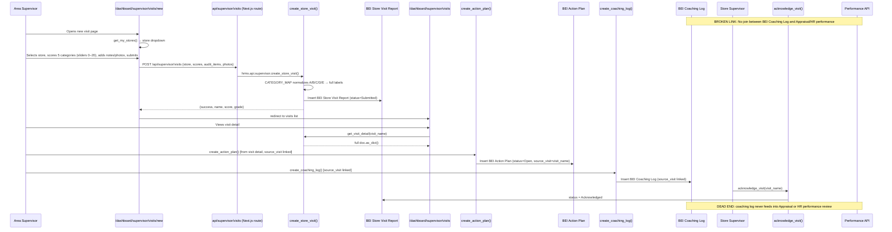

# Flow 10: Store Visit & Coaching
**Departments:** Area Supervisor → Store → HR (performance link) | **Scanned:** 2026-02-23 | **Agent:** flow-tracer-4

## Flow Diagram (Mermaid)

## Step-by-Step Trace

| Step | Actor | Action | Frontend Page | API Endpoint | DocType Created/Updated | Status |
|------|-------|--------|---------------|--------------|------------------------|--------|
| 1 | Area Supervisor | Opens new store visit form | `/dashboard/supervisor/visits/new/page.tsx` | `hrms.api.supervisor.get_my_stores` (via useUserStore) | Warehouse (read) | LIVE |
| 2 | Area Supervisor | Selects store from dropdown | `/dashboard/supervisor/visits/new/page.tsx` | None (client state) | — | LIVE |
| 3 | Area Supervisor | Fetches 100-pt template (categories/grading) | `/dashboard/supervisor/visits/new/page.tsx` | `hrms.api.supervisor.get_store_visit_template` | None (hardcoded stub) | STUB — returns hardcoded dict, no DB read |
| 4 | Area Supervisor | Scores 5 categories via sliders (0–20 each), adds notes + optional per-category photo | `/dashboard/supervisor/visits/new/page.tsx` | Client state | — | LIVE |
| 5 | Area Supervisor | Clicks Submit | `/dashboard/supervisor/visits/new/page.tsx` | POST `/api/supervisor/visits` (Next.js route) | — | LIVE |
| 6 | Next.js Route | Proxies to Frappe | `/api/supervisor/visits` (Next.js) | `hrms.api.supervisor.create_store_visit` | BEI Store Visit Report (Submitted) | LIVE |
| 7 | Backend | Normalizes category codes (CATEGORY_MAP), inserts audit_items child table, attaches photos | `supervisor.py` | `create_store_visit()` | BEI Store Visit Report + BEI Store Audit Item child + BEI Visit Photo child | LIVE |
| 8 | Backend | Returns {success, name, score, grade} | `supervisor.py` | — | — | LIVE |
| 9 | Frontend | Toasts "Score: X% - GRADE", redirects to visits list | `/dashboard/supervisor/visits/new/page.tsx` | — | — | LIVE |
| 10 | Area Supervisor | Views visit detail | `/dashboard/supervisor/visits/[id]/page.tsx` | `hrms.api.supervisor.get_visit_detail` | BEI Store Visit Report (read) | LIVE |
| 11 | Area Supervisor | Creates action plan linked to visit | `/dashboard/supervisor/action-plans/page.tsx` | `hrms.api.supervisor.create_action_plan` | BEI Action Plan (Open, source_visit linked) | LIVE |
| 12 | Area Supervisor | Logs coaching session linked to visit | `/dashboard/supervisor/coaching/page.tsx` | `hrms.api.supervisor.create_coaching_log` | BEI Coaching Log (source_visit + source_action_plan linked) | LIVE |
| 13 | Area Supervisor | Monitors action plan follow-up | `/dashboard/supervisor/action-plans/page.tsx` | `hrms.api.supervisor.get_action_plans`, `update_action_plan_status` | BEI Action Plan (In Progress / Completed) | LIVE |
| 14 | Store Supervisor | Acknowledges visit report | `/dashboard/supervisor/visits/[id]/page.tsx` | `hrms.api.supervisor.acknowledge_visit` | BEI Store Visit Report (status=Acknowledged) | LIVE — no timestamp recorded |
| 15 | HR/Supervisor | Links coaching to employee performance review | — | None | Appraisal / BEI Performance Review | **MISSING — no link exists** |

## Handoff Points

| From Dept | To Dept | Trigger | Mechanism | Status |
|-----------|---------|---------|-----------|--------|
| Area Supervisor | Store (via BEI Store Visit Report) | Visit submitted with score | `BEI Store Visit Report` status=Submitted; visible in store's compliance feed | LIVE |
| Area Supervisor | Store Supervisor | Follow-up coaching required | `BEI Coaching Log.follow_up_required=1`, `follow_up_date` set | LIVE (no notification sent; supervisor must poll) |
| Area Supervisor | Store Supervisor | Action plan assigned | `BEI Action Plan.assigned_to` field; store supervisor must log in to see it | LIVE (no notification at plan creation) |
| Store Supervisor | Area Supervisor | Acknowledges visit report | `acknowledge_visit()` sets status=Acknowledged | LIVE (no `acknowledged_at` timestamp; no audit trail) |
| Coaching Log | HR Performance | Coaching history should feed probation/appraisal review | **NO LINK EXISTS** — `BEI Coaching Log` and `Appraisal` are fully disconnected DocTypes | **BROKEN** |
| Action Plan | HR Performance | Repeated critical findings should trigger PIP or corrective action | **NO LINK EXISTS** — BEI Action Plan has no HR escalation path | **BROKEN** |

## Broken Links / Gaps

| ID | Location | Problem | Impact | Severity |
|----|----------|---------|--------|----------|
| BL-10-01 | `get_store_visit_template` (supervisor.py:1382–1447) | Returns hardcoded Python dict — no DB lookup. Template is code-level constant; changing it requires a code deploy. | Cannot customize scoring per store type or update items without redeployment | MEDIUM |
| BL-10-02 | `create_coaching_log` → Appraisal | BEI Coaching Log has `source_visit` link and typed coaching types, but zero connection to `Appraisal` or any HR performance DocType. `hrms/api/performance.py` has no reference to coaching_log at all. | Coaching history captured but invisible to HR during appraisals and probation reviews. Area supervisors cannot present coaching log evidence in formal reviews from the app. | HIGH |
| BL-10-03 | `acknowledge_visit()` (supervisor.py:192–197) | Sets `status="Acknowledged"` but records no `acknowledged_at` timestamp or `acknowledged_by` user | Cannot audit when or by whom acknowledgement was made | LOW |
| BL-10-04 | Unified approval queue → action plans | `get_unified_approval_queue` includes Draft labor plans but does NOT include newly created action plans. Area supervisors discover open action plans only by visiting the action plans page directly. | No proactive alert for action plan creation; area supervisor must poll | MEDIUM |
| BL-10-05 | Action plan overdue detection (supervisor.py:684–692) | `get_area_dashboard` counts overdue via `due_date < today` filter, but no scheduled job ever sets `status="Overdue"`. DB `status` stays "Open" indefinitely. | Displayed overdue count in dashboard is accurate, but actual DocType `status` field is misleading; reports and filters on status="Overdue" will return 0 | MEDIUM |
| BL-10-06 | `/dashboard/supervisor/page.tsx` | No dedicated Area Supervisor landing page exists. `get_area_dashboard` is called inside the visits page in dual-mode. | Supervisor lands on Visits list, not an overview dashboard. UX confusion. | HIGH |
| BL-10-07 | Coaching follow-up notification | `BEI Coaching Log` stores `follow_up_required`, `follow_up_date`, `follow_up_status` but no scheduler checks them. | Coaching follow-ups silently expire with no reminder | MEDIUM |
| BL-10-08 | Photo handling in `create_store_visit` | FE sends `photo` as base64 dataUrl inside the `audit_items` JSON array. Backend appends these to `BEI Visit Photo` child table, but there is no `save_base64_image` call — the raw dataUrl is stored as-is in the DB. | Photo URLs in `BEI Store Visit Report` are raw base64 strings, not proper File attachments. Large visit reports; may break preview rendering on older devices. | MEDIUM |

## Error Paths

| Trigger | What Happens | User Experience | Status |
|---------|-------------|----------------|--------|
| Store not selected on submit | `create_store_visit` throws `frappe.throw("Store is required")` | Frontend shows toast.error from data.error field | HANDLED |
| Store supervisor has no stores configured in `custom_area_supervisor` on Warehouse | `get_my_stores` returns empty list | Store dropdown is empty; user sees "Loading..." then blank — no warning shown | POOR UX (no empty state message) |
| `audit_items` contains a category code not in CATEGORY_MAP | Item's category is appended as-is to child table without normalization | Data inconsistency in BEI Store Audit Item child table; may cause reporting issues | UNHANDLED |
| Photo base64 string too large | No size check in `create_store_visit`; Frappe row size limit may be exceeded | 500 error from DB; generic toast.error shown | UNHANDLED |
| `acknowledge_visit` called by non-supervisor | No role check in `acknowledge_visit()` — any authenticated user can acknowledge any visit | Visit can be falsely acknowledged by unauthorized user | SECURITY GAP |

## Improvement Suggestions

1. **Coaching-to-HR Link (HIGH):** Add a read-only section in the Frappe Appraisal form listing related `BEI Coaching Log` entries by employee. Or add a `coaching_logs` getter in `performance.py` that fetches logs by `employee` and date range for use in appraisal review.

2. **Visit Template as DocType (MEDIUM):** Move `get_store_visit_template` from hardcoded dict to `BEI Visit Template` DocType. Support multiple templates per store type (kiosk vs. full-service). Eliminates code deploy for template changes.

3. **Photo Storage Fix (MEDIUM):** Call `save_base64_image` (pattern already exists in `store.py`) inside `create_store_visit` before inserting to convert base64 to proper Frappe File attachments.

4. **Coaching Follow-up Scheduler (MEDIUM):** Add daily cron: find `BEI Coaching Log` where `follow_up_required=1` AND `follow_up_date <= today` AND `follow_up_status != 'Complete'`; send Google Chat to `coached_by` user.

5. **Acknowledge Audit Trail (LOW):** Add `acknowledged_at` (Datetime) and `acknowledged_by` (Link→User) fields to `BEI Store Visit Report`; populate in `acknowledge_visit()`.

6. **Role Gate on Acknowledge (MEDIUM):** Add role check in `acknowledge_visit()` to allow only Store Supervisor or the store's own staff, not arbitrary users.

7. **Action Plan Overdue Scheduler (MEDIUM):** Daily scheduler: set `status="Overdue"` on Open/In-Progress plans where `due_date < today`; notify `assigned_to` via Google Chat.

8. **Dedicated Supervisor Dashboard (HIGH):** Create `/dashboard/supervisor/page.tsx` as a proper landing page with KPI cards (visits this week, overdue action plans, stores missing reports, pending approvals) linking to each subfeature.
