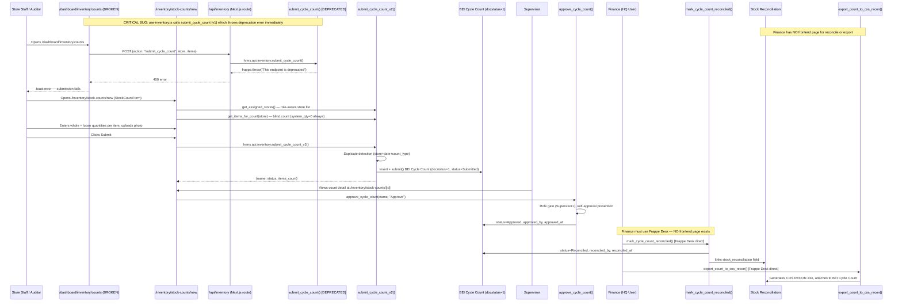

# Flow 11: Inventory Cycle Count to Variance
**Departments:** Store/Auditor → Supervisor Approval → Warehouse/Finance | **Scanned:** 2026-02-23 | **Agent:** flow-tracer-4

## Flow Diagram (Mermaid)

## Step-by-Step Trace

| Step | Actor | Action | Frontend Page | API Endpoint | DocType Created/Updated | Status |
|------|-------|--------|---------------|--------------|------------------------|--------|
| 1A | Store Staff | Opens **broken** cycle count page | `/dashboard/inventory/counts` | — | — | **BROKEN PATH** |
| 1B | Store Staff | `useInventory` hook calls `submitCycleCount` on form submit | `use-inventory.ts` line 122 | POST `/api/inventory` {action: "submit_cycle_count"} | — | **BROKEN — calls v1** |
| 1C | Next.js route | Routes to v1 backend | `/app/api/inventory/route.ts` line 232–235 | `hrms.api.inventory.submit_cycle_count` | — | **BROKEN — hardwired to v1** |
| 1D | Backend v1 | Immediately throws deprecation error | `inventory.py:17–23` | — | — | **DEPRECATED — throws on line 23** |
| 2 | Store Staff | Opens **working** stock count form (alternative path) | `/inventory/stock-counts/new` | — | — | LIVE |
| 3 | Store Staff / Auditor | Gets assigned stores (role-aware) | `/inventory/stock-counts/new` | `hrms.api.inventory.get_assigned_stores` | BEI External Auditor Store Access / Warehouse / Employee (read) | LIVE |
| 4 | Store Staff / Auditor | Gets item list for blind count (system_qty=0 always returned) | `/inventory/stock-counts/new` | `hrms.api.inventory.get_items_for_count` | tabItem, tabUOM Conversion Detail (read) | LIVE |
| 5 | External Auditor | Store access verified via `_check_store_access` | Backend | `_check_store_access()` | BEI External Auditor Store Access (read) | LIVE |
| 6 | Store Staff | Saves draft mid-count | `/inventory/stock-counts/new` | `hrms.api.inventory.save_cycle_count_draft` | BEI Cycle Count (docstatus=0, status=Draft) | LIVE |
| 7 | Store Staff | Uploads photo separately, then submits | `/inventory/stock-counts/new` | `hrms.api.inventory.submit_cycle_count_v2` | BEI Cycle Count (docstatus=1, status=Submitted) | LIVE |
| 8 | Backend | Duplicate detection runs: same store+date+count_type+docstatus=1 not in Rejected/Resubmitted | `inventory.py:848–858` | — | — | LIVE |
| 9 | Backend | `validate()` populates real system_qty from Bin, variance_qty, unit_cost from valuation_rate | DocType controller | BEI Cycle Count Item (populated server-side) | BEI Cycle Count Item | LIVE |
| 10 | Backend | Links orphan photo File to newly created count | `inventory.py:888–890` | frappe.db.set_value on File | File (updated) | LIVE |
| 11 | Store Staff | Views submitted count list | `/inventory/stock-counts` | `hrms.api.inventory.get_cycle_counts` | BEI Cycle Count (read) | LIVE |
| 12 | Supervisor | Opens count detail to review items | `/inventory/stock-counts/[id]` | `hrms.api.inventory.get_cycle_count` | BEI Cycle Count + BEI Cycle Count Item (read) | LIVE |
| 13 | Supervisor | Approves count | `/inventory/stock-counts/[id]` | `hrms.api.inventory.approve_cycle_count(action="Approve")` | BEI Cycle Count (status=Approved) | LIVE |
| 13A | Supervisor | Rejects count with mandatory comment | `/inventory/stock-counts/[id]` | `hrms.api.inventory.approve_cycle_count(action="Reject")` | BEI Cycle Count (status=Rejected) | LIVE |
| 14 | Store Staff (rejected case) | Resubmits with corrections | `/inventory/stock-counts` (or detail) | `hrms.api.inventory.resubmit_cycle_count` | New BEI Cycle Count (status=Resubmitted, original_count linked); original marked Resubmitted | LIVE |
| 15 | Finance / HQ | Marks count reconciled with Stock Reconciliation link | **Frappe Desk only** | `hrms.api.inventory.mark_cycle_count_reconciled` | BEI Cycle Count (status=Reconciled); links Stock Reconciliation | LIVE — **NO frontend page** |
| 16 | Finance / HQ | Exports to COS RECON xlsx | **Frappe Desk only** | `hrms.api.inventory.export_count_to_cos_recon` | File (xlsx attached to BEI Cycle Count); BEI Cycle Count flags updated | LIVE — **NO frontend page** |

## Handoff Points

| From Dept | To Dept | Trigger | Mechanism | Status |
|-----------|---------|---------|-----------|--------|
| Store Staff | Supervisor | Count submitted (docstatus=1, status=Submitted) | Supervisor polls `/inventory/stock-counts` filtered by status=Submitted | LIVE — **no push notification** |
| External Auditor | Supervisor | Auditor submits count; auditor field set on BEI Cycle Count | Supervisor sees `external_auditor` field on count detail | LIVE |
| Supervisor | Finance | Count approved (status=Approved) | Finance must discover via Frappe Desk or manually poll via API | **BROKEN — no frontend for Finance** |
| Finance | Warehouse | Stock Reconciliation created and linked | `stock_reconciliation` field on BEI Cycle Count; Frappe Stock Reconciliation updates Bin | LIVE (Frappe native) |
| Finance | Finance (audit) | COS RECON xlsx exported and attached | File attachment on BEI Cycle Count document | LIVE — **no frontend** |

## Broken Links / Gaps

| ID | Location | Problem | Impact | Severity |
|----|----------|---------|--------|----------|
| BL-11-01 | `use-inventory.ts:122` + `/app/api/inventory/route.ts:232–235` | `submitCycleCount()` in hook calls `action: "submit_cycle_count"` → Next.js route maps this to `hrms.api.inventory.submit_cycle_count` (v1) which throws immediately: `frappe.throw("This endpoint is deprecated")`. Result: every submission from `/dashboard/inventory/counts` fails with a 400 error. | `/dashboard/inventory/counts` is completely broken for submission. Store staff who use this page cannot submit any cycle count. | **CRITICAL** |
| BL-11-02 | `/app/api/inventory/route.ts:231–235` | The Next.js API route has hardcoded `"hrms.api.inventory.submit_cycle_count"` (v1) for the `"submit_cycle_count"` action. There is no `"submit_cycle_count_v2"` action in the switch statement. The v2 path is only reachable from `/inventory/stock-counts/new` which calls the Frappe API directly, bypassing this route. | Two separate submission paths exist with different APIs, different payload shapes (`counted_qty` vs `counted_qty_whole/counted_qty_loose`), and different approval requirements. Counting behavior is inconsistent by page. | **CRITICAL** |
| BL-11-03 | `mark_cycle_count_reconciled` + `export_count_to_cos_recon` | Both Finance endpoints are fully implemented and live in backend but have zero frontend pages in my.bebang.ph. Finance cannot close out the cycle count workflow from the app. | Finance must use Frappe Desk to mark reconciliation and export COS RECON xlsx. Workflow ends silently at "Approved" from app perspective. | HIGH |
| BL-11-04 | Approval notification | No Google Chat or email notification sent when a count reaches Submitted status. Supervisor has no alert that a new count requires review. | Supervisors must manually poll the counts list; counts may sit unreviewed for days. | HIGH |
| BL-11-05 | Shelf life extension approval | `approve_shelf_extension` exists and is mapped in `/api/inventory/route.ts` but there is no frontend page for supervisors to discover and action pending shelf life requests. | Supervisors cannot approve shelf life extensions from my.bebang.ph. Requests queue unresolved unless supervisor knows to use Frappe Desk. | MEDIUM |
| BL-11-06 | COS RECON grams column | `export_count_to_cos_recon` line 999: `ws.cell(..., value=0)` with `# TODO: populate from item properties when available` | COS RECON Excel always has 0 in the grams column; downstream COGS calculations that rely on grams are incorrect | MEDIUM |
| BL-11-07 | Inventory variance resolution endpoint | `inventory.py` contains `resolve_variance()` and `/api/inventory/route.ts` maps `"resolve_variance"` action. The variance management page has a resolution modal. However the dept scan (I-05) flagged this as VERIFY — the exact frontend component name was not confirmed. | Variance resolution may be working end-to-end, or the modal may call a slightly different endpoint name. Needs smoke test confirmation. | MEDIUM (verify) |
| BL-11-08 | External Auditor store access — admin page | `BEI External Auditor Store Access` DocType exists and is enforced in backend (`_check_store_access`). No frontend admin page exists to grant/revoke access. | IT/Admin must use Frappe Desk to manage auditor assignments | LOW |
| BL-11-09 | `/dashboard/inventory/counts` counts list vs `/inventory/stock-counts` list | Two separate cycle count list pages exist at different routes. The broken path (`/dashboard/inventory/counts`) uses `useInventory` hook; the working path (`/inventory/stock-counts`) uses `StockCountList` component. Users may not know which to use. | Confusion; the broken page shows rejected count alerts but cannot submit new counts | MEDIUM |

## Error Paths

| Trigger | What Happens | User Experience | Status |
|---------|-------------|----------------|--------|
| Submit via `/dashboard/inventory/counts` | v1 throws `frappe.ValidationError`; Next.js route returns 400 `{success: false, error: "This endpoint is deprecated"}` | `toast.error("This endpoint is deprecated")` — user sees cryptic deprecation message | **BAD UX — unhandled for end users** |
| Duplicate count (same store+date+count_type, already submitted) | `submit_cycle_count_v2` throws with existing record name | Frontend shows toast with the existing record name | HANDLED |
| Auditor without store access calls `get_items_for_count` | `_check_store_access` throws `frappe.PermissionError` | 403 returned; "You do not have access to count at store X" | HANDLED |
| `approve_cycle_count` called by the counter (self-approval) | Throws `frappe.throw("You cannot approve your own cycle count")` | Frontend shows error toast | HANDLED |
| `resubmit_cycle_count` called on non-Rejected count | Throws `frappe.throw("Only rejected cycle counts can be resubmitted")` | Frontend shows error toast | HANDLED |
| `mark_cycle_count_reconciled` on non-Approved/Verified count | Throws with current status in message | Frappe Desk shows error (no frontend page anyway) | HANDLED |
| Photo upload fails (file too large or network error) | `submit_cycle_count_v2` `photo_url` parameter is None; doc inserts without photo | Count submitted successfully but without photo evidence; no warning to user | POOR UX |

## Improvement Suggestions

1. **Fix v1 Bug — Immediate (CRITICAL):** In `use-inventory.ts`, change `action: "submit_cycle_count"` to `action: "submit_cycle_count_v2"`. Update `CycleCountItem` interface to include `counted_qty_whole` and `counted_qty_loose` fields. Update `/api/inventory/route.ts` to add a `"submit_cycle_count_v2"` case mapping to `hrms.api.inventory.submit_cycle_count_v2`.

2. **Redirect broken page to working page (HIGH):** Either redirect `/dashboard/inventory/counts` to `/inventory/stock-counts`, or replace the `useInventory` hook's submit call in the counts page to call the working `/inventory/stock-counts/new`.

3. **Finance frontend for reconciliation + export (HIGH):** Add `/dashboard/inventory/counts/reconcile/[id]` page for Finance to mark reconciliation and trigger COS RECON export. Wire to `mark_cycle_count_reconciled` and `export_count_to_cos_recon` endpoints.

4. **Submission notification (HIGH):** On `submit_cycle_count_v2` success, send Google Chat notification to the store's supervisor (`custom_area_supervisor` on Warehouse) with count name, store, item count.

5. **Unified count route (MEDIUM):** Deprecate `/dashboard/inventory/counts` page or repurpose it as a redirect/status-only view. Make `/inventory/stock-counts` the single authoritative path for all cycle count operations.

6. **Grams field in COS RECON (MEDIUM):** Map grams from an Item custom field (e.g., `custom_weight_grams`). Add a migration to populate this field from existing item master data.
