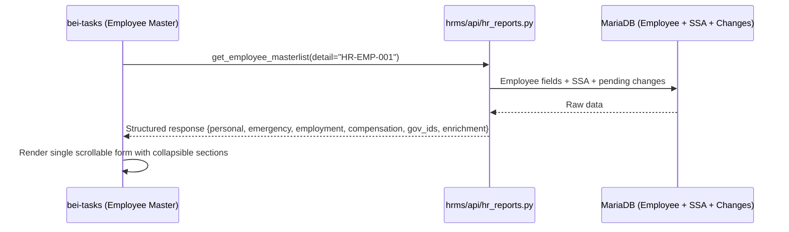

# S160: Employee Master UX — EmployeeDetailDialog with Collapsible Sections

## Context

The current Employee Master page (`bei-tasks/app/dashboard/hr/employee-master/page.tsx`, 761 lines) has a **view-only** `Employee360Drawer` (side Sheet) that shows basic employee info but requires navigating to separate pages for any edits (enrichment, transfer, separations, or the external Frappe admin form).

In S158, we built the `CompensationDetailDialog` pattern — a large modal dialog (`sm:max-w-[95vw]`) with inline editing, live computation, batch save, and dual-control approval for sensitive fields. HR loved it.

**Goal:** Apply the same pattern to Employee Master. Replace the read-only Employee360Drawer with an `EmployeeDetailDialog` — a single scrollable form with collapsible sections showing ALL employee data with inline editing.

## Architecture



## Design Rationale (For Cold-Start Agents)

**Why a Dialog (not a separate page):**
- S158 proved that staying on the grid page (dialog overlay) is better UX than navigating away
- HR edits multiple employees in sequence — dialog close -> click next name -> dialog opens is faster than page navigation
- The grid refreshes when the dialog closes, showing updated data immediately

**Why a single scrollable form with collapsible sections (NOT tabs):**
- Tabs force HR to click between sections and lose context — they can't see personal + employment at the same time
- A single scrollable form lets HR see everything at a glance — sections they don't need can be collapsed
- "Expand All" button uncollapses everything for full-form review
- This matches how Frappe's own Employee form works (single page, collapsible sections)
- Faster for bulk data entry — no tab switching overhead

**Why reuse existing mutations (not new bulk endpoint):**
- Personal/employment field updates: use `frappe.client.set_value` (simple field updates)
- Compensation changes: reuse `useBatchUpdateCompensation` from S158
- Sensitive changes (bank, gov IDs): reuse `useSubmitSensitiveChangeRequestMutation` from S114
- No new backend endpoint needed for basic field edits

**Why extend `get_employee_masterlist()` instead of creating a new endpoint:**
- The existing endpoint already has permission checks, filtering, enrichment status computation
- Adding a `detail=employee_id` mode returns full data for one employee without duplicating auth logic
- Single source of truth for employee queries

## Existing Code to Reuse (with line numbers)

| What | Location | Lines | How |
|------|----------|-------|-----|
| `_check_hr_permission()` | `hrms/api/hr_reports.py` (via `utils/api_helpers.py`) | Entry guard | Already called at function entry |
| Manager name resolution | `hrms/api/hr_reports.py` | 100-108 | Same pattern for `reports_to_name` |
| Pending enrichment check | `hrms/api/hr_reports.py` | 110-119 | Same `BEI Onboarding Request` query |
| SSA lookup SQL | `hrms/api/payroll_compensation.py` | 378-397 | Same SQL for latest SSA |
| `bei_*` column existence check | `hrms/api/payroll_compensation.py` | 340-349 | Same `SHOW COLUMNS` pattern |
| Bank masking | `hrms/api/payroll_compensation.py` | 370-371 | Same `****` + last 4 digits |
| Pending changes count | `hrms/api/payroll_compensation.py` | 404-411 | Same `BEI Compensation Change` query |
| Statutory computation | `hrms/api/payroll_compensation.py` | 30-108 | Reuse for projected deductions |
| `SENSITIVE_FIELDS` + labels | `hrms/api/payroll_compensation.py` | 116-133 | Already includes bank + gov IDs |
| `CompensationDetailDialog` | `bei-tasks/app/dashboard/hr/payroll/compensation-setup/[employee]/page.tsx` | Full file | Open as nested dialog for compensation edits |
| `compensationQueries.detail()` | `bei-tasks/lib/queries/hr-payroll-compensation.ts` | 207-215 | Reuse for compensation section data |
| `useBatchUpdateCompensation()` | `bei-tasks/lib/queries/hr-payroll-compensation.ts` | 290-365 | Reuse for compensation saves |
| `useSubmitSensitiveChangeRequestMutation()` | `bei-tasks/lib/queries/hr-payroll-compensation.ts` | 344-367 | Reuse for bank/gov ID changes |
| `ph-statutory.ts` | `bei-tasks/lib/ph-statutory.ts` | Full file | Reuse for live deduction preview |
| `EnrichmentBadge` | `bei-tasks/app/dashboard/hr/employee-master/page.tsx` | 75-94 | Reuse inline |
| `Employee360Drawer` | `bei-tasks/app/dashboard/hr/employee-master/page.tsx` | 128-269 | Remove (replaced by dialog) |
| `RoleGuard` + `ROLES` | `bei-tasks/components/layout/role-guard.tsx`, `bei-tasks/lib/roles.ts` | — | Same RBAC pattern |
| Shadcn `Collapsible` | `bei-tasks/components/ui/collapsible.tsx` | — | If exists; otherwise use Shadcn Accordion or custom |

## Files to Modify

### Backend (BEI-ERP)

| # | File | Change | Phase |
|---|------|--------|-------|
| 1 | `hrms/api/hr_reports.py` | Extend `get_employee_masterlist()` with `detail=employee_id` mode. Add `_get_employee_detail()` helper returning structured response. | 1 |

### Frontend (bei-tasks)

| # | File | Change | Phase |
|---|------|--------|-------|
| 2 | `lib/queries/hr-employee-detail.ts` | **NEW** — `EmployeeDetail` interface, `employeeDetailQueries.detail()`, `useUpdateEmployeeField()` mutation | 2 |
| 3 | `app/dashboard/hr/employee-master/employee-detail-dialog.tsx` | **NEW** — `EmployeeDetailDialog` with collapsible sections (Personal, Employment, Compensation, Gov IDs & Documents) | 3 |
| 4 | `app/dashboard/hr/employee-master/page.tsx` | Replace `Employee360Drawer` with `EmployeeDetailDialog`, wire name clicks + 360 button | 4 |

---

## Phase 1: Backend — Extend `get_employee_masterlist()` with detail mode (10 units)

### Task 1.1: Add `detail` parameter to `get_employee_masterlist()`
**MUST_MODIFY:** `hrms/api/hr_reports.py`
**MUST_CONTAIN:** `if detail`

Add optional `detail: str | None = None` parameter. When provided, return single-employee detail response:

```python
@frappe.whitelist()
def get_employee_masterlist(
    ...,
    detail: str | None = None,   # NEW
):
    if detail:
        return _get_employee_detail(detail)
    # ... existing list logic unchanged ...
```

### Task 1.2: Implement `_get_employee_detail(employee_id)` helper
**MUST_MODIFY:** `hrms/api/hr_reports.py`
**MUST_CONTAIN:** `_get_employee_detail`

Private function returning structured employee data:

**Personal section fields:**
- `employee_name`, `first_name`, `middle_name`, `last_name`
- `date_of_birth`, `gender`, `marital_status`, `blood_group` (optional)
- `cell_number`, `personal_email`, `current_address`, `permanent_address`
- `custom_nickname`, `custom_uniform_size`

**Emergency contact fields:**
- `person_to_be_contacted` (NOT `emergency_contact_name` — verified in `enrichment.py:89`)
- `emergency_phone_number` (NOT `emergency_phone` — verified in `enrichment.py:90`)
- `relation`

**Employment section fields:**
- `department`, `designation`, `branch`, `employment_type`
- `date_of_joining`, `status`, `company`, `reports_to`
- `company_email`, `custom_work_phone`, `user_id`
- Resolve `reports_to` -> `reports_to_name` (same pattern as list endpoint, `hr_reports.py:100-108`)

**Compensation section fields** (reuse pattern from `payroll_compensation.py:318-397`):
- Latest SSA: `base_salary`, `salary_structure`, `tax_slab`, `ssa_from_date`
- Allowances: 6 `bei_*` fields (with column-existence check, same pattern as `payroll_compensation.py:340-349`)
- Projected deductions: reuse `compute_sss_employee()`, `compute_philhealth_employee()`, `compute_pagibig_employee()`, `compute_monthly_tax()`
- Bank info: `salary_mode`, `bank_name`, `bank_account_name`, `bank_ac_no` (masked, pattern: `payroll_compensation.py:370-371`)
- Pending compensation changes count from `BEI Compensation Change`

**Gov ID fields** (from `SENSITIVE_FIELDS` in `payroll_compensation.py:116-124`):
- `tin_number`, `sss_number`, `philhealth_number`, `pagibig_number`
- All masked: show only last 4 digits

**Enrichment status:**
- `custom_enrichment_status`, `custom_enrichment_submitted_date`, `custom_enrichment_complete_date`
- `custom_tin_verified`, `custom_sss_verified`, `custom_philhealth_verified`, `custom_pagibig_verified`
- `has_pending_enrichment` (same check as list endpoint, `hr_reports.py:110-125`)

**Recent changes (last 10 combined):**
- From `BEI Compensation Change` and `BEI Sensitive Change Request`

**Response structure:**
```python
{
    "employee": "HR-EMP-001",
    "personal": { "employee_name": "...", "first_name": "...", ... },
    "emergency": { "person_to_be_contacted": "...", ... },
    "employment": { "department": "...", "branch": "...", ... },
    "compensation": { "base_salary": 20000, "bei_comm_allow_monthly": 0, ... },
    "gov_ids": { "tin_number": "****1234", ... },
    "enrichment": { "custom_enrichment_status": "Complete", ... },
    "recent_changes": [ ... ],
}
```

**Guards:**
- Employee existence check: `if not frappe.db.exists("Employee", detail): frappe.throw(...)`
- Must call `set_backend_observability_context(module="hr", action="get_employee_detail", mutation_type="read")`

### Task 1.3: Regression test
Verify calling without `detail` param returns the existing paginated list response unchanged.

---

## Phase 2: Frontend Query Layer (8 units)

### Task 2.1: Create `lib/queries/hr-employee-detail.ts`
**NEW FILE:** `lib/queries/hr-employee-detail.ts`
**MUST_CONTAIN:** `EmployeeDetail`
**MUST_CONTAIN:** `employee-detail`

Define TypeScript interfaces matching the structured backend response:

```typescript
export interface EmployeeDetailPersonal {
  employee_name: string;
  first_name: string;
  middle_name: string | null;
  last_name: string;
  date_of_birth: string | null;
  gender: string | null;
  marital_status: string | null;
  blood_group: string | null;
  cell_number: string | null;
  personal_email: string | null;
  current_address: string | null;
  permanent_address: string | null;
  custom_nickname: string | null;
  custom_uniform_size: string | null;
}

export interface EmployeeDetailEmergency {
  person_to_be_contacted: string | null;
  emergency_phone_number: string | null;
  relation: string | null;
}

export interface EmployeeDetailEmployment {
  department: string;
  branch: string;
  designation: string;
  employment_type: string;
  date_of_joining: string;
  reports_to: string | null;
  reports_to_name: string | null;
  status: string;
  company: string;
  company_email: string | null;
  custom_work_phone: string | null;
  user_id: string | null;
}

// CompensationDetailEmployee reused from hr-payroll-compensation.ts

export interface EmployeeDetail {
  employee: string;
  personal: EmployeeDetailPersonal;
  emergency: EmployeeDetailEmergency;
  employment: EmployeeDetailEmployment;
  compensation: { /* reuse CompensationDetailEmployee shape */ };
  gov_ids: { tin_number: string | null; sss_number: string | null; philhealth_number: string | null; pagibig_number: string | null; };
  enrichment: { custom_enrichment_status: string | null; /* ... */ };
  recent_changes: Array<{ name: string; change_type: string; /* ... */ }>;
}
```

Add query options:
- queryKey: `["hr", "employee-detail", employeeId]`
- queryFn: calls `hrms.api.hr_reports.get_employee_masterlist` with `detail=employeeId`
- enabled: `!!employeeId`
- staleTime: `10_000` (10 seconds)

### Task 2.2: Add `useUpdateEmployeeField()` mutation
**MUST_CONTAIN:** `useUpdateEmployeeField`

For non-sensitive fields, use `frappe.client.set_value`:
```typescript
export function useUpdateEmployeeField() {
  return useMutation({
    mutationFn: async (data: { employee: string; fieldname: string; value: string }) => {
      return frappePost("frappe.client.set_value", {
        doctype: "Employee", name: data.employee,
        fieldname: data.fieldname, value: data.value,
      });
    },
    onSuccess: () => {
      queryClient.invalidateQueries({ queryKey: ["hr", "employee-detail"] });
      queryClient.invalidateQueries({ queryKey: ["hr", "employee-masterlist"] });
    },
  });
}
```

For sensitive fields, reuse `useSubmitSensitiveChangeRequestMutation` from `hr-payroll-compensation.ts`.

---

## Phase 3: EmployeeDetailDialog Component (20 units)

### Task 3.1: Create dialog with collapsible sections
**NEW FILE:** `app/dashboard/hr/employee-master/employee-detail-dialog.tsx`
**MUST_CONTAIN:** `EmployeeDetailDialog`
**MUST_CONTAIN:** `Collapsible`

Layout — single scrollable form with collapsible sections:

```
+------------------------------------------------------------------+
| EMPLOYEE NAME    [Dept badge] [Branch badge] [Status badge]     X |
| ID · Designation · Employment Type · Joined YYYY-MM-DD            |
|                                                    [Expand All]   |
+------------------------------------------------------------------+
| > PERSONAL INFO                                        [Edit]     |
|   Name: ...  DOB: ...  Gender: ...  Marital: ...                  |
|   Phone: ...  Email: ...  Address: ...                            |
|   Emergency: ...  Phone: ...  Relation: ...                       |
+------------------------------------------------------------------+
| > EMPLOYMENT                                           [Edit]     |
|   Department: ...  Branch: ...  Designation: ...                  |
|   Type: ...  Joined: ...  Reports To: ...                         |
|   Company Email: ...  Work Phone: ...                             |
+------------------------------------------------------------------+
| > COMPENSATION                                   [Edit in Dialog] |
|   Base: P20,000  Daily: P769.23  Gross: P20,000                  |
|   Allowances: Comm P0 | De Min P0 | Hon P0 | Meal P0 | Gas P0    |
|   Deductions: SSS P900 | PH P500 | PIG P100 | Tax P0             |
|   Net: P18,500  Company Cost: P22,500                             |
|   Bank: Unionbank | Acct: Cyrus John | No: ****1257               |
+------------------------------------------------------------------+
| > GOV IDs & DOCUMENTS                                             |
|   TIN: ****1234 [Verified]  SSS: ****5678 [Verified]             |
|   PhilHealth: ****9012 [Pending]  Pag-IBIG: ****3456 [Verified]  |
|   Enrichment: Complete (submitted 2026-02-15)                     |
|   [Open Enrichment Form]  [Open in HRMS]                         |
+------------------------------------------------------------------+
| > RECENT CHANGES                                                  |
|   Date | Type | Field | Old -> New | Status | By                  |
+------------------------------------------------------------------+
```

**"Expand All" button** at top right — toggles all sections open/closed. Each section independently collapsible via click on the header.

Use Shadcn `Collapsible` (`CollapsibleTrigger` + `CollapsibleContent`) or a custom `<details>/<summary>` pattern. All sections default to **open** on first load.

### Task 3.2: Personal Info section
**MUST_CONTAIN:** `personal`

Read-only display + edit mode for:
- Full Name (first + middle + last), DOB, Gender, Marital Status, Blood Group (optional) — responsive grid
- Nickname, Uniform Size — compact row
- Phone, Personal Email, Company Email — 3-col
- Current Address, Permanent Address — 2-col
- Emergency: Contact Name, Phone, Relation — 3-col

Edit mode: standard Input/Select fields. Save via `useUpdateEmployeeField` (one API call per changed field).

### Task 3.3: Employment section
**MUST_CONTAIN:** `employment`

Read-only display + edit mode for:
- Department, Branch, Designation — 3-col (dropdowns in edit mode, fetch options from Frappe API)
- Employment Type, Date of Joining, Reports To — 3-col
- Company Email, Work Phone, User ID — 3-col (read-only)
- Status, Company — read-only (status changes go through HR workflow)

### Task 3.4: Compensation section
**MUST_CONTAIN:** `compensation`

Build a **read-only summary** showing all compensation data in compact form:
- Base Salary, Daily Rate (base/26), Gross Pay — 3-col
- 6 Allowances — 6-col compact row (same as S158 dialog)
- Statutory Deductions (SSS, PhilHealth, Pag-IBIG, Tax) — 4-col
- Net Take-Home (green, bold), Company Cost — summary row
- Bank: Name, Account Name, Account No. (masked) — 3-col

**"Edit Compensation" button** -> opens the existing `CompensationDetailDialog` as a **nested dialog** on top of this one. When the compensation dialog closes, the section refreshes.

**HARD BLOCKER:** Do NOT try to extract or refactor `CompensationDetailDialog`. It has tightly coupled local state (`isEditing`, `editValues`, `batchMutation`). Import it directly and open it as a nested dialog. Data comes from `compensationQueries.detail()` which is already built.

### Task 3.5: Gov IDs & Documents section
**MUST_CONTAIN:** `gov_ids`

Shows:
- 4 Gov IDs (TIN, SSS, PhilHealth, Pag-IBIG) — each with masked value + verified/unverified badge — 4-col grid
- Enrichment status badge + submitted/completed dates
- Pending Sensitive Change Requests count
- Quick action buttons: "Open Enrichment Form", "Open in HRMS"

Gov ID editing is NOT inline — it goes through the existing Sensitive Change dual-control flow (S114). Show a note: "To update gov IDs, use the Sensitive Changes queue."

### Task 3.6: Recent Changes section
**MUST_CONTAIN:** `recent_changes`

Combined table of last 10 changes from `BEI Compensation Change` + `BEI Sensitive Change Request`:
- Date | Type | Field/Component | Old -> New | Status | By

### Task 3.7: RBAC guard + edit permissions
**MUST_CONTAIN:** `RoleGuard`

Dialog access: same roles as Employee Master page:
```tsx
<RoleGuard roles={[ROLES.HR_USER, ROLES.HR_MANAGER, ROLES.ACCOUNTS_MANAGER, ROLES.SYSTEM_MANAGER, ROLES.ADMINISTRATOR]}>
```

Edit button visibility per section:
- Personal + Employment: only `HR_MANAGER`, `SYSTEM_MANAGER`, `ADMINISTRATOR`
- Compensation: all roles with access (edits go through approval chain anyway)

---

## Phase 4: Wire Dialog into Employee Master Page (7 units)

### Task 4.1: Replace Employee360Drawer with EmployeeDetailDialog
**MUST_MODIFY:** `app/dashboard/hr/employee-master/page.tsx`
**MUST_CONTAIN:** `EmployeeDetailDialog`

- Remove `Employee360Drawer` component (lines 128-269)
- Remove `Sheet` imports (if no longer used elsewhere)
- Add `detailEmployeeId` state
- Import and render `EmployeeDetailDialog`

### Task 4.2: Wire name clicks + 360 button to open dialog
**MUST_MODIFY:** `app/dashboard/hr/employee-master/page.tsx`
**MUST_CONTAIN:** `setDetailEmployeeId`

- Change employee name `<Link>` (line ~601) to `<button>` with `onClick={() => setDetailEmployeeId(employee.employee_id)}`
- Change "360" button to also call `setDetailEmployeeId`
- Remove navigation to compensation-setup from employee name (compensation is now a section in the dialog)

---

## Sentry Observability (DM-7)

The `_get_employee_detail()` helper is called inside `get_employee_masterlist()` which already has Sentry context. Add `set_backend_observability_context(module="hr", action="get_employee_detail", mutation_type="read")` at the start of `_get_employee_detail()`.

---

## Requirements Regression Checklist

- [ ] Does the dialog show ALL employee data in collapsible sections (not tabs)?
- [ ] Is there an "Expand All" button that opens all sections?
- [ ] Can HR edit personal fields (name, DOB, gender, phone, address, blood group) inline?
- [ ] Can HR edit employment fields (department, branch, designation, reports_to) inline?
- [ ] Does the Compensation section show a read-only summary with an "Edit Compensation" button?
- [ ] Does "Edit Compensation" open the existing `CompensationDetailDialog` as a nested dialog?
- [ ] Do sensitive field changes (bank, gov IDs) route through dual-control approval?
- [ ] Does the backend return a structured response grouped by section?
- [ ] Is the dialog protected by `RoleGuard` with correct `roles` prop?
- [ ] Does clicking employee name in the table open the dialog (not navigate away)?
- [ ] Does the old Employee360Drawer get completely removed?
- [ ] Are gov IDs masked in the API response (show only last 4 digits)?
- [ ] Are emergency contact fields using correct names (`person_to_be_contacted`, `emergency_phone_number`)?
- [ ] Does the endpoint call `set_backend_observability_context()`?
- [ ] Are `middle_name`, `blood_group`, `custom_nickname`, `custom_uniform_size`, `custom_work_phone`, `relation` included?

---

## Zero-Skip Enforcement

Every task MUST be implemented. If a task cannot be completed, the agent STOPS and asks the user.

**Forbidden behaviors:**
- Skipping a task silently
- Marking partial work as "done"
- Replacing a task with a simpler version without user approval
- Saying "deferred to next sprint"
- Implementing happy path only, skipping edge cases

---

## L3 Workflow Scenarios

| User | Action | Expected Outcome | Failure Means |
|------|--------|-------------------|---------------|
| test.hr@bebang.ph | Click employee name in Employee Master table | EmployeeDetailDialog opens with all sections visible | Task 4.2 broken |
| test.hr@bebang.ph | Click "Expand All" button | All collapsed sections expand | Task 3.1 broken |
| test.hr@bebang.ph | Collapse "Employment" section, then click its header | Section expands again | Collapsible not wired |
| test.hr@bebang.ph | Click Edit on Personal section -> change phone number -> Save | Field updates via API, toast confirms, section refreshes | Task 3.2 mutation broken |
| test.hr@bebang.ph | Click Edit on Employment -> change branch dropdown -> Save | Branch updates, toast confirms | Task 3.3 broken |
| test.hr@bebang.ph | Click "Edit Compensation" button in Compensation section | CompensationDetailDialog opens as nested dialog | Task 3.4 broken |
| test.hr@bebang.ph | In nested compensation dialog, change allowance -> Save | Change submitted for approval (same as S158 flow) | CompensationDetailDialog integration broken |
| test.hr@bebang.ph | See Gov IDs section | Masked gov IDs with verified/unverified badges visible | Task 3.5 broken |
| test.hr@bebang.ph | See Recent Changes section | Combined table with last 10 changes from both queues | Task 3.6 broken |
| test.hr@bebang.ph | Navigate to employee with no SSA | Compensation section shows "No salary data" gracefully | Missing null handling |

---

## Agent Boot Sequence

1. Read this plan fully.
2. **Create sprint branch:** `git fetch origin production && git checkout -b s160-employee-detail-dialog origin/production`. NEVER write code on production.
3. Read `docs/plans/SPRINT_REGISTRY.md` for cross-sprint context.
4. Read `hrms/api/hr_reports.py` — understand `get_employee_masterlist()` to extend.
5. Read `hrms/api/payroll_compensation.py` — understand `get_employee_compensation_detail()` pattern to reuse (lines 318-430).
6. Read `bei-tasks/app/dashboard/hr/employee-master/page.tsx` — understand current Employee360Drawer (lines 128-269).
7. Read `bei-tasks/app/dashboard/hr/payroll/compensation-setup/[employee]/page.tsx` — understand CompensationDetailDialog to import.
8. Read `bei-tasks/lib/queries/hr-payroll-compensation.ts` — understand existing queries/mutations to reuse.
9. Check if `bei-tasks/components/ui/collapsible.tsx` exists. If not, install via `npx shadcn@latest add collapsible`.
10. Start Phase 1 (backend).

## Execution Authority

This sprint is intended for autonomous end-to-end execution. Do not stop for progress-only updates. Only pause for items listed in the stop_only_for section below.

## Autonomous Execution Contract

- **completion_condition:**
  - All 4 phases complete with MUST_MODIFY/MUST_CONTAIN verified
  - PR created for both repos (BEI-ERP + bei-tasks)
  - Sprint registry updated with PR numbers
  - Plan YAML status updated to PR_CREATED
- **stop_only_for:**
  - Missing credentials/access
  - Frappe Employee DocType field names unclear
  - Direct conflict with in-flight changes
- **continue_without_pause_through:** code -> test -> PR creation -> closeout
- **blocker_policy:**
  - programmatic -> fix and continue
  - environment/runtime -> debug, continue
  - business-data/policy -> pause
- **signoff_authority:** single-owner (Sam)

## Execution Workflow

- Test Python changes: `/local-frappe`
- Deploy BEI-ERP: `/deploy-frappe` with `no_cache=true` (new endpoint logic)
- Deploy bei-tasks: Vercel auto-deploys on push
- E2E testing: `/e2e-test`

## Out of Scope

- Employee creation (new hire flow) — separate sprint
- Bulk editing from the table (grid page already has exception filters)
- Photo upload/display (enrichment handles this)
- Transfer/separation workflows (existing separate pages work fine)
- Mobile responsiveness (HR uses desktop for employee management)
- Inline gov ID editing (uses existing Sensitive Change dual-control flow)
