# System Architecture Audit Findings
## Plan: S105 Docker Build Acceleration
## Date: 2026-03-24
## Reviewer: system-arch-auditor

### Architecture Score: 4/5

### Domain Scores
| Sub-Domain | Score (1-5) | Critical | Warning | Info |
|------------|-------------|----------|---------|------|
| Design Patterns | 5 | 0 | 0 | 1 |
| System Design | 4 | 0 | 1 | 1 |
| Scalability | 4 | 0 | 1 | 0 |
| Technology Evaluation | 5 | 0 | 0 | 1 |
| Integration Patterns | 4 | 0 | 1 | 0 |
| Security Architecture | 3 | 1 | 0 | 1 |
| Performance Architecture | 4 | 0 | 1 | 1 |
| Data Architecture | 4 | 0 | 1 | 0 |
| Technical Debt | 5 | 0 | 0 | 2 |
| **Totals** | **4.2 avg** | **1** | **5** | **7** |

---

### CRITICAL Findings

#### C1: Base Image Tag Mutability Creates Silent Regression Risk
**Sub-Domain:** Security Architecture
**Severity:** CRITICAL
**Location:** Phase A (A1, A2) and Phase B (B4)

The plan uses `samkarazi/frappe-base:v15` as a mutable tag. When the base image is rebuilt via `build-base.yml`, the same `v15` tag is overwritten. This means:

1. **No rollback path.** If a base rebuild introduces a regression (e.g., a breaking frappe version-15 commit), the previous known-good base image is gone. The `Containerfile.fast` `FROM frappe-base:v15` will pull the broken base on every subsequent build.
2. **No audit trail.** There is no way to determine which base image a given production build used. If an issue surfaces days later, there is no immutable reference to trace back to.
3. **Supply chain integrity.** The production pipeline's correctness now depends on a manually-triggered workflow producing the right content. A mistaken or malicious base rebuild silently corrupts all subsequent builds.

**Recommendation:** Tag base images immutably (e.g., `frappe-base:v15-20260324` or `frappe-base:v15-<sha>`). Keep `v15` as a floating alias that points to the latest, but always build `Containerfile.fast` against the dated/SHA tag. Store the base image tag used in a build output or artifact for traceability.

---

### WARNING Findings

#### W1: No Automated Staleness Detection for Base Image
**Sub-Domain:** System Design
**Severity:** WARNING
**Location:** Phase A (A2), Execution Contract

The plan acknowledges the base image staleness risk ("If Frappe releases a critical security patch, we need to rebuild the base") but only mitigates it with a manual `workflow_dispatch` trigger. There is no automated mechanism to detect when the upstream frappe/erpnext/payments repositories have new commits on `version-15`.

This creates a silent drift window. If a CVE is patched in frappe and the team doesn't notice, production runs a stale base indefinitely.

**Recommendation:** Add a scheduled GitHub Actions workflow (weekly cron) that checks the HEAD SHA of `frappe/frappe:version-15`, `frappe/erpnext:version-15`, and `frappe/payments:version-15` against the SHAs baked into the current base image. If any differ, open an issue or send a notification. This does not need to auto-rebuild -- just alert.

#### W2: Single EC2 Instance for Verification Creates Blast Radius
**Sub-Domain:** Scalability
**Severity:** WARNING
**Location:** Phase B (B3)

The plan tests the fast-built image by pulling it directly onto the production EC2 instance (`i-026b7477d27bd46d6`). While B3 says "run alongside production" rather than replacing it, Docker Swarm on a single node means the test pull consumes disk and memory on the production host. A large or malformed image could exhaust disk (despite the 6 GB guard) or cause OOM pressure during the pull/run.

**Recommendation:** The risk is acceptable given the small team and infrastructure, but document it explicitly: the B3 verification step should include a pre-check of available disk/memory before pulling, and the test container should be removed immediately after verification (`docker rmi` the test tag).

#### W3: GHA Cache Type Mismatch Between Test and Production Workflows
**Sub-Domain:** Integration Patterns
**Severity:** WARNING
**Location:** Phase A (A4) vs Phase B (B4)

The test workflow `build-fast.yml` (A4) uses `type=gha,mode=max` for caching, while the production workflow after swap (B4) changes `no-cache` to `false` and relies on registry-based caching (inherited from the current workflow's `cache-from: type=registry`). These are different caching strategies with different behaviors.

`type=gha` cache is per-workflow and scoped to the branch. `type=registry` cache pulls layers from Docker Hub. After the Phase B swap, the production workflow's caching behavior may differ from what was tested in the test lane.

**Recommendation:** Ensure B4 explicitly specifies the cache strategy (either `type=gha` or `type=registry`) and that it matches what was validated in A4/B2. Document which cache strategy is used post-swap.

#### W4: `bench build --app hrms` Behavior Not Validated
**Sub-Domain:** Performance Architecture
**Severity:** WARNING
**Location:** Phase A (A3), marked as HARD BLOCKER in plan

The plan correctly identifies that `bench build --app hrms` should only compile BEI assets, but notes this as a HARD BLOCKER without confirming that this flag actually works as expected with the upstream frappe-bench version included in the base image. Some versions of `bench build` with `--app` may still trigger rebuilds of shared assets (frappe.bundle.js, etc.) or fail if asset manifests from other apps are stale.

**Recommendation:** Add a verification step in B2 that compares `bench build --app hrms` output against `bench build` output to confirm:
1. Only hrms assets are recompiled
2. Asset manifest (`assets.json`) is complete (includes frappe + erpnext + hrms entries)
3. No "missing module" or "stale manifest" errors in the build log

#### W5: Cleanup Job Does Not Account for Base Image in Retention Policy
**Sub-Domain:** Data Architecture
**Severity:** WARNING
**Location:** Phase B (B4), cleanup job (lines 539-620)

The existing cleanup job retains the latest 4 builds of `samkarazi/bebang-erpnext-hrms`. After Phase B, the EC2 host also has `samkarazi/frappe-base:v15` as a permanent resident (~2 GB). The plan notes "EC2 disk: Base image adds ~2 GB permanent resident" but does not update the cleanup job to:

1. Never prune the base image (it would match `docker image prune -af`)
2. Adjust the `MIN_FREE_KB` threshold to account for the permanent base image

The `docker image prune -af` in the disk-low code path (line 201) would delete the base image if no container references it, breaking subsequent builds that try to use a locally cached base.

**Recommendation:** Add `--filter "label!=base-image"` to the prune command, or pin the base image with a label/tag that the cleanup script explicitly preserves. Update `MIN_FREE_KB` from 6 GB to 8 GB to account for the permanent base image.

---

### INFO Findings

#### I1: Layered Cache Architecture Is a Well-Known Pattern
**Sub-Domain:** Design Patterns
**Severity:** INFO

The two-tier image strategy (stable base + volatile overlay) follows the established "golden image" or "base image layering" pattern used extensively in enterprise container deployments. This is a sound architectural choice that provides clear cache lifecycle separation.

#### I2: Alternative Approaches Correctly Scoped Out
**Sub-Domain:** Technology Evaluation
**Severity:** INFO

The plan explicitly excludes self-hosted runners, Docker Build Cloud, and infrastructure changes. This is appropriate -- the 3-minute savings from base image layering achieves the goal without introducing new infrastructure complexity or cost.

#### I3: Audit Amendment Is Strong Engineering Practice
**Sub-Domain:** System Design
**Severity:** INFO

The plan includes an "Audit Amendment" section that corrects original assumptions against actual GHA build logs. This evidence-driven correction (15-20 min claimed vs 6 min actual) prevents over-engineering and sets realistic targets.

#### I4: HRMS_SHA Cache-Busting Preserves Stale-Code Prevention
**Sub-Domain:** Performance Architecture
**Severity:** INFO

The plan correctly identifies that removing `CACHE_BUST` globally would reintroduce the 2026-01-29 stale code incident, and instead applies SHA-based cache invalidation only to the hrms layer. This preserves the safety invariant while enabling caching of stable layers.

#### I5: Two-Workflow Test Lane Is Low-Risk Migration Path
**Sub-Domain:** Technical Debt
**Severity:** INFO

Running `build-fast.yml` as a test lane alongside the untouched production `build-and-deploy.yml` is a safe migration strategy. It allows validation without any production risk. The plan explicitly requires the production workflow to remain untouched until Phase B.

#### I6: Plan Actively Reduces Technical Debt
**Sub-Domain:** Technical Debt
**Severity:** INFO

The current monolithic `bench init` build is a form of technical debt -- rebuilding unchanged code on every merge. This plan structurally addresses it by separating concerns into base (stable) and overlay (volatile) layers. The approach also removes the need for the `APPS_JSON_BASE64` mechanism and the `frappe_docker` checkout step, simplifying the workflow.

#### I7: Docker Hub as Single Image Registry
**Sub-Domain:** Security Architecture
**Severity:** INFO

The plan continues to use Docker Hub as the sole image registry. For a team of this size, this is acceptable. However, if the organization grows or compliance requirements change, consider migrating to a private registry (AWS ECR is already in the infrastructure footprint) for better access control and audit logging.

---

### Architecture Diagram (Mermaid)

```mermaid
graph TB
    subgraph "Current Architecture (Before S105)"
        PR1[PR Merge to production] --> GHA1[build-and-deploy.yml]
        GHA1 --> CO1[Checkout frappe_docker]
        CO1 --> APPS[Prepare apps.json]
        APPS --> BUILD1["docker build (Containerfile)<br/>bench init ALL apps<br/>~6 min"]
        BUILD1 --> PUSH1[Push to Docker Hub<br/>samkarazi/bebang-erpnext-hrms:v15]
        PUSH1 --> DEPLOY1[Deploy via SSM<br/>Docker Swarm rolling update]
    end

    subgraph "New Architecture (After S105)"
        subgraph "Manual Trigger (Rare)"
            MANUAL[workflow_dispatch] --> BASE_WF[build-base.yml]
            BASE_WF --> BASE_BUILD["docker build (Containerfile.base)<br/>frappe + erpnext + payments<br/>~6 min (one-time)"]
            BASE_BUILD --> BASE_PUSH[Push to Docker Hub<br/>samkarazi/frappe-base:v15]
        end

        subgraph "Every PR Merge"
            PR2[PR Merge to production] --> GHA2[build-and-deploy.yml<br/>modified in B4]
            GHA2 --> FAST_BUILD["docker build (Containerfile.fast)<br/>FROM frappe-base:v15<br/>+ hrms ONLY<br/>Target: < 3 min"]
            FAST_BUILD -->|HRMS_SHA cache-bust| PUSH2[Push to Docker Hub<br/>samkarazi/bebang-erpnext-hrms:v15]
            PUSH2 --> DEPLOY2[Deploy via SSM<br/>Docker Swarm rolling update<br/>IDENTICAL to current]
        end

        BASE_PUSH -.->|base layer cached| FAST_BUILD
    end

    subgraph "Test Lane (Phase A-B)"
        DISPATCH[workflow_dispatch] --> TEST_WF[build-fast.yml]
        TEST_WF --> TEST_BUILD["docker build (Containerfile.fast)<br/>Push to v15-fast-test tag"]
        TEST_BUILD --> VERIFY[EC2 Verification<br/>bench doctor + API check]
        VERIFY -->|Pass| SWAP[Swap: modify build-and-deploy.yml]
    end

    subgraph "Docker Image Layers"
        L1[Python 3.11-slim] --> L2[git, node, yarn, nginx, wkhtmltopdf]
        L2 --> L3[frappe-bench CLI]
        L3 --> L4[frappe version-15<br/>erpnext version-15<br/>payments version-15]
        L4 --> L5["bench build (frappe+erpnext+payments assets)"]
        L5 -->|frappe-base:v15| L6[gcc + build-essential<br/>bench get-app hrms<br/>pip install hrms deps]
        L6 --> L7["bench build --app hrms"]
        L7 --> L8[Remove build deps]
        L8 -->|bebang-erpnext-hrms:v15| FINAL[Production Image]

        style L1 fill:#e1f5fe
        style L2 fill:#e1f5fe
        style L3 fill:#e1f5fe
        style L4 fill:#e1f5fe
        style L5 fill:#e1f5fe
        style L6 fill:#fff3e0
        style L7 fill:#fff3e0
        style L8 fill:#fff3e0

    end

    subgraph "Legend"
        STABLE[Stable layers - cached in base image]
        VOLATILE[Volatile layers - rebuilt every merge]
        style STABLE fill:#e1f5fe
        style VOLATILE fill:#fff3e0
    end

    subgraph "Post-Deploy Steps (Unchanged)"
        DEPLOY2 --> SENTRY[Set Sentry DSN]
        SENTRY --> SUPA[Set Supabase env]
        SUPA --> NGINX[Fix nginx header]
        NGINX --> BLIP[Configure Blip proxy]
        BLIP --> MIGRATE[Run migrations]
        MIGRATE --> ASSETS[Sync assets]
        ASSETS --> REDIS[Flush Redis]
        REDIS --> VERIFY2[Verify API + assets]
        VERIFY2 --> CLEANUP[Cleanup old images]
    end
```

---

### Summary

S105 is a well-designed plan that applies the established "golden base image" pattern to cut Docker build times by ~50%. The plan demonstrates strong engineering discipline: it was amended against real build data, preserves the stale-code safety invariant via targeted `HRMS_SHA` cache-busting, and uses a test-lane approach that carries zero production risk during validation.

**One critical finding** demands attention before execution: the mutable `frappe-base:v15` tag creates rollback and traceability gaps -- immutable tagging with a floating alias is the standard fix. **Five warnings** address operational gaps: no automated staleness detection for the base image, single-node verification blast radius, cache strategy mismatch between test and production, unvalidated `bench build --app` behavior, and cleanup job not accounting for the permanent base image. **Seven informational findings** confirm sound architectural decisions.

The plan's strongest architectural quality is its structural separation of cache lifecycles -- static upstream apps vs. volatile BEI code -- which is fundamentally more robust than trying to make Docker layer caching work with monolithic `bench init`. The weakest area is operational lifecycle management of the base image (rebuild triggers, retention, traceability), which should be addressed before or during execution.

**Verdict:** Architecturally sound. Address C1 (immutable base tags) before execution. Warnings are addressable during implementation without plan revision.
