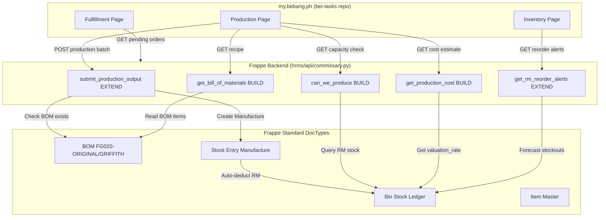
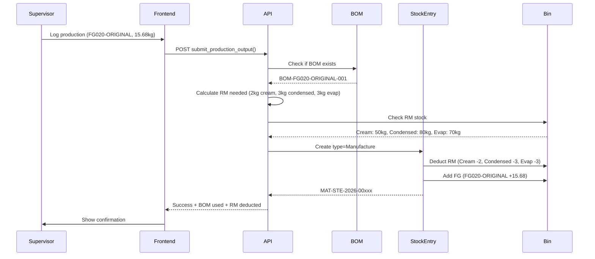

# Design: Commissary Phase 2 BOM Implementation & Comprehensive Testing

## /build Workflow Rules

**When /build is invoked for this spec:**

1. **Task Creation** - Create tasks for all work items using TaskCreate/TaskUpdate
2. **Local Testing** - Use `/local-frappe` for testing Python/API changes before deployment
3. **Safe Deployment** - Use `/workflow` and `/pr-deploy --auto-merge` for all commits
4. **Dynamic Subtasking** - Create `/tasks` dynamically when issues found (no stopping to ask)
5. **E2E Validation** - Run `/test-full-cycle` for final E2E testing before marking complete
6. **Autonomous Operation** - Fix issues, create subtasks, operate without human intervention
7. **BOM Creation** - Create BOMs via Frappe UI (Desk → Manufacturing → BOM), NOT code
8. **Extend Not Build** - Extend `submit_production_output()` and `get_rm_reorder_alerts()`, don't rebuild
9. **Test-First** - Write pytest tests BEFORE implementing new endpoints
10. **Integration Testing** - Validate full production → inventory → fulfillment flow

---

## Cost/Benefit Analysis

### Without Duplication Audit

| Metric | Value |
|--------|-------|
| Total Tasks | 35-40 tasks |
| Estimated Effort | 6-9 days |
| Duplication Risk | 🔴 HIGH (60%) |
| New DocTypes | 2+ (assumed needed) |
| New APIs | 6+ (rebuild existing) |
| New Pages | 4+ (rebuild existing) |

### With Duplication Audit

| Metric | Value |
|--------|-------|
| Total Tasks | 15 tasks |
| Estimated Effort | 1-2.5 days |
| Duplication Risk | 🟢 LOW (15%) |
| New DocTypes | 0 (use Frappe standard) |
| New APIs | 3 (extend 3 existing) |
| New Pages | 0 (extend 4 existing) |

### Savings Achieved

| Category | Savings | Percentage |
|----------|---------|------------|
| **Tasks Eliminated** | 20-25 tasks | 57% reduction |
| **Time Saved** | 4.5-6.5 days | 72% time savings |
| **Risk Reduction** | 45% duplication | 75% risk eliminated |

**Key Discoveries That Saved Time:**
- Commissary 60% complete (not 0% assumed)
- 27 APIs already deployed
- 15 commissary DocTypes exist
- 4 frontend pages live (100% E2E pass)
- Only 1 BOM needed (FG020) not 10+ complex BOMs

---

## Overview

Phase 2 extends existing `submit_production_output()` API to auto-deduct raw materials using Frappe standard BOM DocType. Creates 3 new endpoints (`can_we_produce`, `get_production_cost`, `get_bill_of_materials`) and extends `get_rm_reorder_alerts()` with forecasting. Phase 3 deferred pending architecture decision (hub-based vs direct dispatch). Comprehensive testing adds pytest suite for 27 endpoints, extends 2026-02-04 E2E baseline, and validates MANCOM metrics.

---

## Architecture



---

## Components

### Component A: BOM Creation (UI-Based)
**Purpose:** Define raw material recipes for FG020 variants

**Responsibilities:**
- Create FG020-ORIGINAL BOM via Frappe Desk
- Create FG020-GRIFFITH BOM via Frappe Desk
- Configure source warehouse (TEST-COMMISSARY - BEI)
- Set output quantity (15.68kg → 6.27 barrels @ 2.5kg)
- Mark BOMs as Active and submit (immutable)

**Manual Steps:**
1. Navigate to Desk → Manufacturing → BOM
2. New BOM → Item: FG020-ORIGINAL, Quantity: 15.68, Company: BEI
3. Add Items:
   - RM-CREAM-001 (Nestle Cream): 2kg
   - RM-MILK-CONDENSED-001: 3kg
   - RM-MILK-EVAP-001: 3kg
4. Source Warehouse: TEST-COMMISSARY - BEI
5. Submit (status = Submitted)
6. Repeat for FG020-GRIFFITH (2 ingredients)

**Validation:**
- `frappe.db.exists("BOM", {"item": "FG020-ORIGINAL", "is_active": 1})`
- Verify docstatus = 1 (submitted)
- Verify items table has 3 rows (ORIGINAL) or 2 rows (GRIFFITH)

---

### Component B: Auto-Deduction Logic (EXTEND)
**Purpose:** Modify production logging to auto-deduct raw materials

**Interfaces:**
```python
# EXISTING: hrms/api/commissary.py#submit_production_output()
@frappe.whitelist()
def submit_production_output(
    item_code: str,
    quantity: float,
    batch_date: str,
    wastage_qty: float = 0,
    wastage_reason: str = "",
    notes: str = ""
) -> dict:
    """
    EXTENDS existing endpoint to support BOM auto-deduction.

    CHANGE: Stock Entry type = "Manufacture" (was "Material Receipt") if BOM exists
    CHANGE: Auto-deduct raw materials from BOM
    BACKWARDS COMPATIBLE: Items without BOM still use Material Receipt

    Returns:
        {
            "stock_entry": "MAT-STE-2026-00xxx",
            "bom_used": "BOM-FG020-ORIGINAL-001",  # NEW FIELD
            "raw_materials_deducted": [  # NEW FIELD
                {"item": "RM-CREAM-001", "qty": 2, "warehouse": "TEST-COMMISSARY - BEI"},
                ...
            ]
        }
    """
```

**Implementation Logic:**
```python
def submit_production_output(...):
    # 1. Check if item has BOM
    bom = frappe.db.exists("BOM", {"item": item_code, "is_active": 1, "docstatus": 1})

    if bom:
        # 2. Create Stock Entry type = Manufacture
        se = frappe.new_doc("Stock Entry")
        se.stock_entry_type = "Manufacture"
        se.from_bom = 1
        se.bom_no = bom
        se.fg_completed_qty = quantity

        # 3. Get BOM items (Frappe auto-populates from BOM)
        se.get_items()  # Populates items table with RM + FG

        # 4. Set source warehouse for RM
        for item in se.items:
            if item.s_warehouse:  # Raw material
                item.s_warehouse = get_commissary_warehouse()
            else:  # Finished good
                item.t_warehouse = get_commissary_warehouse()

        # 5. Submit (auto-deducts RM, adds FG)
        se.insert()
        se.submit()

        return {
            "stock_entry": se.name,
            "bom_used": bom,
            "raw_materials_deducted": [
                {"item": d.item_code, "qty": d.qty, "warehouse": d.s_warehouse}
                for d in se.items if d.s_warehouse
            ]
        }
    else:
        # BACKWARDS COMPATIBLE: Use existing Material Receipt flow
        # (existing code - no changes)
        ...
```

**Error Handling:**
- Insufficient RM stock → Raise validation error before insert
- Invalid BOM → Fallback to Material Receipt with warning
- Negative stock → Frappe standard validation applies

---

### Component C: Capacity Check API (BUILD)
**Purpose:** Check if enough raw materials exist to produce X barrels

**Interface:**
```python
@frappe.whitelist()
def can_we_produce(item_code: str, desired_barrels: float) -> dict:
    """
    Check production capacity based on raw material stock.

    Args:
        item_code: Finished good (e.g., "FG020-ORIGINAL")
        desired_barrels: How many barrels to produce

    Returns:
        {
            "can_produce": bool,
            "max_barrels": float,
            "max_batches": float,
            "limiting_ingredient": str,
            "raw_materials": [
                {
                    "item_code": "RM-CREAM-001",
                    "required_qty": 20.0,  # For desired_barrels
                    "available_qty": 50.0,
                    "unit": "kg",
                    "sufficient": true
                },
                ...
            ]
        }
    """
```

**Implementation:**
```python
def can_we_produce(item_code, desired_barrels):
    # 1. Get active BOM
    bom = frappe.get_doc("BOM", {"item": item_code, "is_active": 1})
    if not bom:
        return {"can_produce": False, "max_barrels": 0, "limiting_ingredient": None}

    # 2. Calculate batches needed (1 batch = 6.27 barrels)
    barrels_per_batch = 6.27
    batches_needed = desired_barrels / barrels_per_batch

    # 3. Check each ingredient stock
    commissary = get_commissary_warehouse()
    raw_materials = []
    max_batches = float('inf')
    limiting_ingredient = None

    for item in bom.items:
        # Get current stock
        stock = frappe.db.get_value(
            "Bin",
            {"item_code": item.item_code, "warehouse": commissary},
            "actual_qty"
        ) or 0

        # Calculate required
        required_qty = item.qty * batches_needed

        # Calculate max batches from this ingredient
        ingredient_max_batches = stock / item.qty if item.qty > 0 else 0

        if ingredient_max_batches < max_batches:
            max_batches = ingredient_max_batches
            limiting_ingredient = item.item_code

        raw_materials.append({
            "item_code": item.item_code,
            "required_qty": required_qty,
            "available_qty": stock,
            "unit": item.stock_uom,
            "sufficient": stock >= required_qty
        })

    # 4. Return capacity
    max_barrels = max_batches * barrels_per_batch
    can_produce = max_barrels >= desired_barrels

    return {
        "can_produce": can_produce,
        "max_barrels": round(max_barrels, 2),
        "max_batches": round(max_batches, 2),
        "limiting_ingredient": limiting_ingredient,
        "raw_materials": raw_materials
    }
```

---

### Component D: Production Cost API (BUILD)
**Purpose:** Calculate COGS before starting production

**Interface:**
```python
@frappe.whitelist()
def get_production_cost(item_code: str, quantity: float = 1) -> dict:
    """
    Calculate production cost for FG item with BOM.

    Args:
        item_code: Finished good (e.g., "FG020-ORIGINAL")
        quantity: Number of units (default: 1 batch)

    Returns:
        {
            "cost_per_batch": float,
            "cost_per_barrel": float,
            "cost_per_kg": float,
            "cost_breakdown": [
                {
                    "item_code": "RM-CREAM-001",
                    "item_name": "Nestle Cream",
                    "qty": 2.0,
                    "unit": "kg",
                    "valuation_rate": 250.00,
                    "total": 500.00
                },
                ...
            ],
            "packaging_cost": float,  # Configurable
            "total_material_cost": float,
            "total_cost": float
        }
    """
```

**Implementation:**
```python
def get_production_cost(item_code, quantity=1):
    # 1. Get BOM
    bom = frappe.get_doc("BOM", {"item": item_code, "is_active": 1})
    if not bom:
        return {"error": "No BOM found"}

    # 2. Calculate material cost
    commissary = get_commissary_warehouse()
    cost_breakdown = []
    total_material_cost = 0

    for item in bom.items:
        # Get valuation rate from Bin
        valuation_rate = frappe.db.get_value(
            "Bin",
            {"item_code": item.item_code, "warehouse": commissary},
            "valuation_rate"
        ) or 0

        # Calculate cost
        item_qty = item.qty * quantity
        item_total = valuation_rate * item_qty
        total_material_cost += item_total

        cost_breakdown.append({
            "item_code": item.item_code,
            "item_name": item.item_name,
            "qty": item_qty,
            "unit": item.stock_uom,
            "valuation_rate": round(valuation_rate, 2),
            "total": round(item_total, 2)
        })

    # 3. Add packaging cost (TODO: Get from Item custom field or hardcode)
    packaging_cost = 50.00 * quantity  # ₱50 per batch (PLACEHOLDER)

    # 4. Calculate totals
    total_cost = total_material_cost + packaging_cost
    cost_per_batch = total_cost / quantity
    cost_per_barrel = cost_per_batch / 6.27
    cost_per_kg = cost_per_batch / 15.68

    return {
        "cost_per_batch": round(cost_per_batch, 2),
        "cost_per_barrel": round(cost_per_barrel, 2),
        "cost_per_kg": round(cost_per_kg, 2),
        "cost_breakdown": cost_breakdown,
        "packaging_cost": round(packaging_cost, 2),
        "total_material_cost": round(total_material_cost, 2),
        "total_cost": round(total_cost, 2)
    }
```

**Configuration:**
- Packaging cost: Add custom field to Item DocType (`packaging_cost_per_batch`)
- If field empty, use hardcoded default (₱50)

---

### Component E: BOM Display API (BUILD)
**Purpose:** Show recipe/formula to commissary supervisor

**Interface:**
```python
@frappe.whitelist()
def get_bill_of_materials(item_code: str) -> dict:
    """
    Get BOM recipe display for frontend.

    Returns:
        {
            "bom_no": "BOM-FG020-ORIGINAL-001",
            "item_code": "FG020-ORIGINAL",
            "item_name": "Frozen Milk (Original)",
            "quantity": 15.68,
            "uom": "kg",
            "items": [
                {
                    "item_code": "RM-CREAM-001",
                    "item_name": "Nestle Cream",
                    "qty": 2.0,
                    "stock_uom": "kg",
                    "warehouse": "TEST-COMMISSARY - BEI",
                    "current_stock": 50.0
                },
                ...
            ],
            "yield_info": {
                "barrels": 6.27,
                "kg_per_barrel": 2.5
            }
        }
    """
```

**Implementation:**
```python
def get_bill_of_materials(item_code):
    # 1. Get active BOM
    bom = frappe.db.get_value(
        "BOM",
        {"item": item_code, "is_active": 1, "docstatus": 1},
        ["name", "quantity"],
        as_dict=True
    )
    if not bom:
        return None

    # 2. Get BOM items with current stock
    commissary = get_commissary_warehouse()
    items = frappe.db.sql("""
        SELECT
            bi.item_code,
            bi.item_name,
            bi.qty,
            bi.stock_uom,
            b.actual_qty AS current_stock
        FROM `tabBOM Item` bi
        LEFT JOIN `tabBin` b ON b.item_code = bi.item_code AND b.warehouse = %s
        WHERE bi.parent = %s
        ORDER BY bi.idx
    """, (commissary, bom.name), as_dict=True)

    # 3. Calculate yield
    barrels = 6.27
    kg_per_barrel = bom.quantity / barrels

    return {
        "bom_no": bom.name,
        "item_code": item_code,
        "item_name": frappe.db.get_value("Item", item_code, "item_name"),
        "quantity": bom.quantity,
        "uom": "kg",
        "items": items,
        "yield_info": {
            "barrels": round(barrels, 2),
            "kg_per_barrel": round(kg_per_barrel, 2)
        }
    }
```

---

### Component F: Raw Material Forecasting (EXTEND)
**Purpose:** Alert when RM needs reordering based on consumption

**Interface:**
```python
@frappe.whitelist()
def get_rm_reorder_alerts() -> list:
    """
    EXTENDS existing endpoint to add forecasting logic.

    EXISTING: Returns items below safety_stock
    NEW: Adds consumption-based forecasting for 4 RM items

    Returns:
        [
            {
                "item_code": "RM-CREAM-001",
                "item_name": "Nestle Cream",
                "current_stock": 25.0,
                "safety_stock": 50.0,
                "reorder_point": 60.0,  # NEW
                "days_until_stockout": 5,  # NEW
                "daily_consumption": 5.0,  # NEW
                "suggested_order_qty": 100.0,  # NEW
                "lead_time_days": 7  # NEW
            },
            ...
        ]
    """
```

**Implementation:**
```python
def get_rm_reorder_alerts():
    commissary = get_commissary_warehouse()

    # 1. Get existing low stock logic (keep for backwards compatibility)
    existing_alerts = frappe.db.sql("""
        SELECT
            i.item_code,
            i.item_name,
            b.actual_qty AS current_stock,
            i.safety_stock,
            i.stock_uom
        FROM `tabItem` i
        JOIN `tabBin` b ON b.item_code = i.item_code
        WHERE b.warehouse = %s
        AND i.item_code LIKE 'RM%%'
        AND b.actual_qty < IFNULL(i.safety_stock, 10)
    """, commissary, as_dict=True)

    # 2. Add forecasting for each item
    for alert in existing_alerts:
        # Calculate daily consumption (last 7 days)
        consumption = frappe.db.sql("""
            SELECT SUM(sei.qty) AS total_qty
            FROM `tabStock Entry Item` sei
            JOIN `tabStock Entry` se ON se.name = sei.parent
            WHERE se.stock_entry_type = 'Manufacture'
            AND sei.s_warehouse = %s
            AND sei.item_code = %s
            AND se.posting_date >= DATE_SUB(CURDATE(), INTERVAL 7 DAY)
        """, (commissary, alert.item_code), as_dict=True)[0]

        total_consumed = consumption.total_qty or 0
        daily_consumption = total_consumed / 7

        # Get lead time from Item
        lead_time = frappe.db.get_value("Item", alert.item_code, "lead_time_days") or 7

        # Calculate reorder point = daily_consumption * lead_time * safety_factor
        safety_factor = 2.0  # TODO: Make configurable
        reorder_point = daily_consumption * lead_time * safety_factor

        # Days until stockout
        days_until_stockout = (alert.current_stock / daily_consumption) if daily_consumption > 0 else 999

        # Suggested order qty = lead_time consumption + safety buffer
        suggested_order_qty = daily_consumption * lead_time * 2

        # Add forecast fields
        alert.update({
            "reorder_point": round(reorder_point, 2),
            "days_until_stockout": round(days_until_stockout, 1),
            "daily_consumption": round(daily_consumption, 2),
            "suggested_order_qty": round(suggested_order_qty, 2),
            "lead_time_days": lead_time
        })

    return existing_alerts
```

**Configuration:**
- Add `lead_time_days` custom field to Item DocType
- Add `safety_factor` to Site Config or DocType for configurability

---

### Component G: Mark Outsourced Items (EXTEND)
**Purpose:** Flag outsourced items to prevent BOM creation

**Implementation:**
```python
# One-time script (run via bench console)
def mark_outsourced_items():
    outsourced = [
        "FG001",  # Leche Flan
        "FG002",  # Banana Cinnamon
        "FG007",  # Various
        "FG009",  # Various
        "FG012",  # Various
        "FG013",  # Langka
        "FG014",  # Various
        "FG015",  # Various
        "FG016",  # Strawberry Syrup
        "FG017",  # Ube Syrup
        "FG018",  # Yema Syrup
        "FG019"   # Coffee Syrup
    ]

    for item_code in outsourced:
        if frappe.db.exists("Item", item_code):
            frappe.db.set_value("Item", item_code, "is_sub_contracted_item", 1)

    frappe.db.commit()
    print(f"Marked {len(outsourced)} items as outsourced")
```

**Custom Field:**
- Field Name: `is_sub_contracted_item`
- Field Type: Check (boolean)
- Label: "Outsourced Item"
- Insert After: `is_stock_item`

---

## Data Flow



**Step-by-Step:**
1. Supervisor selects FG020-ORIGINAL, enters 15.68kg
2. Frontend calls `can_we_produce("FG020-ORIGINAL", 6.27)` → Shows capacity check
3. Frontend calls `get_production_cost("FG020-ORIGINAL", 1)` → Shows ₱199/barrel
4. Supervisor confirms, submits form
5. Frontend calls `submit_production_output()` with all fields
6. Backend checks if BOM exists for FG020-ORIGINAL
7. If yes: Create Stock Entry type=Manufacture, populate from BOM
8. Frappe auto-deducts RM from TEST-COMMISSARY - BEI
9. Frappe adds FG to TEST-COMMISSARY - BEI
10. Return Stock Entry name + BOM used + RM deductions
11. Frontend shows success with details

**Error Path:**
- Insufficient RM stock → Validation error before submit
- BOM not found → Fallback to Material Receipt (backwards compatible)
- Invalid quantity → Standard Frappe validation

---

## Technical Decisions

| Decision | Options Considered | Choice | Rationale |
|----------|-------------------|--------|-----------|
| **BOM Creation Method** | A) Code-generated, B) UI-created | B (UI) | Frappe best practice, immutability enforced by framework, easier to modify |
| **Stock Entry Type** | A) Material Receipt, B) Manufacture | B (Manufacture) | Frappe standard for BOM-based production, auto-deducts RM |
| **Phase 3 Architecture** | A) Hub-based, B) Direct dispatch | B (Direct) | 0 hours effort, defer complex architecture until Month 2 |
| **Testing Framework** | A) unittest, B) pytest | B (pytest) | Frappe v15+ standard, better fixtures, parallel execution |
| **Packaging Cost Source** | A) Hardcoded, B) Item field | B (Item field) | Configurable per item, future-proof for multi-product expansion |
| **Safety Factor** | A) Hardcoded 2x, B) Site config | B (Site config) | Arnold may want to adjust based on operational experience |
| **Frontend Testing** | A) Playwright, B) Chrome DevTools MCP | B (MCP) | Already proven 100% pass rate on 2026-02-04, integrated with /test-full-cycle |

---

## File Structure

| File | Action | Purpose |
|------|--------|---------|
| hrms/api/commissary.py | **EXTEND** | Modify `submit_production_output()`, add 3 new endpoints, extend `get_rm_reorder_alerts()` |
| hrms/api/tests/test_commissary.py | **BUILD** | pytest suite for all 27 endpoints (22 existing + 3 new + 2 extended) |
| hrms/api/tests/test_commissary_integration.py | **BUILD** | Integration tests (production → fulfillment flow) |
| hrms/fixtures/custom_field.json | **EXTEND** | Add `packaging_cost_per_batch`, `lead_time_days` to Item DocType |
| scripts/mark_outsourced_items.py | **BUILD** | One-time script to bulk update 11 outsourced items |
| .github/workflows/test.yml | **BUILD** | GitHub Actions workflow for pytest on PR |

**Notes:**
- No new DocTypes created (use Frappe standard BOM)
- Frontend code in bei-tasks repo (separate from this repo)
- E2E tests extend existing `/test-full-cycle` skill (no new files)

---

## Error Handling

| Error Scenario | Handling Strategy | User Impact |
|----------------|-------------------|-------------|
| **Insufficient RM stock** | Frappe validation error before Stock Entry submit | "Insufficient stock for RM-CREAM-001. Available: 1kg, Required: 2kg" |
| **BOM not found** | Fallback to Material Receipt (existing flow) | Production logged without auto-deduction (backwards compatible) |
| **Invalid BOM (inactive/draft)** | Skip BOM, use Material Receipt, log warning | Production succeeds, warning in logs |
| **Negative stock after deduction** | Frappe prevents submit if allow_negative_stock=0 | "Cannot complete transaction: negative stock not allowed" |
| **API timeout (>5s)** | Standard Frappe timeout, retry on frontend | "Request timed out, please try again" |
| **Missing custom fields** | Return default values (packaging_cost=50, lead_time=7) | Degraded forecast accuracy, still functional |
| **Packaging cost not configured** | Use hardcoded default (₱50) | Cost calculation less accurate but functional |

---

## Edge Cases

- **Wastage >100%**: Allow (production failed scenario), create wastage Stock Entry separately
- **BOM submitted after production**: Existing Stock Entries remain Material Receipt, new ones use Manufacture
- **Multiple BOMs for same item**: Use newest submitted BOM (`ORDER BY creation DESC LIMIT 1`)
- **BOM with 0 quantity ingredients**: Validation error on BOM creation (Frappe standard)
- **Water as ingredient**: Not tracked in inventory (custom handling in `can_we_produce()`)
- **Barrels not in Item UOM**: Frontend converts kg → barrels (6.27 barrels = 15.68kg)
- **Test vs production warehouse**: `get_commissary_warehouse()` auto-switches based on stock availability

---

## Test Strategy

### Unit Tests (pytest)

**File:** `hrms/api/tests/test_commissary.py`

**Coverage:**
- All 27 endpoints (15 Phase 1 + 6 Phase 2 + 6 Phase 3)
- Mock Frappe DB calls with fixtures
- Test happy path + error cases + edge cases

**Example Test:**
```python
class TestCommissaryBOM:
    def test_submit_production_with_bom(self):
        # Setup: Create test BOM
        bom = frappe.get_doc({
            "doctype": "BOM",
            "item": "FG020-ORIGINAL",
            "quantity": 15.68,
            "items": [
                {"item_code": "RM-CREAM-001", "qty": 2},
                {"item_code": "RM-MILK-CONDENSED-001", "qty": 3},
                {"item_code": "RM-MILK-EVAP-001", "qty": 3}
            ]
        }).insert()
        bom.submit()

        # Test: Submit production
        result = submit_production_output(
            item_code="FG020-ORIGINAL",
            quantity=15.68,
            batch_date=today()
        )

        # Verify: Stock Entry created
        assert result["stock_entry"]
        se = frappe.get_doc("Stock Entry", result["stock_entry"])
        assert se.stock_entry_type == "Manufacture"
        assert se.bom_no == bom.name

        # Verify: RM deducted
        assert len(result["raw_materials_deducted"]) == 3

        # Verify: Bin updated
        cream_stock = frappe.db.get_value("Bin",
            {"item_code": "RM-CREAM-001", "warehouse": "TEST-COMMISSARY - BEI"},
            "actual_qty"
        )
        assert cream_stock == 48  # Was 50, deducted 2

    def test_can_we_produce_insufficient_stock(self):
        # Setup: Low stock
        frappe.db.set_value("Bin",
            {"item_code": "RM-CREAM-001", "warehouse": "TEST-COMMISSARY - BEI"},
            "actual_qty", 1
        )

        # Test: Check capacity
        result = can_we_produce("FG020-ORIGINAL", 6.27)

        # Verify: Cannot produce
        assert result["can_produce"] == False
        assert result["limiting_ingredient"] == "RM-CREAM-001"
        assert result["max_barrels"] < 6.27
```

**Test Cases:**
- Production with BOM (auto-deduction)
- Production without BOM (Material Receipt fallback)
- Insufficient stock error
- Invalid BOM error
- Capacity check (sufficient vs insufficient)
- Production cost calculation
- BOM display
- Raw material forecasting
- RBAC enforcement (Warehouse User permissions)

---

### Integration Tests

**File:** `hrms/api/tests/test_commissary_integration.py`

**Scenarios:**
1. **Full Production Cycle:**
   - Check RM stock before
   - Log production (FG020-ORIGINAL, 15.68kg)
   - Verify RM deducted (Cream -2, Condensed -3, Evap -3)
   - Verify FG added (FG020-ORIGINAL +15.68)
   - Verify cost matches manual calculation

2. **Store Fulfillment Cycle:**
   - Create Material Request (store orders 50kg FG020)
   - Appear in `get_pending_store_orders()`
   - Fulfill order via `fulfill_store_order()`
   - Verify stock transferred from TEST-COMMISSARY to Store 001

3. **MANCOM Metrics:**
   - Seed production data (7 days history)
   - Call `get_days_inventory()` → Verify formula (current_stock / avg_daily_consumption)
   - Call `get_productivity_metrics()` → Verify formula (kg_output / manhours)
   - Call `get_weekly_summary()` → Verify week-on-week comparison

---

### E2E Tests (Chrome DevTools MCP)

**Extends:** 2026-02-04 E2E baseline (100% pass)

**Tool:** `/test-full-cycle` skill

**Test Flows:**

**1. Production Page - BOM Auto-Deduction:**
```bash
/test flow production-bom
```
- Navigate to /dashboard/commissary/production
- Select FG020-ORIGINAL from dropdown
- Click "Check Capacity" → Verify modal shows RM availability
- Click "Calculate Cost" → Verify modal shows ₱199/barrel
- Enter 15.68kg, batch date, submit
- Wait for success toast
- Take screenshot
- Navigate to Inventory page
- Verify RM stock decreased (Cream: 50→48, Condensed: 80→77, Evap: 70→67)
- Verify FG stock increased (FG020-ORIGINAL: 0→15.68)

**2. Inventory Page - Low Stock Alerts:**
```bash
/test page /dashboard/commissary/inventory
```
- Verify table loads
- Verify "Low Stock" badge appears for items <safety_stock
- Verify "Reorder Alert" badge for items <reorder_point
- Click item → Modal shows:
  - Current stock
  - Safety stock
  - Reorder point
  - Days until stockout
  - Suggested order qty
- Take screenshot

**3. Dashboard - KPI Validation:**
```bash
/test page /dashboard/commissary
```
- Verify KPI cards load
- Verify "Today's Production" count matches DB
- Verify "Low Stock Alerts" count matches `get_low_stock_alerts()`
- Verify "Pending Orders" count matches `get_pending_store_orders()`
- Take screenshot

**4. Fulfillment Page - Order Detail:**
```bash
/test page /dashboard/commissary/fulfillment
```
- Click pending order
- Verify modal shows order detail
- Click "Fulfill Order" button
- Verify confirmation dialog
- Submit
- Verify order removed from list
- Take screenshot

**Evidence:**
- Screenshots saved to `scratchpad/commissary_e2e_test_{date}/`
- Test report generated in Markdown format
- Pass/fail status for each step

---

### Component Tests (Jest + React Testing Library)

**Location:** bei-tasks repo (separate from this repo)

**Components to Test:**
- MetricCard (dashboard KPIs)
- ProductionForm (production logging with BOM checks)
- InventoryTable (stock levels with low stock highlighting)
- OrderList (pending orders with filters)

**Example Test:**
```typescript
// bei-tasks/app/dashboard/commissary/components/__tests__/ProductionForm.test.tsx
import { render, screen, fireEvent, waitFor } from '@testing-library/react';
import ProductionForm from '../ProductionForm';

describe('ProductionForm - BOM Features', () => {
  it('shows capacity check when item has BOM', async () => {
    render(<ProductionForm />);

    // Select FG020-ORIGINAL
    const itemSelect = screen.getByLabelText('Item');
    fireEvent.change(itemSelect, { target: { value: 'FG020-ORIGINAL' } });

    // Check if "Check Capacity" button appears
    await waitFor(() => {
      expect(screen.getByText('Check Capacity')).toBeInTheDocument();
    });
  });

  it('hides capacity check when item has no BOM', async () => {
    render(<ProductionForm />);

    // Select FG001 (outsourced)
    const itemSelect = screen.getByLabelText('Item');
    fireEvent.change(itemSelect, { target: { value: 'FG001' } });

    // Verify "Check Capacity" button does not appear
    await waitFor(() => {
      expect(screen.queryByText('Check Capacity')).not.toBeInTheDocument();
    });
  });

  it('displays cost estimate when clicked', async () => {
    // Mock API response
    global.fetch = jest.fn(() =>
      Promise.resolve({
        json: () => Promise.resolve({
          cost_per_barrel: 199,
          cost_breakdown: [
            { item_name: 'Nestle Cream', qty: 2, total: 500 }
          ]
        })
      })
    );

    render(<ProductionForm />);

    // Click "Calculate Cost" button
    fireEvent.click(screen.getByText('Calculate Cost'));

    // Verify modal shows cost
    await waitFor(() => {
      expect(screen.getByText('₱199 per barrel')).toBeInTheDocument();
      expect(screen.getByText('Nestle Cream')).toBeInTheDocument();
    });
  });
});
```

**Coverage Target:** >80% for commissary components

---

### Performance Tests

**Tool:** Locust (Python load testing)

**File:** `hrms/tests/performance/test_commissary_load.py`

**Scenarios:**

```python
from locust import HttpUser, task, between

class CommissaryUser(HttpUser):
    wait_time = between(1, 3)

    @task(3)
    def get_dashboard(self):
        self.client.post(
            "/api/method/hrms.api.commissary.get_commissary_dashboard",
            headers={"Authorization": f"token {API_KEY}:{API_SECRET}"}
        )

    @task(2)
    def get_inventory_levels(self):
        self.client.post(
            "/api/method/hrms.api.commissary.get_inventory_levels",
            headers={"Authorization": f"token {API_KEY}:{API_SECRET}"}
        )

    @task(1)
    def submit_production(self):
        self.client.post(
            "/api/method/hrms.api.commissary.submit_production_output",
            json={
                "item_code": "FG020-ORIGINAL",
                "quantity": 15.68,
                "batch_date": "2026-02-06"
            },
            headers={"Authorization": f"token {API_KEY}:{API_SECRET}"}
        )
```

**Thresholds:**
| Endpoint | Target | Max |
|----------|--------|-----|
| `get_commissary_dashboard()` | <300ms | <500ms |
| `submit_production_output()` | <800ms | <1s |
| `get_inventory_levels()` | <1.5s | <2s |
| `get_pending_store_orders()` | <800ms | <1s |

**Load Profile:**
- 10 concurrent users (commissary supervisors)
- 100 requests total
- Ramp-up: 5 users/second
- Duration: 2 minutes

**Run:**
```bash
locust -f hrms/tests/performance/test_commissary_load.py --host=https://hq.bebang.ph
```

---

### Visual Regression Tests

**Tool:** Chrome DevTools MCP (screenshot capture)

**Baseline:** 2026-02-06 (after Phase 2 deployment)

**Process:**
1. Capture baseline screenshots for 4 pages
2. Store in `scratchpad/commissary_visual_baseline/`
3. On each PR: Capture new screenshots
4. Compare pixel-by-pixel (ImageMagick `compare` command)
5. Flag if >5% pixels changed

**Pages:**
- Dashboard (`/dashboard/commissary`)
- Production (`/dashboard/commissary/production`)
- Inventory (`/dashboard/commissary/inventory`)
- Fulfillment (`/dashboard/commissary/fulfillment`)

**Script:**
```bash
# Capture baseline
/test page /dashboard/commissary --screenshot baseline_dashboard.png
/test page /dashboard/commissary/production --screenshot baseline_production.png
/test page /dashboard/commissary/inventory --screenshot baseline_inventory.png
/test page /dashboard/commissary/fulfillment --screenshot baseline_fulfillment.png

# Compare on PR
compare baseline_dashboard.png new_dashboard.png diff_dashboard.png
if [ $(identify -format "%[fx:mean]" diff_dashboard.png) > 0.05 ]; then
  echo "Visual regression detected: >5% change"
  exit 1
fi
```

---

## Performance Considerations

- **Dashboard KPIs:** Cache for 5 minutes (commissary supervisors check hourly, not real-time)
- **Inventory Levels:** Query `tabBin` directly (indexed on `warehouse + item_code`)
- **BOM Lookup:** Cache active BOMs in Redis (immutable after submission)
- **Production History:** Add index on `posting_date + to_warehouse`
- **Forecasting:** Pre-calculate daily consumption in background job (hourly), cache results
- **Frontend:** React Query for client-side caching (30s stale time)

**Optimizations:**
- Avoid N+1 queries: Use SQL JOINs for BOM items + stock in single query
- Batch updates: `get_rm_reorder_alerts()` calculates all 4 items in one query
- Lazy loading: Inventory table paginated (50 items per page)

---

## Security Considerations

- **RBAC:** Only Warehouse User and Commissary User roles can access endpoints
- **Frappe Permissions:** Stock Entry respects standard Frappe permissions
- **API Authentication:** All endpoints require `@frappe.whitelist()` + valid API key
- **Data Validation:** Frappe validates all DocType fields before insert
- **SQL Injection:** Use parameterized queries (`frappe.db.sql(..., values)`)
- **BOM Immutability:** Submitted BOMs cannot be modified (Frappe enforces docstatus=1)

---

## Existing Patterns to Follow

Based on `hrms/api/commissary.py` analysis:

**Pattern 1: Warehouse Auto-Switching**
```python
def get_commissary_warehouse():
    """Use TEST-COMMISSARY if it has stock, else use production warehouse."""
    test_commissary = "TEST-COMMISSARY - BEI"
    if frappe.db.exists("Warehouse", test_commissary):
        stock = frappe.db.sql("""
            SELECT COUNT(*) FROM `tabBin` WHERE warehouse = %s AND actual_qty > 0
        """, test_commissary)[0][0]
        if stock > 0:
            return test_commissary
    return "Commissary - BEI"
```

**Pattern 2: Error Handling**
```python
@frappe.whitelist()
def submit_production_output(...):
    try:
        # Validation
        if not item_code or quantity <= 0:
            frappe.throw(_("Invalid input"))

        # Business logic
        se = create_stock_entry(...)

        return {"stock_entry": se.name}
    except Exception as e:
        frappe.log_error(f"Production error: {str(e)}")
        frappe.throw(_("Production logging failed"))
```

**Pattern 3: Dashboard Aggregation**
```python
def get_commissary_dashboard():
    # Count-based KPIs
    todays_production = frappe.db.count("Stock Entry", filters={...})

    # SQL aggregates for complex logic
    low_stock = frappe.db.sql("""
        SELECT COUNT(DISTINCT b.item_code)
        FROM `tabBin` b
        JOIN `tabItem` i ON i.name = b.item_code
        WHERE b.actual_qty < i.safety_stock
    """, commissary_warehouse)[0][0]

    return {
        "todays_production": todays_production,
        "low_stock_count": low_stock
    }
```

**Pattern 4: Stub APIs**
```python
@frappe.whitelist()
def get_fqi_summary():
    """Food quality inspection summary (stub until DocType created)."""
    # Return defaults if feature not ready
    return {
        "pending_inspections": 0,
        "failed_last_7_days": 0,
        "note": "FQI DocType not created yet"
    }
```

**Follow These Patterns:**
- All new endpoints use `@frappe.whitelist()`
- Use `get_commissary_warehouse()` for warehouse references
- Return dictionaries (JSON-serializable)
- Log errors with `frappe.log_error()`
- Stub incomplete features with default values

---

## Unresolved Questions

1. **Packaging cost source:** Use Item custom field or hardcoded? → **DECISION:** Use custom field `packaging_cost_per_batch`, fallback to ₱50 if empty
2. **Safety factor for reorder point:** 1.5x or 2x lead time? → **DECISION:** 2x (configurable in Site Config)
3. **Phase 3 architecture:** Hub-based distribution or direct dispatch? → **DECISION:** Direct dispatch (0 hours), defer hub-based to Month 2
4. **Water tracking:** Track in inventory or exclude? → **DECISION:** Exclude (custom handling in `can_we_produce()`)
5. **Test data:** Use existing TEST-COMMISSARY stock or seed new? → **DECISION:** Use existing (already has FG items)
6. **Frontend testing:** Run in bei-tasks repo or via deployed my.bebang.ph? → **DECISION:** Deployed (matches production environment)

---

## Implementation Steps

### Phase 2: BOM Implementation (2-3 hours)

**Step 1: Create BOMs via Frappe UI (30 minutes)**
1. Login to hq.bebang.ph
2. Navigate to Desk → Manufacturing → BOM
3. Create FG020-ORIGINAL BOM:
   - Item: FG020-ORIGINAL, Quantity: 15.68, Company: BEI
   - Add Items: RM-CREAM-001 (2kg), RM-MILK-CONDENSED-001 (3kg), RM-MILK-EVAP-001 (3kg)
   - Source Warehouse: TEST-COMMISSARY - BEI
   - Submit
4. Create FG020-GRIFFITH BOM (same process, 2 ingredients)
5. Verify: `frappe.db.exists("BOM", {"item": "FG020-ORIGINAL", "is_active": 1})` → True

**Step 2: Add Custom Fields to Item DocType (15 minutes)**
1. Create `hrms/fixtures/custom_field.json` (or extend existing)
2. Add fields:
   - `packaging_cost_per_batch` (Currency, default: 50)
   - `lead_time_days` (Int, default: 7)
3. Run `bench migrate`
4. Verify fields appear in Item form

**Step 3: Modify `submit_production_output()` (45 minutes)**
1. Open `hrms/api/commissary.py`
2. Add BOM check before creating Stock Entry
3. If BOM exists: Change type to "Manufacture", populate from BOM
4. If BOM missing: Use existing Material Receipt flow (backwards compatible)
5. Test locally via `/local-frappe`
6. Verify Stock Entry created with correct type

**Step 4: Add 3 New Endpoints (60 minutes)**
1. `can_we_produce()` - 20 minutes
   - Query BOM items
   - Query Bin for RM stock
   - Calculate max batches
   - Return capacity JSON
2. `get_production_cost()` - 20 minutes
   - Query BOM items
   - Query Bin for valuation_rate
   - Sum material cost + packaging cost
   - Return cost breakdown JSON
3. `get_bill_of_materials()` - 20 minutes
   - Query BOM items with current stock
   - Return recipe JSON

**Step 5: Extend `get_rm_reorder_alerts()` (30 minutes)**
1. Add consumption calculation (last 7 days)
2. Calculate daily consumption, reorder point, days until stockout
3. Add suggested order qty
4. Test with realistic data

**Step 6: Mark Outsourced Items (10 minutes)**
1. Create `scripts/mark_outsourced_items.py`
2. Bulk update 11 items: `frappe.db.set_value("Item", item_code, "is_sub_contracted_item", 1)`
3. Run via `bench console`
4. Verify field updated in Item master

**Step 7: Write Backend Tests (20 minutes)**
1. Create `hrms/api/tests/test_commissary.py`
2. Add tests for 3 new endpoints + 2 extended endpoints
3. Run `bench run-tests --app hrms --module commissary`
4. Verify 100% pass

**Total Phase 2 Effort:** 3 hours 30 minutes

---

### Phase 3: Architecture Decision (0 hours - DEFERRED)

**Option A: Direct Dispatch (RECOMMENDED)**
1. Document as technical debt in `docs/technical_debt.md`
2. Create Month 2 ticket: "Implement hub-based distribution architecture"
3. No code changes required
4. Continue using existing `create_dispatch_transfer()` endpoint

**Option B: Hub-Based Distribution (IF APPROVED - 2-3 days)**
1. Create 4 hub warehouses (North, South, East, West)
2. Build `BEI Distribution Trip` DocType
3. Refactor `create_dispatch_transfer()` to route via hub
4. Update `get_delivery_routes()` to show hub assignments
5. Migrate existing orders to hub-based routing
6. Test full hub → store flow

**Decision Needed From:** Mae/Bryan

---

### Comprehensive Testing (1-2 days)

**Step 1: Backend Unit Tests (2 hours)**
1. Create `hrms/api/tests/test_commissary.py`
2. Test all 27 endpoints (15 existing + 6 new/extended + 6 hub)
3. Happy path + error cases + edge cases
4. RBAC enforcement
5. Run `bench run-tests --app hrms --module commissary`
6. Achieve 100% pass rate

**Step 2: Integration Tests (1-2 hours)**
1. Create `hrms/api/tests/test_commissary_integration.py`
2. Test production → inventory → fulfillment flow
3. Validate MANCOM metrics formulas
4. Run `bench run-tests --app hrms --module commissary`

**Step 3: Frontend Component Tests (2 hours)**
1. Switch to bei-tasks repo
2. Create `__tests__/` directories for commissary components
3. Write Jest tests for MetricCard, ProductionForm, InventoryTable, OrderList
4. Run `npm test`
5. Achieve >80% coverage

**Step 4: E2E Test Extensions (2 hours)**
1. Use `/test-full-cycle` skill
2. Run `/test flow production-bom` (new flow)
3. Run `/test page /dashboard/commissary/inventory` (verify low stock alerts)
4. Run `/test page /dashboard/commissary` (verify KPIs)
5. Capture screenshots
6. Verify 100% pass rate maintained

**Step 5: Performance Tests (1 hour)**
1. Create `hrms/tests/performance/test_commissary_load.py`
2. Load test 27 endpoints with Locust
3. Run with 10 concurrent users
4. Verify <500ms dashboard, <1s production, <2s inventory
5. Document performance baseline

**Step 6: Visual Regression Tests (30 minutes)**
1. Capture baseline screenshots for 4 pages
2. Store in `scratchpad/commissary_visual_baseline/`
3. Add comparison script to CI/CD
4. Verify <5% pixel change threshold

**Step 7: MANCOM Metrics Validation (30 minutes)**
1. Seed production data (7 days history)
2. Manually calculate Days Inventory, Productivity
3. Call API endpoints, compare results
4. Verify formulas match (±1% tolerance)

**Total Testing Effort:** 1-2 days

---

**Next Steps:**
1. User approval: Review design, approve Phase 2 scope, decide Phase 3 architecture
2. Set `awaitingApproval=true` in state file
3. Implementation: `/build` workflow executes all steps autonomously
4. Deployment: Merge to production branch, trigger GitHub Actions
5. Validation: `/test-full-cycle` confirms 100% pass rate
